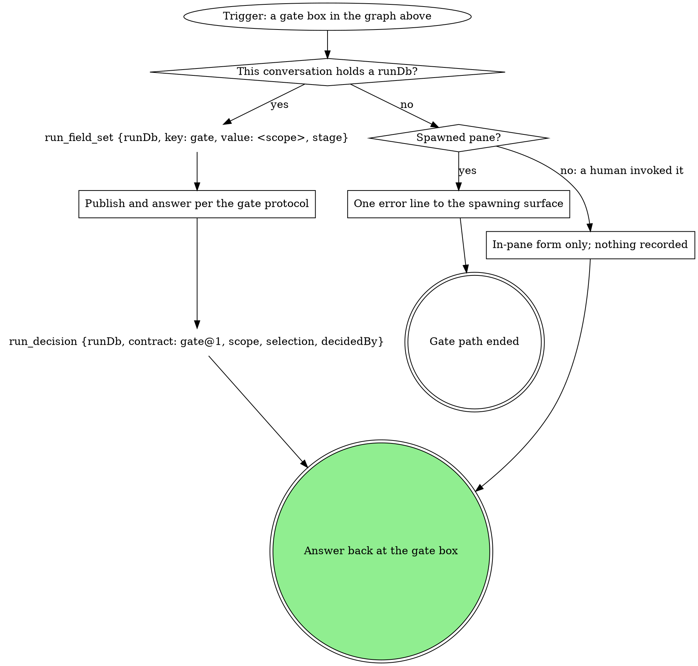

# rebase-worktree

Bring one worktree's branch current with the default branch: the
`branch_sync` tool first, the manual rebase only where `branch_sync` did
not run. This never guesses: it refuses on a dirty tree, refuses a stack
member, and hands conflicts back to a human.

```dot
digraph rebase_worktree {
    rankdir=TB;

    "Trigger: one worktree's branch to bring current" [shape=ellipse];
    "git -C <tree> status --porcelain" [shape=plaintext];
    "Tree clean?" [shape=diamond];
    "STOP: never stash; gate the dirty tree" [shape=octagon style=filled fillcolor=red fontcolor=white];
    "Gate clarify: dirty tree" [shape=box];
    "tree answer?" [shape=diamond];
    "Dirty retries = 2?" [shape=diamond];
    "git -C <tree> status -sb" [shape=plaintext];
    "Upstream set?" [shape=diamond];
    "git -C <tree> symbolic-ref refs/remotes/origin/HEAD" [shape=plaintext];
    "Default branch read?" [shape=diamond];
    "Forge fallback run already?" [shape=diamond];
    "Discover the default from the forge" [shape=box];
    "git -C <tree> log -1 --oneline" [shape=plaintext];
    "branch_sync {tree}" [shape=plaintext];
    "branch_sync result?" [shape=diamond];
    "Pulled once already?" [shape=diamond];
    "git_pull {tree}" [shape=plaintext];
    "git_pull result?" [shape=diamond];
    "STOP: a safety refusal ends the run; report it" [shape=octagon style=filled fillcolor=red fontcolor=white];
    "git -C <tree> remote get-url origin" [shape=plaintext];
    "Forge host?" [shape=diamond];
    "mr_list {repoName: <tree>, maxAgeMs: 5000}" [shape=plaintext];
    "Read synced?" [shape=diamond];
    "gh pr view <branch>" [shape=plaintext];
    "gh pr list --base <branch>" [shape=plaintext];
    "gh reads succeeded?" [shape=diamond];
    "Apply the child and parent checks" [shape=box];
    "Either check refused?" [shape=diamond];
    "git -C <tree> fetch origin" [shape=plaintext];
    "git -C <tree> log --oneline origin/<default>..HEAD" [shape=plaintext];
    "git_rebase {tree, onto: origin/<default>}" [shape=plaintext];
    "git_rebase result?" [shape=diamond];
    "STOP: never resolve a conflict; hand it back" [shape=octagon style=filled fillcolor=red fontcolor=white];
    "Conflict: caller composing per branch?" [shape=diamond];
    "Gate conflict:rebase-worktree:<attempt>" [shape=box];
    "conflict answer?" [shape=diamond];
    "git_rebase {tree, abort: true}" [shape=plaintext];
    "git -C <tree> status" [shape=plaintext];
    "Still mid-rebase?" [shape=diamond];
    "Conflict attempts = 3?" [shape=diamond];
    "STOP: leave the rebase for the human" [shape=octagon style=filled fillcolor=red fontcolor=white];
    "git -C <tree> log -1 --oneline HEAD" [shape=plaintext];
    "Head still the old head?" [shape=diamond];
    "Report the move" [shape=box];
    "Old head = new head?" [shape=diamond];
    "branch_sync pushed it?" [shape=diamond];
    "Push: caller composing per branch?" [shape=diamond];
    "Gate push" [shape=box];
    "push answer?" [shape=diamond];
    "git_push {tree, forceWithLease: true}" [shape=plaintext];
    "git_push result?" [shape=diamond];
    "Push retried once?" [shape=diamond];
    "git_push {tree: <the root the error prints>, forceWithLease: true}" [shape=plaintext];
    "STOP: push only with git_push" [shape=octagon style=filled fillcolor=red fontcolor=white];
    "Off-script gate" [shape=box];
    "off-script answer?" [shape=diamond];
    "Make the recorded move once" [shape=box];
    "Recorded move succeeded?" [shape=diamond];
    "Off-script rounds = 2?" [shape=diamond];
    "Dirty tree: reported" [shape=doublecircle];
    "Aborted: nothing touched" [shape=doublecircle];
    "No upstream: reported" [shape=doublecircle];
    "No default branch: reported" [shape=doublecircle];
    "Refused: reported" [shape=doublecircle];
    "Refused: stack member, tool named" [shape=doublecircle];
    "Stack check could not run: reported" [shape=doublecircle];
    "Refused: restack with the stack tool" [shape=doublecircle];
    "Rebase error: reported" [shape=doublecircle];
    "Handed back: conflicted files named" [shape=doublecircle];
    "Left mid-rebase for the human" [shape=doublecircle];
    "Aborted" [shape=doublecircle];
    "Rebase aborted in the human's pane: reported" [shape=doublecircle];
    "Handed back: push to decide" [shape=doublecircle];
    "Rebased, left unpushed" [shape=doublecircle];
    "Rebased, push refused: reported" [shape=doublecircle];
    "Held: end the turn naming the gate" [shape=doublecircle];
    "Done: move reported" [shape=doublecircle style=filled fillcolor=lightgreen];

    "Trigger: one worktree's branch to bring current" -> "git -C <tree> status --porcelain";
    "git -C <tree> status --porcelain" -> "Tree clean?";
    "Tree clean?" -> "git -C <tree> status -sb" [label="yes"];
    "Tree clean?" -> "Gate clarify: dirty tree" [label="no"];
    "Tree clean?" -> "STOP: never stash; gate the dirty tree" [label="tempted to stash and proceed"];
    "STOP: never stash; gate the dirty tree" -> "Gate clarify: dirty tree";
    "Gate clarify: dirty tree" -> "tree answer?";
    "tree answer?" -> "Dirty retries = 2?" [label="I committed them, retry"];
    "tree answer?" -> "Aborted: nothing touched" [label="abort"];
    "tree answer?" -> "Held: end the turn naming the gate" [label="hold"];
    "Dirty retries = 2?" -> "git -C <tree> status --porcelain" [label="no"];
    "Dirty retries = 2?" -> "Dirty tree: reported" [label="yes"];
    "git -C <tree> status -sb" -> "Upstream set?";
    "Upstream set?" -> "git -C <tree> symbolic-ref refs/remotes/origin/HEAD" [label="yes"];
    "Upstream set?" -> "No upstream: reported" [label="no"];
    "git -C <tree> symbolic-ref refs/remotes/origin/HEAD" -> "Default branch read?";
    "Default branch read?" -> "git -C <tree> log -1 --oneline" [label="yes"];
    "Default branch read?" -> "Forge fallback run already?" [label="no"];
    "Forge fallback run already?" -> "Discover the default from the forge" [label="no"];
    "Forge fallback run already?" -> "No default branch: reported" [label="yes"];
    "Discover the default from the forge" -> "Default branch read?";
    "git -C <tree> log -1 --oneline" -> "branch_sync {tree}";
    "branch_sync {tree}" -> "branch_sync result?";
    "branch_sync result?" -> "Report the move" [label="synced"];
    "branch_sync result?" -> "Conflict: caller composing per branch?" [label="conflict"];
    "branch_sync result?" -> "git -C <tree> remote get-url origin" [label="stack check could not run, or the sync itself failed"];
    "branch_sync result?" -> "Refused: stack member, tool named" [label="stack refusal ending Run: <tool>"];
    "branch_sync result?" -> "Pulled once already?" [label="run git_pull first"];
    "branch_sync result?" -> "Refused: reported" [label="any other refusal"];
    "branch_sync result?" -> "STOP: a safety refusal ends the run; report it" [label="tempted to take the manual path"];
    "branch_sync result?" -> "STOP: never resolve a conflict; hand it back" [label="tempted to resolve or continue it yourself"];
    "STOP: a safety refusal ends the run; report it" -> "Refused: reported";
    "Pulled once already?" -> "git_pull {tree}" [label="no"];
    "Pulled once already?" -> "Refused: reported" [label="yes"];
    "git_pull {tree}" -> "git_pull result?";
    "git_pull result?" -> "branch_sync {tree}" [label="fast-forwarded"];
    "git_pull result?" -> "Refused: reported" [label="error"];
    "git -C <tree> remote get-url origin" -> "Forge host?";
    "Forge host?" -> "mr_list {repoName: <tree>, maxAgeMs: 5000}" [label="GitLab"];
    "Forge host?" -> "gh pr view <branch>" [label="GitHub"];
    "mr_list {repoName: <tree>, maxAgeMs: 5000}" -> "Read synced?";
    "Read synced?" -> "Apply the child and parent checks" [label="yes"];
    "Read synced?" -> "Stack check could not run: reported" [label="no: error, syncError, or syncedAt 0"];
    "gh pr view <branch>" -> "gh pr list --base <branch>";
    "gh pr list --base <branch>" -> "gh reads succeeded?";
    "gh reads succeeded?" -> "Apply the child and parent checks" [label="yes"];
    "gh reads succeeded?" -> "Stack check could not run: reported" [label="no"];
    "Apply the child and parent checks" -> "Either check refused?";
    "Either check refused?" -> "Refused: restack with the stack tool" [label="yes"];
    "Either check refused?" -> "git -C <tree> fetch origin" [label="no"];
    "git -C <tree> fetch origin" -> "git -C <tree> log --oneline origin/<default>..HEAD";
    "git -C <tree> log --oneline origin/<default>..HEAD" -> "git_rebase {tree, onto: origin/<default>}";
    "git_rebase {tree, onto: origin/<default>}" -> "git_rebase result?";
    "git_rebase result?" -> "Report the move" [label="clean"];
    "git_rebase result?" -> "Conflict: caller composing per branch?" [label="conflict"];
    "git_rebase result?" -> "Rebase error: reported" [label="any other error"];
    "git_rebase result?" -> "STOP: never resolve a conflict; hand it back" [label="tempted to resolve or continue it yourself"];
    "STOP: never resolve a conflict; hand it back" -> "Conflict: caller composing per branch?";
    "Conflict: caller composing per branch?" -> "Handed back: conflicted files named" [label="yes"];
    "Conflict: caller composing per branch?" -> "Gate conflict:rebase-worktree:<attempt>" [label="no"];
    "Gate conflict:rebase-worktree:<attempt>" -> "conflict answer?";
    "conflict answer?" -> "Left mid-rebase for the human" [label="leave"];
    "conflict answer?" -> "git_rebase {tree, abort: true}" [label="abort"];
    "conflict answer?" -> "Held: end the turn naming the gate" [label="hold"];
    "conflict answer?" -> "git -C <tree> status" [label="iterate: the human worked in their pane"];
    "git_rebase {tree, abort: true}" -> "Aborted";
    "git -C <tree> status" -> "Still mid-rebase?";
    "Still mid-rebase?" -> "Conflict attempts = 3?" [label="yes"];
    "Still mid-rebase?" -> "git -C <tree> log -1 --oneline HEAD" [label="no"];
    "Conflict attempts = 3?" -> "Gate conflict:rebase-worktree:<attempt>" [label="no: attempt n+1"];
    "Conflict attempts = 3?" -> "STOP: leave the rebase for the human" [label="yes"];
    "STOP: leave the rebase for the human" -> "Left mid-rebase for the human";
    "git -C <tree> log -1 --oneline HEAD" -> "Head still the old head?";
    "Head still the old head?" -> "Rebase aborted in the human's pane: reported" [label="yes"];
    "Head still the old head?" -> "Report the move" [label="no: the rebase finished"];
    "Report the move" -> "Old head = new head?";
    "Old head = new head?" -> "Done: move reported" [label="yes: already current, nothing pushed"];
    "Old head = new head?" -> "branch_sync pushed it?" [label="no"];
    "branch_sync pushed it?" -> "Done: move reported" [label="yes: pushed by branch_sync"];
    "branch_sync pushed it?" -> "Push: caller composing per branch?" [label="no"];
    "Push: caller composing per branch?" -> "Handed back: push to decide" [label="yes"];
    "Push: caller composing per branch?" -> "Gate push" [label="no"];
    "Gate push" -> "push answer?";
    "push answer?" -> "git_push {tree, forceWithLease: true}" [label="push with force-with-lease"];
    "push answer?" -> "Rebased, left unpushed" [label="leave it unpushed"];
    "push answer?" -> "Report the move" [label="iterate"];
    "push answer?" -> "Held: end the turn naming the gate" [label="hold"];
    "git_push {tree, forceWithLease: true}" -> "git_push result?";
    "git_push {tree: <the root the error prints>, forceWithLease: true}" -> "git_push result?";
    "git_push result?" -> "Done: move reported" [label="pushed"];
    "git_push result?" -> "Rebased, push refused: reported" [label="safety refusal: lease, protected or default branch, detached HEAD, upstream mismatch"];
    "git_push result?" -> "Push retried once?" [label="tree must be the absolute path of the root"];
    "git_push result?" -> "STOP: push only with git_push" [label="not registered with rt"];
    "Push retried once?" -> "git_push {tree: <the root the error prints>, forceWithLease: true}" [label="no"];
    "Push retried once?" -> "STOP: push only with git_push" [label="yes"];
    "STOP: push only with git_push" -> "Off-script gate";
    "Off-script gate" -> "off-script answer?";
    "off-script answer?" -> "Make the recorded move once" [label="take"];
    "off-script answer?" -> "Off-script rounds = 2?" [label="iterate: the human fixed it, retry"];
    "off-script answer?" -> "Rebased, push refused: reported" [label="hand back"];
    "off-script answer?" -> "Held: end the turn naming the gate" [label="hold"];
    "Off-script rounds = 2?" -> "git_push {tree, forceWithLease: true}" [label="no"];
    "Off-script rounds = 2?" -> "Rebased, push refused: reported" [label="yes"];
    "Make the recorded move once" -> "Recorded move succeeded?";
    "Recorded move succeeded?" -> "Done: move reported" [label="yes"];
    "Recorded move succeeded?" -> "Rebased, push refused: reported" [label="no"];
}
```

`<tree>` is the worktree's absolute path. The graph is the map; each box has a section below with the how. Every gate box runs the gate steps graph under **Gates**.

### Gate clarify: dirty tree

Scope `clarify`. One sentence listing the uncommitted paths, then the
questions `tree`: **I committed them, retry** / **Abort**; **Hold**.
Selection `{"tree":"retry|abort"}`. Never stash and proceed: moving
someone's uncommitted work is not this skill's call. The table under
**Gate push** binds this form too.

{{include:spawned-no-run-guard}}

### Discover the default from the forge

The origin URL names the forge. GitHub: `gh repo view --json
defaultBranchRef`. GitLab: `git -C <tree> remote set-head origin --auto`
(it sets the local ref and pushes nothing), then read the symbolic-ref
again. An MR's `targetBranch` is where that MR merges, not the default
branch: never take the default from it. Never hardcode a branch name.

### branch_sync result?

`branch_sync` does the fetch, the stack check, the rebase, and the push in
one call, and says why when it will not. The result decides, and nothing
else does:

| result | carries | next |
|---|---|---|
| `status: "synced"` | `divergedFromOrigin` (true when local and origin had diverged before the sync) | Synced: `branch_sync` rebased and pushed with force-with-lease, or found the branch current and pushed nothing. Go to **Report the move**; the push already happened, so no push gate. |
| `status: "conflict"` | rt sync's bundle (`unresolvedFiles`, `backupBranch`, `state: mid-rebase`) | The rebase is paused in the worktree. Go to **Conflict: caller composing per branch?** with `unresolvedFiles` as the files. |
| error `rt sync refused (exit 4): could not determine the default branch ...` or `rt sync refused (exit 4): could not list open MRs to rule out a stack: ...` | error text only | The stack could not be verified either way. Go to `git -C <tree> remote get-url origin` and the manual path's stack guards; if those fail for the same reason, stop at **Stack check could not run: reported** and report both failures. Never rebase an unverified branch. | <!-- mcp-lint: allow -->
| any other `rt sync refused (exit 4): ...` error: a stack refusal, whose text ends `Run: <tool>` (e.g. `<branch> is a member of stack <name> (parent <parent>); rebasing it alone onto <default> would break the stack. Run: <tool>`) | error text only | **Refused: stack member, tool named**: report the error text and name the tool after `Run:`. The run ends here; the restack belongs to the stack tool. | <!-- mcp-lint: allow -->
| error `rt sync timed out after ...`, `could not start rt sync`, or `rt sync refused (exit N): ...` with N other than 4 | error text only | rt sync itself failed. Report it, then go to `git -C <tree> remote get-url origin` (the manual path). | <!-- mcp-lint: allow -->
| any other error: `branch_sync` refused before rt sync ran (`refusing to sync <branch>: ...`, `refusing to reset <branch> to origin: ...`, `origin/<branch> has commits this tree lacks; ...`, `a rebase is in progress; ...`, or a git read that failed) | error text only | **Refused: reported**: report the error text and stop. The manual path's force-with-lease push would not protect what the tool refused over. When the text ends `run git_pull first`, go to **Pulled once already?** instead: one `git_pull {tree}`, then one more `branch_sync`. |

| Thought | Reality |
|---|---|
| "The stack refusal came back, but I can see the MR targets the default branch, so I'll rebase by hand" | A stack refusal is the guard's verdict, not a hint. Only the two could-not-run texts open the manual path, and only through its own guards. |
| "`status: "synced"`, so now the push gate" | `branch_sync` already pushed; that is the fast path's contract. A push form for a push that happened is a false choice. Report it as pushed. |
| "The check could not run, so the safe move is to stop and ask" | The manual guards are the same check by other means. Run them; stop only when they fail too. |
| "It only said `refusing to sync`; the manual path will get it done" | A preflight refusal is a safety verdict on this tree. Report it and stop; the manual path is only for the rows that send there. |

### Apply the child and parent checks

A single-branch rebase is legal only when the branch is stack-free in both
directions. On GitLab both checks read the one `mr_list` result; on GitHub
they read the two `gh` results.

- **Child check:** the branch's open MR or PR (GitLab: the row whose
  `sourceBranch` is this branch, then its `targetBranch`; GitHub: `gh pr
  view <branch>`). Targets anything other than the default branch:
  REFUSE, naming the target. A stacked branch rebases onto
  `origin/<target>` if it rebases at all; moving it onto the default
  branch destroys the stack.
- **Parent check:** open MRs or PRs targeting this branch (GitLab: the
  rows whose `targetBranch` is this branch; GitHub: `gh pr list --base
  <branch>`). Any hit: REFUSE, naming the dependents. Rewriting a parent's
  history strands every child on commits that no longer exist.

When the result's `scope` limits the cache to certain authors or a time
window, the verdict covers only that scope: say so, and carry "stack check
covered <scope> only" on the old head -> new head line (**Report the
move**) so it reaches whoever gates the push.

Either refusal is a restack signal: the chain moves together or not at
all. Say so and point at the stack tool (`gitq:sync` where available);
never improvise a multi-branch rebase here.

| Thought | Reality |
|---|---|
| "The pipeline needs the default branch's fix" | A stacked MR reaches the default branch through its stack root. Rebasing it there directly destroys the stack. |
| "Just this parent; the children catch up later" | The moment the parent rewrites, every child points at history that no longer exists. |
| "No open MR in either direction" | On a synced read (no `syncError`, `syncedAt` not 0), the branch is stack-free within the read's `scope`: proceed, naming any scope limit. |

### Gate conflict:rebase-worktree:<attempt>

One sentence listing the conflicted files (the bundle's `unresolvedFiles`,
the files `git_rebase` returned, or the `UU` and similar rows of
`git -C <tree> status --porcelain`). That sentence is also the hand-back
when a caller composes this per branch.

`<attempt>` counts from 1. The questions, each its own question (never
fold one list into another: a question over 4 options sends the whole gate
to the wait queue):

- `conflict`: **Leave the rebase in progress for me** (recommended) /
  **Abort the rebase**
- `next`: **Proceed** (recommended) / **Iterate here** / **Hold**

Selection `{"next":"leave|abort|iterate|hold","note":"<their words or null>"}`.
**Iterate here** means the human worked in their own pane; the graph
re-reads the tree. Never resolve the conflict yourself, stage the files,
or continue or skip the rebase.

{{include:spawned-no-run-guard}}

### Report the move

Old head -> new head, from the two `git -C <tree> log -1 --oneline`
reads: the one before `branch_sync`, and the same read once the rebase
finished (the `HEAD` read already made it after an iterate). The line ends
"already current; nothing pushed" when the heads match, or "pushed by
branch_sync" when `branch_sync` moved it. Carry any "stack check covered
<scope> only" caveat on the line. When a caller composes this per branch,
this line is what goes back.

### Gate push

Scope `push`. The sentence is the old head -> new head line; nothing else
before the form. The questions, each its own question (never fold one list
into another: a question over 4 options sends the whole gate to the wait
queue):

- `push`: **Push with force-with-lease now** / **Leave it unpushed**
  (recommended when the branch has an open MR others may have pulled)
- `next`: **Proceed** / **Iterate here** / **Hold**

Selection `{"push":true|false,"next":"proceed|iterate|hold","note":"<their words or null>"}`.

{{include:spawned-no-run-guard}}

**These thoughts mean you are skipping the gate -- STOP:**

| Thought | Reality |
|---------|---------|
| "Push with force-with-lease now is the natural next action, so I'll mark it Recommended" | Only **Leave it unpushed** carries a recommended label, and only conditionally (an open MR others may have pulled). Render that qualifier attached to that option exactly; never move it to the push option. |
| "Restating the finding and explaining each option makes the ask clearer" | A gate's form is one sentence of context, then the bare option labels the gate text names, nothing more -- no restated heading, no per-option description, no conditional aside on when Hold applies. |

### Off-script gate

Scope `off-script:<run.current_stage>:<n>`, `n` counting from 1 within
this attempt; with no run, the in-pane form per the gate steps. The
context sentence quotes the `git_push` refusal. The questions, each its
own question:

- `action`: **Take the proposed move** (the value spells the move in full)
  / **Hand back**
- `next`: **Proceed** (recommended) / **Iterate here** / **Hold**

Selection `{"move":"<the move>","why":"<the refusal>","action":"take|handback","next":"proceed|iterate|hold","note":"<their words or null>"}`.
**Iterate here** means the human fixed the cause and wants the push
retried.

### Make the recorded move once

Exactly the move the selection recorded, once. Its result decides the next
node; a failure is reported, never a second off-script gate.

## What the graph cannot show

- The two "caller composing per branch?" diamonds are yes when the invoking verb said it composes this as its per-branch step (sync-open-mrs does).
- "Head still the old head?" yes means the human aborted in their pane, never "already current".
- A mechanical `git_push` refusal is one of "tree must be the absolute path of the root" (retry once with the printed root) or "not registered with rt" (no retry).
- Never push unasked.
- Aborting the rebase happens only on the **Abort the rebase** answer.
- "Upstream set?" is no when the `status -sb` branch line carries no `...origin/<branch>` tracking ref.

## Gates

Every gate box above runs this graph.

### Publish and answer per the gate protocol

If a rule below asks for a move this graph marks STOP, take the off-script edge instead.

{{include:gate-protocol}}

### One error line to the spawning surface

The guard text in the gate's own section (for the off-script gate, the
one under **Gate push**) says what the line is and where it goes; the gate
path ends there.

### In-pane form only; nothing recorded

A human invocation with no run gets the same form in the pane, and no
`run_*` call is made.

## Wrap-up form contract

{{include:wrap-up-form}}
