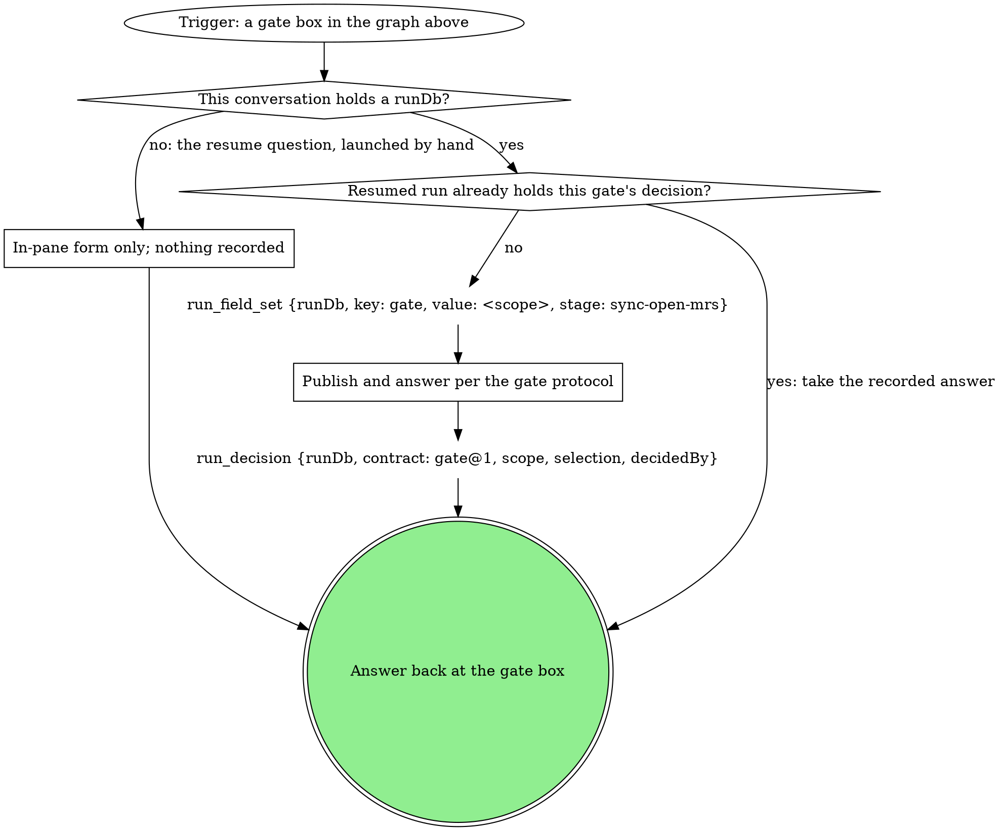

# sync-open-mrs

Bring every open MR or PR current with the default branch in one sweep:
rebase each, then offer to push and watch CI. This verb owns the
sequencing, the two batch gates and the report; discovery, rebasing and CI
watching belong to the verbs it follows, never reimplemented here.

```dot
digraph sync_open_mrs {
    rankdir=TB;

    "Trigger: every open MR should come current" [shape=ellipse];
    "Caller handed a runDb?" [shape=diamond];
    "run_snapshot {runDb}" [shape=plaintext];
    "run.status = running?" [shape=diamond];
    "Inherit the run" [shape=box];
    "Spawned by a surface?" [shape=diamond];
    "run_list {repo}" [shape=plaintext];
    "Running sync-open-mrs runs?" [shape=diamond];
    "Gate clarify: resume or start fresh" [shape=box];
    "clarify answer?" [shape=diamond];
    "run_stage {runDb: <resumed>, action: start, stage: sync-open-mrs}" [shape=plaintext];
    "run_field_set {runDb: <resumed>, key: hold, value: -, stage: sync-open-mrs}" [shape=plaintext];
    "run_snapshot {runDb: <resumed>}" [shape=plaintext];
    "Keep the recorded answers" [shape=box];
    "run_start {flags, skillDir, spawnedBy?}" [shape=plaintext];
    "run_start ok with a runDb?" [shape=diamond];
    "run_stage {action: start, stage: sync-open-mrs}" [shape=plaintext];
    "Follow map-open-mrs for the table" [shape=box];
    "Plan the sweep" [shape=box];
    "Gate sweep" [shape=box];
    "sweep answer?" [shape=diamond];
    "Say nothing was selected" [shape=box];
    "Selected branches left?" [shape=diamond];
    "Follow rebase-worktree for the next branch" [shape=box];
    "Record the branch in its bucket" [shape=box];
    "Any rebased, still unpushed?" [shape=diamond];
    "Summarize the rebase pass" [shape=box];
    "Gate push" [shape=box];
    "push answer?" [shape=diamond];
    "Selected pushes left?" [shape=diamond];
    "git_push {tree, forceWithLease: true}" [shape=plaintext];
    "git_push result?" [shape=diamond];
    "Record pushed" [shape=box];
    "Record push failed, reason quoted" [shape=box];
    "Retried this branch once?" [shape=diamond];
    "git_push {tree: <the root the error prints>, forceWithLease: true}" [shape=plaintext];
    "Record push failed, mechanical" [shape=box];
    "Any mechanical push failure?" [shape=diamond];
    "STOP: push only with git_push" [shape=octagon style=filled fillcolor=red fontcolor=white];
    "Off-script gate" [shape=box];
    "off-script answer?" [shape=diamond];
    "Off-script rounds = 2?" [shape=diamond];
    "Queue the mechanical failures again" [shape=box];
    "Make the recorded move once per listed branch" [shape=box];
    "Watch CI asked?" [shape=diamond];
    "Follow watch-ci per pushed branch" [shape=box];
    "Report every branch in one bucket" [shape=box];
    "Started this run here?" [shape=diamond];
    "run_stage {action: done, stage: sync-open-mrs}" [shape=plaintext];
    "Sweep abandoned?" [shape=diamond];
    "run_status {status: done}" [shape=plaintext];
    "run_status {status: abandoned}" [shape=plaintext];
    "Inherited sweep abandoned?" [shape=diamond];
    "rt too old: told the user to update" [shape=doublecircle];
    "Held: end the turn naming the gate" [shape=doublecircle];
    "Sweep abandoned" [shape=doublecircle];
    "Sweep reported" [shape=doublecircle style=filled fillcolor=lightgreen];

    "Trigger: every open MR should come current" -> "Caller handed a runDb?";
    "Caller handed a runDb?" -> "run_snapshot {runDb}" [label="yes"];
    "Caller handed a runDb?" -> "Spawned by a surface?" [label="no"];
    "run_snapshot {runDb}" -> "run.status = running?";
    "run.status = running?" -> "Inherit the run" [label="yes"];
    "run.status = running?" -> "Spawned by a surface?" [label="no"];
    "Inherit the run" -> "Follow map-open-mrs for the table";
    "Spawned by a surface?" -> "run_start {flags, skillDir, spawnedBy?}" [label="yes: start fresh"];
    "Spawned by a surface?" -> "run_list {repo}" [label="no: launched by hand"];
    "run_list {repo}" -> "Running sync-open-mrs runs?";
    "Running sync-open-mrs runs?" -> "Gate clarify: resume or start fresh" [label="yes"];
    "Running sync-open-mrs runs?" -> "run_start {flags, skillDir, spawnedBy?}" [label="no"];
    "Gate clarify: resume or start fresh" -> "clarify answer?";
    "clarify answer?" -> "run_stage {runDb: <resumed>, action: start, stage: sync-open-mrs}" [label="resume a candidate"];
    "clarify answer?" -> "run_start {flags, skillDir, spawnedBy?}" [label="start fresh"];
    "clarify answer?" -> "Held: end the turn naming the gate" [label="hold"];
    "run_stage {runDb: <resumed>, action: start, stage: sync-open-mrs}" -> "run_field_set {runDb: <resumed>, key: hold, value: -, stage: sync-open-mrs}";
    "run_field_set {runDb: <resumed>, key: hold, value: -, stage: sync-open-mrs}" -> "run_snapshot {runDb: <resumed>}";
    "run_snapshot {runDb: <resumed>}" -> "Keep the recorded answers";
    "Keep the recorded answers" -> "Follow map-open-mrs for the table";
    "run_start {flags, skillDir, spawnedBy?}" -> "run_start ok with a runDb?";
    "run_start ok with a runDb?" -> "run_stage {action: start, stage: sync-open-mrs}" [label="yes"];
    "run_start ok with a runDb?" -> "rt too old: told the user to update" [label="no"];
    "run_stage {action: start, stage: sync-open-mrs}" -> "Follow map-open-mrs for the table";
    "Follow map-open-mrs for the table" -> "Plan the sweep";
    "Plan the sweep" -> "Gate sweep";
    "Gate sweep" -> "sweep answer?";
    "sweep answer?" -> "Selected branches left?" [label="proceed with branches"];
    "sweep answer?" -> "Say nothing was selected" [label="proceed with none selected"];
    "sweep answer?" -> "Plan the sweep" [label="iterate"];
    "sweep answer?" -> "Held: end the turn naming the gate" [label="hold"];
    "Say nothing was selected" -> "Started this run here?";
    "Selected branches left?" -> "Follow rebase-worktree for the next branch" [label="yes"];
    "Selected branches left?" -> "Any rebased, still unpushed?" [label="no"];
    "Follow rebase-worktree for the next branch" -> "Record the branch in its bucket";
    "Record the branch in its bucket" -> "Selected branches left?";
    "Any rebased, still unpushed?" -> "Summarize the rebase pass" [label="yes"];
    "Any rebased, still unpushed?" -> "Report every branch in one bucket" [label="no"];
    "Summarize the rebase pass" -> "Gate push";
    "Gate push" -> "push answer?";
    "push answer?" -> "Selected pushes left?" [label="proceed"];
    "push answer?" -> "Summarize the rebase pass" [label="iterate"];
    "push answer?" -> "Held: end the turn naming the gate" [label="hold"];
    "Selected pushes left?" -> "git_push {tree, forceWithLease: true}" [label="yes"];
    "Selected pushes left?" -> "Any mechanical push failure?" [label="no"];
    "git_push {tree, forceWithLease: true}" -> "git_push result?";
    "git_push {tree: <the root the error prints>, forceWithLease: true}" -> "git_push result?";
    "git_push result?" -> "Record pushed" [label="pushed"];
    "git_push result?" -> "Record push failed, reason quoted" [label="safety refusal: lease, protected or default branch, detached HEAD, upstream mismatch"];
    "git_push result?" -> "Retried this branch once?" [label="tree must be the absolute path of the root"];
    "git_push result?" -> "Record push failed, mechanical" [label="not registered with rt"];
    "git_push result?" -> "Record push failed, reason quoted" [label="any other error"];
    "Retried this branch once?" -> "git_push {tree: <the root the error prints>, forceWithLease: true}" [label="no"];
    "Retried this branch once?" -> "Record push failed, mechanical" [label="yes"];
    "Record pushed" -> "Selected pushes left?";
    "Record push failed, reason quoted" -> "Selected pushes left?";
    "Record push failed, mechanical" -> "Selected pushes left?";
    "Any mechanical push failure?" -> "STOP: push only with git_push" [label="yes"];
    "Any mechanical push failure?" -> "Watch CI asked?" [label="no"];
    "STOP: push only with git_push" -> "Off-script gate";
    "Off-script gate" -> "off-script answer?";
    "off-script answer?" -> "Make the recorded move once per listed branch" [label="take"];
    "off-script answer?" -> "Off-script rounds = 2?" [label="iterate: the human fixed it, retry"];
    "off-script answer?" -> "Watch CI asked?" [label="hand back: they stay push failed"];
    "off-script answer?" -> "Held: end the turn naming the gate" [label="hold"];
    "Off-script rounds = 2?" -> "Queue the mechanical failures again" [label="no"];
    "Off-script rounds = 2?" -> "Watch CI asked?" [label="yes: they stay push failed"];
    "Queue the mechanical failures again" -> "Selected pushes left?";
    "Make the recorded move once per listed branch" -> "Watch CI asked?";
    "Watch CI asked?" -> "Follow watch-ci per pushed branch" [label="yes"];
    "Watch CI asked?" -> "Report every branch in one bucket" [label="no"];
    "Follow watch-ci per pushed branch" -> "Report every branch in one bucket";
    "Report every branch in one bucket" -> "Started this run here?";
    "Started this run here?" -> "run_stage {action: done, stage: sync-open-mrs}" [label="yes"];
    "Started this run here?" -> "Inherited sweep abandoned?" [label="no: close nothing"];
    "run_stage {action: done, stage: sync-open-mrs}" -> "Sweep abandoned?";
    "Sweep abandoned?" -> "run_status {status: done}" [label="no"];
    "Sweep abandoned?" -> "run_status {status: abandoned}" [label="yes"];
    "run_status {status: done}" -> "Sweep reported";
    "run_status {status: abandoned}" -> "Sweep abandoned";
    "Inherited sweep abandoned?" -> "Sweep reported" [label="no"];
    "Inherited sweep abandoned?" -> "Sweep abandoned" [label="yes"];
}
```

### Inherit the run

The caller handed a `runDb` and the `run_snapshot` tool with that `runDb`
shows `run.status` = `running`: you were invoked from inside that run and
inherit it. `run.current_stage` is your stage, and you close nothing at the
end.

### Gate clarify: resume or start fresh

The candidates are the `run_list` rows (`repo` = the `--repo` value in the
flag text under **Starting the run**) whose `status` is `running` and
`work_type` is `sync-open-mrs`; never read the run dbs by hand.

Scope `clarify`. One sentence naming each candidate's `spawned_by`,
`started_at`, and `current_stage`, then one **Resume** option per candidate
(recommended for a run this session started earlier; a run another live
pane owns is not yours) / **Start fresh**; **Hold**.

Resume: the candidate's `runDb` is `~/.mattstack/runs/<repo>/<id>/state.db`
built from the row's `repo` and `id`, with `~` expanded to the home
directory. Keep it for every `run_*` call; the `run_stage` start that
follows is a new attempt, which re-records this session.

### Keep the recorded answers

The decisions the resumed `run_snapshot` shows are answers already given.
Each gate step that finds its scope's decision there takes it instead of
asking again.

### Follow map-open-mrs for the table

Follow the pack's compiled `map-open-mrs` verb (`../map-open-mrs/SKILL.md`,
relative to this file, when the pack compiles both on the same side; a
different surface changes the path) and get its table: MR ref, title,
author, source branch, worktree path or NONE.

### Plan the sweep

One sentence: how many branches rebase, how many are skipped up front (NONE
rows with nothing local to rebase, trees whose `git status --porcelain`
is not empty, which `rebase-worktree` would refuse, and, when the user's
forge username is known, MRs whose author is someone else) and why. When
the username is not known, the sentence also says the author could not be
confirmed, and each `branches` option's label carries its MR's author
(`<branch> (by <author>)`). Every branch starts pre-selected only when the
username is known; otherwise every option starts deselected and the
human picks their own, because the per-branch `branch_sync` fast path
pushes without a gate, so a pre-checked teammate branch would be
force-pushed on one click.

**These thoughts mean you are skipping the gate -- STOP:**

| Thought | Reality |
|---------|---------|
| "I'll list the dirty tree too and let the rebase step refuse it" | The sweep form lists only branches the sweep will rebase; a tree the rebase would refuse is a skipped row, named up front with its reason. |

### Gate sweep

Scope `sweep`, once for the whole batch, never per branch. The questions,
each its own question (never fold one list into another: a question over 4
options sends the whole gate to the wait queue):

- `branches`: a multi-select of the branches to rebase, in order,
  pre-selected by the rule under **Plan the sweep** (deselecting skips
  one); over 4 branches it splits into `branches-1`, `branches-2`, ... of
  up to 4 options each, in order, whose answers read as one union
- `next`: **Proceed** (recommended) / **Iterate here** (their text
  reorders or excludes) / **Hold**

Selection `{"branches":[...]}`. Nothing is touched before the answer.
**Proceed** with an empty `branches` union is "proceed with none selected".

### Say nothing was selected

One sentence: no branch was selected, so nothing is rebased or pushed. The
sweep ends abandoned; a run this verb started closes as `abandoned`.

### Follow rebase-worktree for the next branch

In the order the sweep answer gave, follow the pack's compiled
`rebase-worktree` verb (a public verb; invoke it by its pack-qualified
skill name) for the next selected branch, saying you compose it as the
per-branch step of this sweep, so it hands conflicts and pushes back
instead of gating them. It inherits this run and its `runDb`, and closes
nothing.

### Record the branch in its bucket

What `rebase-worktree` hands back decides the bucket. No branch's outcome
ever blocks the rest of the sweep:

- The conflicted-files sentence (the branch is left mid-rebase): needs-hands.
- "pushed by branch_sync": pushed.
- "already current; nothing pushed": current.
- An old head -> new head line with the push still to decide (the manual
  path): rebased, still unpushed. Keep any "stack check covered <scope>
  only" caveat for **Summarize the rebase pass**.
- Any refusal or error (dirty tree, no upstream, a stack refusal, a
  `git_rebase` error, a `branch_sync` refusal): skipped, with its text as
  the reason. `rebase-worktree` already pulls once on "run git_pull
  first", so that text arrives here only when the refusal survived the
  pull.
- `rebase-worktree` ending at its own dirty-tree question (**Aborted:
  nothing touched** or **Held**): skipped, with that answer as the reason.

### Summarize the rebase pass

One sentence: which branches rebased clean (old head -> new head each,
"pushed by branch_sync" where that happened, with any "stack check covered
<scope> only" caveat a branch handed back) and which were already current.

### Gate push

Scope `push`, once for the batch of still-unpushed branches; never push one
of those unasked, never one by one as each rebase completes. The
questions, each its own question (never fold one list into another: a
question over 4 options sends the whole gate to the wait queue):

- `branches`: a multi-select of the clean, still-unpushed branches to
  push with force-with-lease, all pre-selected; over 4 branches it
  splits into `branches-1`, `branches-2`, ... of up to 4 options each,
  in order, whose answers read as one union
- `watch_ci`: **Watch CI after pushing** (yes / no)
- `next`: **Proceed** (recommended) / **Iterate here** / **Hold**

Selection `{"branches":[...],"watch_ci":true|false}`. Each selected branch
then goes to `git_push` with `tree` = its worktree path.

### Record pushed

The branch lands in the pushed bucket.

### Record push failed, reason quoted

The branch lands in push failed with the `git_push` error quoted as the
reason, and the rest carry on. A safety refusal (lease, protected or
default branch, detached HEAD, upstream mismatch) is a verdict on that
branch: never gated, never retried; so is any other `git_push` error.

### Record push failed, mechanical

The branch lands in push failed with the refusal quoted, marked mechanical:
"tree must be the absolute path of the root" after its one retry with the
printed root, or "not registered with rt" (no retry; it prints no root).
The rest carry on; the mechanical ones go to the batch off-script gate once
the queue is empty.

### Off-script gate

Scope `off-script:<run.current_stage>:<n>`, `n` counting from 1 per
off-script round in this sweep. One gate for the whole batch: the context
sentence quotes each mechanical refusal with its branch. The questions,
each its own question:

- `action`: **Take the proposed move** (the value spells the move in full,
  one move per branch) / **Hand back**
- `next`: **Proceed** (recommended) / **Iterate here** / **Hold**

Selection `{"move":"<one move per listed branch>","why":"<each refusal>","action":"take|handback","next":"proceed|iterate|hold","note":"<their words or null>"}`.
**Iterate here** means the human fixed the cause and wants those pushes
retried; **Hand back** leaves them push failed.

### Queue the mechanical failures again

Every branch recorded push failed, mechanical goes back into the push
queue for this round, with its one printed-root retry available again.
Branches already pushed or failed for a safety reason stay where they are.

### Make the recorded move once per listed branch

Exactly the move the selection recorded, once for each listed branch. Each
branch's result moves it to pushed or leaves it push failed with the new
error quoted; a failure is reported, never a second off-script gate.

### Follow watch-ci per pushed branch

Follow the pack's compiled `watch-ci` verb (a public verb; invoke it by its
pack-qualified skill name) per pushed branch. It inherits this run and its
`runDb`, hands back its verdict, and closes nothing.

### Report every branch in one bucket

One table, every branch from the map-open-mrs table landing in exactly one
bucket: rebased (old head -> new head), pushed, current (nothing to push),
conflicted (needs-hands), push failed (with reason), or skipped (with
reason -- dirty tree, no upstream, NONE row, another author's MR).

### Starting the run

The `run_start` node: `flags` is the compiled flag text below, verbatim;
`skillDir` is this skill's own directory; add `spawnedBy` when a board or
another surface launched this pane.

{{run-start.flags:sync-open-mrs}}

The result must carry `ok: true` and a `runDb`. Anything else means this rt
predates the run tools: tell the user to update rt. Keep `runDb` and pass
it to every `run_*` call; nothing is exported.

## Gates

Every gate box above runs this graph.

### In-pane form only; nothing recorded

Only the resume question runs with no run: a human launched this pane and
no run exists yet. It gets the form in the pane, and no `run_*` call is
made.

### Publish and answer per the gate protocol

If a rule below asks for a move this graph marks STOP, take the off-script edge instead.

{{include:gate-protocol}}

## Wrap-up form contract

{{include:wrap-up-form}}
