# Gate protocol

One shared protocol for any gated pane or wrapper: publish first, then act
on the presentation the daemon returns. The daemon's gate registry is the
single arbiter; no per-verb conflict logic belongs anywhere downstream of
it. Every gate walks this graph: the site names the scope, the questions
and the selection; this part publishes, answers and records.

If a rule in the including verb asks for a move this graph marks STOP, take
the off-script edge instead (Off-script gate, below).

```dot
digraph gate_protocol {
    rankdir=TB;

    "Trigger: a site reaches its gate" [shape=ellipse];
    "Build the gate's questions and context" [shape=box];
    "Under a run: bracket the gate?" [shape=diamond];
    "run_field_set {key: gate, value: <scope>, stage}" [shape=plaintext];
    "gate_ask {questions, kind: <scope>, context?, subject?}" [shape=plaintext];
    "gate_ask result?" [shape=diamond];
    "Fixed this gate_ask call once already?" [shape=diamond];
    "Fix what the gate_ask refusal names" [shape=box];
    "Daemon down: is the gated pane unattended?" [shape=diamond];
    "Under a run: fail the stage at the gate?" [shape=diamond];
    "run_stage {action: fail, stage, reason: <the gate_ask refusal, verbatim>}" [shape=plaintext];
    "Present the gate form with no registry" [shape=box];
    "gate_ask presentation?" [shape=diamond];
    "Wait: is the gated pane an attended non-herdr session?" [shape=diamond];
    "Present the in-pane gate form" [shape=box];
    "Gate form result?" [shape=diamond];
    "Gate questions left for another form call?" [shape=diamond];
    "Map the gate answer to exact option values" [shape=box];
    "gate_answer {id, answers}" [shape=plaintext];
    "gate_answer result?" [shape=diamond];
    "Resubmitted this gate_answer once already?" [shape=diamond];
    "Discard the form's gate answer; say which surface won" [shape=box];
    "Holding an open gate: under a run?" [shape=diamond];
    "Under a run: set waiting-gate?" [shape=diamond];
    "run_field_set {key: waiting-gate, value: <id>, stage}" [shape=plaintext];
    "rt gate wait <id> as a background Bash task" [shape=plaintext];
    "End the turn: holding at gate <id>" [shape=box];
    "Trigger: the gate wait finished and re-invoked this pane" [shape=ellipse];
    "Gate wait result for an already reconciled gate?" [shape=diamond];
    "Trigger: the human answers in words at a held gate" [shape=ellipse];
    "Trigger: a gate doorbell push arrives" [shape=ellipse];
    "Doorbell for an already reconciled gate?" [shape=diamond];
    "rt gate wait <id> --timeout 2s" [shape=plaintext];
    "waiting-gate set on this run?" [shape=diamond];
    "run_field_set {key: waiting-gate, value: -, stage}" [shape=plaintext];
    "Gate answer already in hand?" [shape=diamond];
    "Gate wait status?" [shape=diamond];
    "Take the winning gate answer and its by" [shape=box];
    "Under a run: record the gate decision?" [shape=diamond];
    "run_decision {contract: gate@1, scope, selection, decidedBy}" [shape=plaintext];
    "STOP: never invent an answer or re-ask a closed gate" [shape=octagon style=filled fillcolor=red fontcolor=white];
    "Gate stage failed" [shape=doublecircle];
    "Verb ends at the gate, quoting the refusal" [shape=doublecircle];
    "No run: held at the open gate, turn ends" [shape=doublecircle];
    "Late gate signal discarded" [shape=doublecircle];
    "Gate path ended per the verb's policy" [shape=doublecircle];
    "Act on the gate answer at the site" [shape=doublecircle style=filled fillcolor=lightgreen];

    "Trigger: a site reaches its gate" -> "Build the gate's questions and context";
    "Build the gate's questions and context" -> "Under a run: bracket the gate?";
    "Under a run: bracket the gate?" -> "run_field_set {key: gate, value: <scope>, stage}" [label="yes"];
    "Under a run: bracket the gate?" -> "gate_ask {questions, kind: <scope>, context?, subject?}" [label="no"];
    "run_field_set {key: gate, value: <scope>, stage}" -> "gate_ask {questions, kind: <scope>, context?, subject?}";
    "gate_ask {questions, kind: <scope>, context?, subject?}" -> "gate_ask result?";
    "gate_ask result?" -> "gate_ask presentation?" [label="ok: keep id and presentation"];
    "gate_ask result?" -> "Daemon down: is the gated pane unattended?" [label="refused: daemon unreachable"];
    "gate_ask result?" -> "Fixed this gate_ask call once already?" [label="refused: any other reason"];
    "Fixed this gate_ask call once already?" -> "Fix what the gate_ask refusal names" [label="no"];
    "Fixed this gate_ask call once already?" -> "Under a run: fail the stage at the gate?" [label="yes: budget spent"];
    "Fix what the gate_ask refusal names" -> "gate_ask {questions, kind: <scope>, context?, subject?}";
    "Daemon down: is the gated pane unattended?" -> "Present the gate form with no registry" [label="no: attended"];
    "Daemon down: is the gated pane unattended?" -> "Under a run: fail the stage at the gate?" [label="yes"];
    "Under a run: fail the stage at the gate?" -> "run_stage {action: fail, stage, reason: <the gate_ask refusal, verbatim>}" [label="yes"];
    "Under a run: fail the stage at the gate?" -> "Verb ends at the gate, quoting the refusal" [label="no"];
    "run_stage {action: fail, stage, reason: <the gate_ask refusal, verbatim>}" -> "Gate stage failed";
    "Present the gate form with no registry" -> "Under a run: record the gate decision?" [label="answered: decidedBy is pane"];
    "gate_ask presentation?" -> "Present the in-pane gate form" [label="form"];
    "gate_ask presentation?" -> "Wait: is the gated pane an attended non-herdr session?" [label="wait"];
    "Wait: is the gated pane an attended non-herdr session?" -> "Present the in-pane gate form" [label="yes: take the form anyway"];
    "Wait: is the gated pane an attended non-herdr session?" -> "Under a run: set waiting-gate?" [label="no: spawned, or any herdr pane"];
    "Present the in-pane gate form" -> "Gate form result?";
    "Gate form result?" -> "Gate questions left for another form call?" [label="answered"];
    "Gate form result?" -> "Trigger: a gate doorbell push arrives" [label="dismissed by the daemon: the doorbell is the next input" style=dashed];
    "Gate form result?" -> "Holding an open gate: under a run?" [label="cancelled by the human"];
    "Gate questions left for another form call?" -> "Present the in-pane gate form" [label="yes: the next chunk"];
    "Gate questions left for another form call?" -> "Map the gate answer to exact option values" [label="no: last chunk answered"];
    "Map the gate answer to exact option values" -> "gate_answer {id, answers}";
    "gate_answer {id, answers}" -> "gate_answer result?";
    "gate_answer result?" -> "Take the winning gate answer and its by" [label="recorded: this answer won"];
    "gate_answer result?" -> "Discard the form's gate answer; say which surface won" [label="conflict: true"];
    "gate_answer result?" -> "Resubmitted this gate_answer once already?" [label="refused: not an option value"];
    "gate_answer result?" -> "STOP: never invent an answer or re-ask a closed gate" [label="refused: gate closed or not found"];
    "Resubmitted this gate_answer once already?" -> "Map the gate answer to exact option values" [label="no"];
    "Resubmitted this gate_answer once already?" -> "Holding an open gate: under a run?" [label="yes: leave it open for another surface"];
    "Discard the form's gate answer; say which surface won" -> "Take the winning gate answer and its by";
    "Holding an open gate: under a run?" -> "run_field_set {key: waiting-gate, value: <id>, stage}" [label="yes"];
    "Holding an open gate: under a run?" -> "No run: held at the open gate, turn ends" [label="no"];
    "Under a run: set waiting-gate?" -> "run_field_set {key: waiting-gate, value: <id>, stage}" [label="yes"];
    "Under a run: set waiting-gate?" -> "rt gate wait <id> as a background Bash task" [label="no"];
    "run_field_set {key: waiting-gate, value: <id>, stage}" -> "rt gate wait <id> as a background Bash task";
    "rt gate wait <id> as a background Bash task" -> "End the turn: holding at gate <id>";
    "End the turn: holding at gate <id>" -> "Trigger: the gate wait finished and re-invoked this pane" [style=dashed];
    "Trigger: the gate wait finished and re-invoked this pane" -> "Gate wait result for an already reconciled gate?";
    "Gate wait result for an already reconciled gate?" -> "Late gate signal discarded" [label="yes"];
    "Gate wait result for an already reconciled gate?" -> "waiting-gate set on this run?" [label="no"];
    "Trigger: the human answers in words at a held gate" -> "waiting-gate set on this run?";
    "Trigger: a gate doorbell push arrives" -> "Doorbell for an already reconciled gate?";
    "Doorbell for an already reconciled gate?" -> "Late gate signal discarded" [label="yes"];
    "Doorbell for an already reconciled gate?" -> "rt gate wait <id> --timeout 2s" [label="no"];
    "rt gate wait <id> --timeout 2s" -> "waiting-gate set on this run?";
    "waiting-gate set on this run?" -> "run_field_set {key: waiting-gate, value: -, stage}" [label="yes: this pane armed it at a hold"];
    "waiting-gate set on this run?" -> "Gate answer already in hand?" [label="no: never armed for this gate (a form pane, or no run)"];
    "run_field_set {key: waiting-gate, value: -, stage}" -> "Gate answer already in hand?";
    "Gate answer already in hand?" -> "Map the gate answer to exact option values" [label="yes: the human answered in words"];
    "Gate answer already in hand?" -> "Gate wait status?" [label="no: a wait printed the row"];
    "Gate wait status?" -> "Take the winning gate answer and its by" [label="answered: row.answer"];
    "Gate wait status?" -> "STOP: never invent an answer or re-ask a closed gate" [label="closed or gate not found"];
    "Gate wait status?" -> "Holding an open gate: under a run?" [label="timed out: still open (the 2s re-read)"];
    "STOP: never invent an answer or re-ask a closed gate" -> "Gate path ended per the verb's policy";
    "Take the winning gate answer and its by" -> "Under a run: record the gate decision?";
    "Under a run: record the gate decision?" -> "run_decision {contract: gate@1, scope, selection, decidedBy}" [label="yes"];
    "Under a run: record the gate decision?" -> "Act on the gate answer at the site" [label="no"];
    "run_decision {contract: gate@1, scope, selection, decidedBy}" -> "Act on the gate answer at the site";
}
```



### Build the gate's questions and context

Open before anything that depends on the answer. `gate_ask` owns the whole
opening ceremony (subject resolution, presentation, nudge, origin, the
context size cap): `questions` (each `{"id", "label", "multi",
"options"}`), `kind` = the gate's scope, and optional `context` and
`subject`. Success returns `id` (`gt-...`), `presentation` (`form` or
`wait`), `subject`, and `supersededId` (null or the superseded gate's id).
Keep `id` and `presentation`: every node after it acts on them.

- **Subject.** The daemon resolves it; never build one by hand. Your
  session's running run wins (`run:<id>`), else your agent record (its
  launch subject when it carries one, else `agent:<id>`); with neither, a
  loud refusal, and a session with multiple running runs is refused naming
  the candidates. Pass `subject` only to open on a subject that is not your
  own. Opening where the subject already carries an open gate of the same
  kind supersedes the old one, so a relaunch after a crash is safe without
  a cleanup step.
- **Context.** A prose `context` is a VERBATIM QUOTE of the material the
  decision is about (the task summary from the brief, the plan section
  under decision, the failing check output), never a freshly composed
  summary; a structured one carries its shape's fields instead (Structured
  context below). A human-owned, non-exempt gate REFUSES on empty or
  whitespace-only context: give it real material or omit the field, never
  blank it. The gate context and every question's `context` share one
  8192-byte UTF-8 budget; over it, the daemon drops the question contexts,
  and the gate context too when it alone is over, loudly: the result
  carries `contextOmitted: true`. Do not measure or trim a prose context
  yourself; a structured open pre-flights instead.
- **Where text goes.** Gate-level `context` is background every question
  shares. A question's own `context` is setup for that one question, when
  the gate asks several that need different framing. An option's
  `description` is the one-line why for that choice; the `label` already
  says what.
- **Options.** Emit labeled options whenever a site's option values are not
  already human-readable; the registry stores every option in that object
  form. Labels cap at 200 UTF-8 bytes and an oversized label REJECTS the
  open: middle-truncate a long path, never alter the value.
- **At most 4 options per question.** That is the native form's hard
  per-question limit, and the daemon presents the in-pane form only when
  EVERY question fits it, so one 5-option question sends the whole gate to
  the background wait queue. The navigation verbs a site lists (Iterate
  here, Go back to a stage, Hold, Abandon) are their own `next` question,
  never extra options folded into a decision question; a selection list
  larger than 4 splits into `<id>-1`, `<id>-2`, ... questions of up to 4
  options each, in order, whose answers read as one union.

```json
{"value": "redirect:implement", "label": "Redirect to implement", "description": "the failing check points at code, not the plan"}
```

Presentation is the daemon's, by one rule no caller computes; the nudge and
origin ride the same call, so there is nothing to stamp by hand. `rt gate
open` remains the raw primitive underneath; a gated verb never needs it.

### Fix what the gate_ask refusal names

A refusal that names a subject or question problem (a blank context, an
oversized label, several running runs) is not daemon-down: fix exactly what
it names and call `gate_ask` again, once. An oversized label is fixed by
middle-truncating that label (keep its start and its end, `...` between)
and nothing else: the option's `value` is sent exactly as it was in the
refused call, never rewritten to carry the label's text, and no whole end
of the label is dropped. A second refusal fails the stage under a run
with a `reason` that quotes the refusal text verbatim, or ends the verb
quoting it with no run. It does not go off-script: `gate_ask` is the
refused tool, and the off-script gate opens through `gate_ask` too.

### Present the gate form with no registry

`gate_ask` failed with a daemon-unreachable error, so the gate runs
form-only in the pane, exactly the pre-facility behavior: present the form
and act on its answer, with no `gate_ask`, `rt gate wait` or `gate_answer`
calls at all. With no registry there is no CAS: the form's answer is the
decision, and its record, when a run exists, carries `decidedBy` `pane`.
An unattended pane never presents this form; it fails the stage under a
run, or ends the verb.

### Present the in-pane gate form

This is the `presentation: "form"` branch; an attended pane on `wait` lands
here too (Attendance, below). The native in-pane structured form is this
gate's registry face: where the launch-injected AskUserQuestion hook is
active, an open gate matching the pane's LAUNCH subject is what lets the
form through, and so is the pane's own worktree carrying its own open run:
gate. Render each option's `label` when it has one and its `description`
when it has one (the AskUserQuestion option's own description field). The
form never shows a structured context's JSON: flatten each context to prose
for the form's question text.

When the gate carries more questions than one form call fits, ask them in
gate order, one chunk per call, and answer once after the last chunk; a
lost CAS at that point discards every chunk's answer together.

Dismissed by the daemon: another surface answered while the form was open,
the daemon injected a single Escape, and the doorbell is your next input.
Cancelled by the human: the gate stays open; never re-present it on your
own.

### Map the gate answer to exact option values

`gate_answer` takes `id` = the gate's id and `answers` = one object keyed by
question id, `{"<question id>": "<value>" | ["<value>", ...] | {"value":
..., "note": "..."}}`. Each value is the chosen option's `value` verbatim
(Answers are option values, below); a question with no options takes what
the human typed. An answer the human gave in words maps the same way, its
nuance in `note`. A value the daemon refuses is remapped once; a second
refusal leaves the gate open for another surface to answer.

### Discard the form's gate answer; say which surface won

A losing `gate_answer` is not an error: it returns a successful result
carrying `conflict: true` and the winner's `row`. Discard the form's
answer, say in the pane in one line which answer won and from where
(`row.answer.by`), and proceed on `row`'s recorded answer; no second read
is needed.

### End the turn: holding at gate <id>

Launch ONE background `rt gate wait <id>` (the shell tool's
run-in-background mode; the wait is never a tool call, since no tool blocks
on a gate) and end the turn in one line: `holding at gate <id>`. When a
wait for this gate is already running, do not launch another. The wait
loops internally around the daemon clamp, survives daemon restarts, and
exits only on answered or closed, printing
`{"ok":true,"status":"answered","row":{...}}` as its last stdout. The pane
is idle but armed: the wait's completion re-invokes this pane with the
answer as the tool result. Under a run a turn ends only with
`waiting-gate` or `hold` set; the pipeline gate stop hook blocks any other
ending, which is why every hold under a run arms the marker and the wait.

### Take the winning gate answer and its by

Read the answers at `row.answer.answers` (or the answer this pane just
recorded) and the deciding surface at `row.answer.by`. `decidedBy` names
the CAS WINNER, never `pane` when a different surface won, and a `gate@1`
record's `decidedBy` is a surface (`pane`, `board`, `console`,
`shepherd`), never a verb name.

## Attendance

Attendance comes from the invocation context, never from asking. Under a
run it is the run's `spawnedBy` (recorded as `spawned_by`): set means a
surface spawned the pane and it is unattended. A verb with no run has no
`spawnedBy`: one a surface launched in a pane (a board wrapper, a herd
brief) is unattended, and its launch instruction says so; one a human typed
is attended.

On `wait`, the branch turns on herdr as well as attendance: an attended
non-herdr session takes the plain in-pane form anyway, because the stamp
names what OTHER surfaces reconcile against, not a command to this pane,
and a non-herdr pane has no herdr PTY to receive the remote-answer Escape
that makes the idle wait safe. A spawned pane, or any herdr pane whether
attended or not, goes to the wait. A human who opens an unattended pane
can interrupt the wait and answer in words: the graph's words trigger.

## Runs integration

A site that says "run gate-protocol's Runs integration with kind `<k>` and
these questions" enters the graph at its trigger and walks every branch;
it is not a list of steps to run in order. The site supplies `kind` (its
scope), the questions and its selection. Every `run_*` call passes the
run's `runDb`, which the verb holds. No `subject`: the daemon resolves this
session's running run. Include `context` only when the site has material to
quote; omit the field otherwise, never an empty string.

A site's own lines for the graph's run nodes are those nodes, not extra
steps: its `run_field_set` with `key` `gate` is the bracket node, and its
`run_decision` line is the `run_decision` node, filled with the site's
selection, never a second record.

## Off-script gate

Leaving a host's graph is legal when it is explicit. A host STOP that
routes here opens this gate through the graph above, scope
`off-script:<site>:<n>` (`n` counts from 1 within the site's attempt), with
`context` quoting the refusal or the line that asks for the move:

| Question | Options |
|---|---|
| `action` | **Take the proposed move** (the value spells the move in full) / **Hand back** |
| `next` | **Proceed** (Recommended) / **Iterate here** / **Hold** |

Selection: `{"move":"<the move>","why":"<the refusal or line>","action":"take|handback","next":"proceed|iterate|hold","note":"<their words or null>"}`,
recorded only under a run, like every `run_decision`. Take: make exactly
that move, once, then continue from the node after the STOP's origin. Hand
back: under a run, `run_stage {action: fail}` with the why as the reason;
with no run, end the verb quoting the why. A host graph draws one
off-script node per STOP origin, never one shared node: "continue from the
node after it" needs to know where it came from, and a shared node cannot
return to the right place.

## Structured context (gate-ctx@1)

A context string may carry a JSON object instead of prose, for surfaces
that render it as cards. It is structured when it parses as an object
whose `"gate-ctx"` key names a known shape; anything else takes the prose
path. The key is both the discriminant and the version:

| Shape | Carried by | Required | Optional |
|---|---|---|---|
| `plan@1` | gate `context` | `reviewer`, `threads.total` | `round`, `threads.blocking` (absent reads 0), `adjudication` (display string) |
| `post@1` | gate `context` | `reviewer`, `replies` (count) | `round`, `fixes` (`[{"sha": ...}]`) |
| `thread@1` | a thread question's `context` | `author`, `severity`, `claim.summary`, `verdict.call`, `reply.kind`, `reply.text` unless `reply.kind` is `none` | `claim.points` (strings), `verdict.note` |
| `reply@1` | a respond-post thread question's `context` | `thread`, `file`, `verb`, `text` | `sha` |
| `replies@1` | a replies question's `context` (the retired respond-post shape; renderers still read gates opened with it) | `replies[]`, each `thread`, `file`, `verb`, `text` | `sha` per entry |
| `review@1` | a review-post gate's `context` | `readiness`, `summary`, `findings` (counts by severity) | `reviewer`, `round`, `re_review` (absent reads false), `prior` (`{addressed, still_open}`, both required) |
| `findings@1` | each `findings-*` question's `context` | `findings[]`, each `id`, `severity`, `title`, `body` | `file`, `fix`, `evidence`, `disposition` per entry |

- Enums: `severity` is `blocking | non-blocking | question | none`;
  `verdict.call` is `valid | valid-low-value | pushback |
  needs-clarification | no-ask`; `reply.kind` is `verbatim` (the exact
  text that will post), `direction` (intent only), or `none` (nothing
  posts); `verb` is `reply | fix`, and `sha` rides only a `fix`.
  `readiness` is `yes | no | with-fixes`, hyphenated; a `findings@1`
  entry's `severity` is `critical | important | minor` and its
  `disposition` (re-review only) is `new | still-open | addressed-check`;
  a severity with no findings may omit its count, and absent reads 0.
- A `thread@1` question's `label` is the thread's `file:line`, and its
  ordinal is its position among the gate's `thread-*` questions. The
  planned fix is not in the context: it is the `fix` option's
  `description`. A `reply@1` question is `multi`, with exactly two
  options, `post:<thread>` and `resolve:<thread>`, picked independently;
  its `label` is the thread's `file:line`. A `replies@1` entry joins its
  checkbox option by `thread` == option value.
- A `findings@1` entry joins its option ONE TO ONE: `id` == the option's
  `value`, every option with exactly one entry and every entry with one
  option; a mismatch either way sends the whole gate to the generic
  view. The options keep the degraded recipe older renderers parse:
  label `[Tier] title`, description `anchor · fix · kind:<word>`. `file`
  is a real `path:line` anchor, never the label of an unanchored
  finding. A `review@1` gate is structured only when EVERY `findings-*`
  question carries a `findings@1` context; otherwise it opens as prose.
- Unknown keys are ignored, and a new field never bumps the version; a
  changed meaning or type does. A missing or wrong-typed required field
  fails the WHOLE context, which then shows as raw JSON through the prose
  path: validate before opening, and omit an optional key rather than
  writing `null`.
- Size: pre-flight the whole open against the shared budget above,
  measuring the serialized strings. Over it, drop `claim.points` from the
  longest thread first, then `verdict.note` the same way; never trim
  `reply.text`, the reply is the thing being approved.
  In a `findings@1` open, drop `evidence` from the entry where it is
  largest first, then `fix` the same way, whole fields only; never
  `title`, `file`, or `body`. Still over: prose
  contexts for the whole gate, never a half-structured one.
- The in-pane form never shows the JSON: flatten each context to prose
  for the form's question text.

## Answers are option values

For a question with options, every answer value must exactly match one of
its option VALUES (multi = array, every element checked); the daemon
compares values only, never labels, and rejects anything else at record
time. Never an index or a paraphrase. Nuance rides the per-answer note
form:
`{"value": <verbatim value or array>, "note": "<free text>"}`.
A surface that lets the human replace text the gate offered (an edited
reply) sends it as `text` on the same object, beside any note:
`{"value": <verbatim value or array>, "text": "<replacement>"}`. The
in-pane form never sends `text`; a replacement for offered text that the
human types in the form's free-text field rides as a note. What a note or
`text` changes is each verb's own act step's call; the protocol swaps
neither in for offered text by itself.

## Closed gates, Hold / Iterate

`closed` means the decision site is abandoned: end that path cleanly per
the verb's own policy. Never invent an answer for a closed gate. Picking
Hold or Iterate is handled IN-PANE by the verb itself, not posted through
the registry as a terminal decision; a verb that re-asks after Hold or
Iterate opens a NEW gate rather than reusing the old one. Marking such
options pane-only (so remote cards render them disabled) rides `meta`,
which only the typed client and raw `rt gate open` carry; `gate_ask`
does not.

## Doorbell

The doorbell phrase is a VERIFY-ONLY signal: it never carries or implies
the answer, only "re-read the registry" (the 2s re-read node). With a form
open, the daemon dismisses it itself with a single Escape into the gate's
pane, so the doorbell arrives as your next input; for a pane the daemon
cannot reach, it queues behind the form until the human answers or cancels
it. The surface that recorded the answer never receives this push, and a
push for a gate already reconciled is discarded.

## Red flags

| Thought | Reality |
|---|---|
| "I'll compute presentation / build --origin / branch on HERDR_ENV myself" | The daemon owns the ceremony. `gate_ask` returns the presentation; act on it. |
| "The doorbell push tells me what they picked" | It's verify-only. It never carries or implies the answer: re-read the registry. |
| "`decidedBy` is whoever just submitted the form" | It names the CAS WINNER, which may be a different surface than the one that just submitted. |
| "I'll ask the human whether this pane is attended" | Attendance comes from the invocation context, never asked. |
| "The site's run_decision line is one more record after the graph's" | It is the graph's `run_decision` node, filled with the site's selection. |
