<!-- author -->
# shepherdr job brief template

Copy this template verbatim for every brief; fill the angle-bracket
slots. The formats are embedded because the contract must survive even
when the worker loads nothing else. A brief is assembled from two
verbatim copies, never composed: this template, plus one strategy body
copied verbatim into `## Method` from the bound strategy skill's
`references/strategies.md`.
<!-- /author -->

# JOB: <name>

<goal, one short paragraph>

## Method
<REQUIRED. One strategy body, copied verbatim from the bound strategy
skill's references/strategies.md with its slots filled. The body carries
this job's task list, verification, and report contract. A brief with no
Method section is a defect.>

## Write fence
You may write only under: <paths>. `.superpowers/` in this worktree is a permitted write path (superpowers owns `sdd/`; the report draft lives here too).

## Inputs (read-only)
<paths the worker may read and must not modify -- supplied specs or
plans, often gitignored and outside the worktree. "none" if none.>

## Repo conventions
<the gate skills that bind this job, named with absolute paths; task A0
for untracked state (dependency install, env or secrets sync); and the
branch name. "none" if the repo has no rules.>

## How this job runs

The herd_* tools read your herd, job and room from this pane's environment; never pass them to those tools.

Follow this graph. A move it does not show is a question for `herd_ask`,
never a judgment call. The sections after it give each tool's exact input.

```dot
digraph herd_job {
    rankdir=TB;

    "Trigger: this brief arrives" [shape=ellipse];
    "Work the Method" [shape=box];
    "What does the Method need next?" [shape=diamond];
    "STOP: questions go through herd_ask, never a bare pane form" [shape=octagon style=filled fillcolor=red fontcolor=white];
    "herd_ask {questions, context}: a decision" [shape=plaintext];
    "herd_milestone {artifact, summary}: a spec or plan" [shape=plaintext];
    "run_start {flags, skillDir: <the verb's skill dir>, spawnedBy: herd:<HERD_ID>}" [shape=plaintext];
    "STOP: push only with git_push" [shape=octagon style=filled fillcolor=red fontcolor=white];
    "git_push {tree: <root>, setUpstream: true}" [shape=plaintext];
    "git_push result?" [shape=diamond];
    "Push attempts = 2?" [shape=diamond];
    "git_push {tree: <the root the error prints>, setUpstream: true}" [shape=plaintext];
    "herd_ask {questions, context}: the push was refused" [shape=plaintext];
    "Forge?" [shape=diamond];
    "mr_create {repoName, sourceBranch, targetBranch, title, description}" [shape=plaintext];
    "gh pr create" [shape=plaintext];
    "Gate opened?" [shape=diamond];
    "STOP: wait; the answer comes only through herd_answer" [shape=octagon style=filled fillcolor=red fontcolor=white];
    "End the turn until the gate answer arrives" [shape=box];
    "Trigger: [gate] <id> answered" [shape=ellipse];
    "herd_answer {gate: <id>}" [shape=plaintext];
    "Which gate was it?" [shape=diamond];
    "Revision rounds on this milestone = 3?" [shape=diamond];
    "Revise the artifact" [shape=box];
    "herd_milestone {artifact, summary}: the revised artifact" [shape=plaintext];
    "herd_ask {questions, context}: keep revising?" [shape=plaintext];
    "Trigger: a chat message arrives" [shape=ellipse];
    "Does it need a reply?" [shape=diamond];
    "STOP: reply with chat_dm, never SendMessage" [shape=octagon style=filled fillcolor=red fontcolor=white];
    "chat_dm {to: <sender id>, body}" [shape=plaintext];
    "Write the report draft" [shape=box];
    "herd_report {body}" [shape=plaintext];
    "Reported: stop" [shape=doublecircle style=filled fillcolor=lightgreen];

    "Trigger: this brief arrives" -> "Work the Method";
    "Work the Method" -> "What does the Method need next?";
    "What does the Method need next?" -> "Work the Method" [label="more of the task list"];
    "What does the Method need next?" -> "herd_ask {questions, context}: a decision" [label="a decision from the user"];
    "What does the Method need next?" -> "STOP: questions go through herd_ask, never a bare pane form" [label="tempted to put up a form in this pane"];
    "STOP: questions go through herd_ask, never a bare pane form" -> "herd_ask {questions, context}: a decision";
    "What does the Method need next?" -> "herd_milestone {artifact, summary}: a spec or plan" [label="a milestone review"];
    "What does the Method need next?" -> "run_start {flags, skillDir: <the verb's skill dir>, spawnedBy: herd:<HERD_ID>}" [label="a pipeline verb"];
    "What does the Method need next?" -> "git_push {tree: <root>, setUpstream: true}" [label="a push or PR the goal asks for"];
    "What does the Method need next?" -> "STOP: push only with git_push" [label="tempted to push from the shell"];
    "STOP: push only with git_push" -> "git_push {tree: <root>, setUpstream: true}";
    "What does the Method need next?" -> "Write the report draft" [label="the work is done"];
    "run_start {flags, skillDir: <the verb's skill dir>, spawnedBy: herd:<HERD_ID>}" -> "Work the Method";
    "git_push {tree: <root>, setUpstream: true}" -> "git_push result?";
    "git_push {tree: <the root the error prints>, setUpstream: true}" -> "git_push result?";
    "git_push result?" -> "Forge?" [label="ok"];
    "git_push result?" -> "Push attempts = 2?" [label="refused"];
    "Push attempts = 2?" -> "git_push {tree: <the root the error prints>, setUpstream: true}" [label="no"];
    "Push attempts = 2?" -> "herd_ask {questions, context}: the push was refused" [label="yes: budget spent"];
    "Forge?" -> "mr_create {repoName, sourceBranch, targetBranch, title, description}" [label="GitLab"];
    "Forge?" -> "gh pr create" [label="GitHub"];
    "mr_create {repoName, sourceBranch, targetBranch, title, description}" -> "Work the Method";
    "gh pr create" -> "Work the Method";
    "herd_ask {questions, context}: a decision" -> "Gate opened?";
    "herd_ask {questions, context}: the push was refused" -> "Gate opened?";
    "herd_ask {questions, context}: keep revising?" -> "Gate opened?";
    "herd_milestone {artifact, summary}: a spec or plan" -> "Gate opened?";
    "herd_milestone {artifact, summary}: the revised artifact" -> "Gate opened?";
    "Gate opened?" -> "End the turn until the gate answer arrives" [label="yes"];
    "Gate opened?" -> "STOP: wait; the answer comes only through herd_answer" [label="no: the call failed"];
    "End the turn until the gate answer arrives" -> "Trigger: [gate] <id> answered" [style=dashed];
    "Trigger: [gate] <id> answered" -> "herd_answer {gate: <id>}";
    "herd_answer {gate: <id>}" -> "Which gate was it?";
    "Which gate was it?" -> "Work the Method" [label="a question, or a milestone Approve: act on it"];
    "Which gate was it?" -> "Revision rounds on this milestone = 3?" [label="a milestone Revise"];
    "Which gate was it?" -> "End the turn until the gate answer arrives" [label="Spawn a reviewer: the findings come by DM"];
    "Revision rounds on this milestone = 3?" -> "Revise the artifact" [label="no"];
    "Revision rounds on this milestone = 3?" -> "herd_ask {questions, context}: keep revising?" [label="yes: budget spent"];
    "Revise the artifact" -> "herd_milestone {artifact, summary}: the revised artifact";
    "Trigger: a chat message arrives" -> "Does it need a reply?";
    "Does it need a reply?" -> "chat_dm {to: <sender id>, body}" [label="yes"];
    "Does it need a reply?" -> "Work the Method" [label="no: it informs, or is a new instruction"];
    "Does it need a reply?" -> "Revision rounds on this milestone = 3?" [label="findings from review-<your job>"];
    "Does it need a reply?" -> "STOP: reply with chat_dm, never SendMessage" [label="tempted to reply with SendMessage"];
    "STOP: reply with chat_dm, never SendMessage" -> "chat_dm {to: <sender id>, body}";
    "chat_dm {to: <sender id>, body}" -> "Work the Method";
    "Write the report draft" -> "herd_report {body}";
    "herd_report {body}" -> "Reported: stop";
}
```

### Work the Method

`## Method` above is the work: its task list, its verification, its
report contract and its own budgets. Come back to the graph whenever the
Method needs something the graph names.

### End the turn until the gate answer arrives

Nothing arms: no background wait, no polling, no reading the registry
yourself. The answer arrives in your context as a message; only then call
`herd_answer`. After **Spawn a reviewer**, what arrives next is the
reviewer's findings as a chat message from `review-<your job>`.

### Revise the artifact

Apply the note from a Revise answer, or the findings DM from
`review-<your job>`, to the artifact; then publish it again as a fresh
milestone. Each counts as a revision round; once three rounds on one
milestone have run, ask whether to keep revising instead.

### Write the report draft

Write the report your Method requires to `.superpowers/report-draft.md`
(`mkdir -p .superpowers` first); `## Publishing a report` below gives the
call.

## Pipeline runs
When your Method runs a pipeline verb (`work`, `ship`, `review`, ...),
start its run with the `run_start` tool and pass
`spawnedBy: "herd:<HERD_ID>"` and `skillDir`, the base directory of the
pipeline verb's skill it just loaded (an absolute path), where
`<HERD_ID>` is the value of `HERD_ID` in this pane's environment
(`printenv HERD_ID` prints it). That
field makes the verb's run take its unattended branch, so the run's gated
questions ride the daemon's gate registry and reach the shepherd through
the same door as the questions below. Inside that run, questions go
through `gate_ask`, never a bare form.

## Asking the user a question
Call the `herd_ask` tool with exactly this input:

    {"questions": [{"id": "q1", "label": "<the decision, under 12 words>", "multi": false, "options": [
      {"value": "<your recommendation, in full>", "label": "<2 to 6 words>", "description": "<one sentence: what this choice does>"},
      {"value": "<alternative, in full>", "label": "<2 to 6 words>", "description": "<one sentence>"},
      {"value": "<alternative, in full>", "label": "<2 to 6 words>", "description": "<one sentence>"}]}],
     "context": "<two or three sentences: what you were doing and why it needs a decision>"}

The call is your first action, before any text. The user reads only each
option's `label` and `description`; `value` comes back to you verbatim,
so it carries the full wording. rt refuses a label over 60 characters.
The first option is always your recommendation, and every question is
multiple choice, even a confirmation ("Approve, proceed" / "Approve with
changes (describe)" / "Walk me through <section> first"). The answer
arrives as `[gate] <id> answered by <surface>; re-read the registry and
proceed on the recorded answer.`: call `herd_answer {gate: <id>}` and act
on what it returns, including any `note`. An answer that did not arrive
through `herd_answer` does not exist. If the call itself failed, wait:
no invented reason, no asking in the pane, no deciding yourself.

## Publishing a milestone
When your Method stops at a milestone (a spec or a plan is ready for
review), call the `herd_milestone` tool exactly:

    {"artifact": "<absolute path to the artifact>", "summary": "<one line>"}

The answer arrives like a question's. **Approve**: continue. **Revise**:
the `note` carries the feedback ("see pane" means it was left in your
pane). **Spawn a reviewer**: findings arrive as a chat message from
`review-<your job>`.

## Publishing a report
Write the report your Method section requires to
.superpowers/report-draft.md in this worktree, then call the
`herd_report` tool with that file's full contents as `body` (the tool
takes the report text, not a path):

    {"body": "<the full text of .superpowers/report-draft.md>"}

then STOP.

## Messages
Chat arrives as `[#<room>] <name> #<n>: ...` or `[dm] <name> #<n>: ...`,
with a reply hint that names the sender's identity id
(`rt chat dm <id> "..."`). Reply with the `chat_dm` tool, `to` = that id. <!-- mcp-lint: allow -->
Only when `chat_sign_in` refuses because this session was replaced by
`/clear`, reply with `rt chat dm <id>` in Bash instead, the body on stdin <!-- mcp-lint: allow -->
from a quoted heredoc.

## Git
Commit incrementally on this branch. Push only when the goal above asks
you to ship, push, or open a PR or MR: `git_push` with `tree` = this
worktree's root and `setUpstream: true`, then `mr_create` on a GitLab
origin or `gh pr create` on a GitHub origin. Any other goal: never push;
the commits on this branch are the deliverable. Questions, milestones,
and reports go through the herd tools, never into the repo. Tooling that
manages its own workspace inside the repo writes where that tooling
specifies; the write fence lists those paths.

## Delegation
For searches, codebase exploration, and mechanical subtasks, dispatch
subagents on cheaper models instead of doing them in your own context.
Reserve your own turns for design decisions and the work itself.
