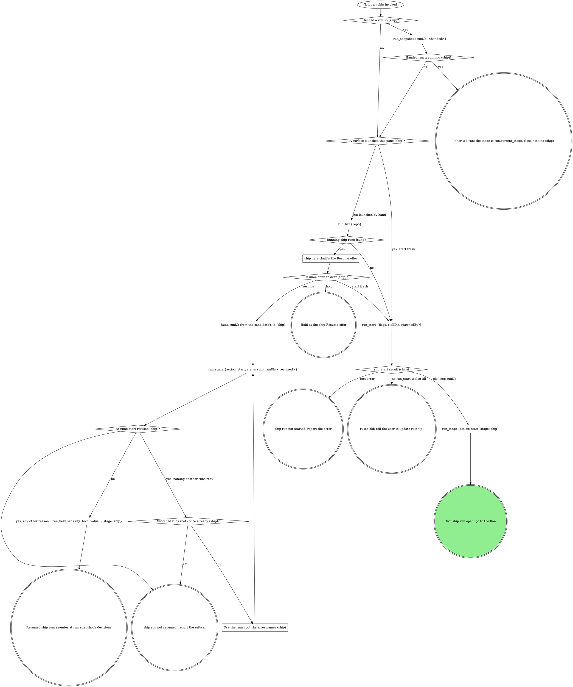

# ship

The standalone entry for shipping the current branch. Same flow as the
pipeline's ship stage, reached directly: target from the checkout. Two
graphs: the run graph opens or inherits the run, the flow graph ships and
closes it. The domain rules below run their own steps in their own order;
the flow graph is where every mechanical move in them lands.

## Run



An own run is a fresh or resumed one: it records identity and closes at the
end. An inherited run records no identity, closes nothing, and hands
control back to the verb that invoked this one.

The flags for this verb, rendered by the compiler:

{{run-start.flags:ship}}

`run_start` takes `flags` = the `ship` flag string from the block above,
verbatim (the value, never its key), `skillDir` = this skill's own
directory, `${CLAUDE_SKILL_DIR}`, as an absolute path, and `spawnedBy` only
when a board or another surface launched this pane. Keep the returned
`runDb` and pass it to every `run_*` call in this verb; nothing is exported.
Every gate below writes its `gate` field and its decision with
`stage: "ship"` in an own run, `stage: run.current_stage` in an inherited
one.

### ship gate clarify: the Resume offer

`run_list` filtered to `status` = `running` and `work_type` = `ship`; never
read the run dbs by hand. Gate `clarify`: one sentence naming each
candidate's `spawned_by`, `started_at` and `current_stage`, then one
**Resume** option per candidate (recommended for a run this session started
earlier; a run another live pane owns is not yours) / **Start fresh**, and
**Hold** in `next`.

### Build runDb from the candidate's id (ship)

`runDb` = `<absolute home>/.mattstack/runs/<repo>/<the candidate row's id>/state.db`.
The run tools refuse `~` and relative paths. The `run_stage` start is a new
attempt that re-records this session.

### Use the runs root the error names (ship)

Rebuild `runDb` under the runs root the refusal names; everything after the
root stays the same.

{{include:run-identity}}

## Flow

`<root>` is the worktree root, the absolute path
`git rev-parse --show-toplevel` prints. `<default>` is the repo's default
branch, `git symbolic-ref --short refs/remotes/origin/HEAD` minus
`origin/`, never guessed.

```dot
digraph ship {
    rankdir=TB;

    "Trigger: a ship run is open (own or inherited)" [shape=ellipse];
    "git branch --show-current (ship)" [shape=plaintext];
    "On the default branch (ship)?" [shape=diamond];
    "Own run (default branch)?" [shape=diamond];
    "run_stage {action: fail, stage: ship, reason: the default branch}" [shape=plaintext];
    "run_status {status: failed} (default branch)" [shape=plaintext];
    "STOP: never ship the default branch" [shape=octagon style=filled fillcolor=red fontcolor=white];
    "Own run (ship identity)?" [shape=diamond];
    "run_field_set {key: branch, value: <branch>, stage: ship}" [shape=plaintext];
    "Run the domain steps before the gate (none when unbound)" [shape=box];
    "git status --porcelain; git log --oneline @{upstream}.. or -5" [shape=plaintext];
    "ship gate ship" [shape=box];
    "ship answer (ship)?" [shape=diamond];
    "dirty answer (ship)?" [shape=diamond];
    "Commit named files (ship)" [shape=box];
    "Stash them; nothing in this verb pops it" [shape=box];
    "Run the domain's fast checks (none when unbound)" [shape=box];
    "Checks pass (ship)?" [shape=diamond];
    "Fix rounds = 3 (ship)?" [shape=diamond];
    "Fix test-first, commit, rerun (ship)" [shape=box];
    "Domain rebases, and no rebase finished this pass (ship)?" [shape=diamond];
    "git_rebase {tree: <root>, onto: origin/<default>}" [shape=plaintext];
    "Rebase status (ship)?" [shape=diamond];
    "Conflict rounds = 3 (ship)?" [shape=diamond];
    "Resolve the files, then git rebase --continue on Bash (ship)" [shape=box];
    "Continue result (ship)?" [shape=diamond];
    "Rebase in progress (ship abort)?" [shape=diamond];
    "git_rebase {tree: <root>, abort: true}" [shape=plaintext];
    "git_rebase {tree: <root>, abort: true} (after a failed continue)" [shape=plaintext];

    "git remote get-url origin (ship)" [shape=plaintext];
    "Forge host (ship, before git_push)?" [shape=diamond];
    "ship gate clarify: which forge?" [shape=box];
    "mr_for_branch {repoName: <root>, branches: [<branch>]} (before git_push)" [shape=plaintext];
    "Open MR on the branch (before git_push)?" [shape=diamond];
    "Push moves the MR's head (ship)?" [shape=diamond];
    "mr_pipeline {repoName, iid} (the prior pipeline id, ship)" [shape=plaintext];
    "git_push {tree: <root>, setUpstream: true}" [shape=plaintext];
    "git_push result (ship)?" [shape=diamond];
    "Retried with the printed root (ship)?" [shape=diamond];
    "git_push {tree: <the root the error prints>, setUpstream: true}" [shape=plaintext];
    "STOP: push only with git_push (ship)" [shape=octagon style=filled fillcolor=red fontcolor=white];
    "ship off-script gate: git_push refused" [shape=box];
    "ship off-script answer (git_push)?" [shape=diamond];
    "Confirm the human's push landed (ship)" [shape=box];
    "Push landed (ship)?" [shape=diamond];

    "Forge host (ship, open the MR)?" [shape=diamond];
    "mr_for_branch {repoName: <root>, branches: [<branch>]} (after git_push)" [shape=plaintext];
    "Open MR on the branch (after git_push)?" [shape=diamond];
    "Created once already (ship)?" [shape=diamond];
    "mr_create {repoName: <root>, sourceBranch, targetBranch: <default>, title, description, draft, squash?, labels?}" [shape=plaintext];
    "mr_create result (ship)?" [shape=diamond];
    "mr_update {mrUrl, squash: true}" [shape=plaintext];
    "STOP: GitLab reads and writes go through mr_* tools (ship)" [shape=octagon style=filled fillcolor=red fontcolor=white];
    "gh pr create --fill --base <default>, --draft unless the gate said ready" [shape=plaintext];
    "gh pr create result (ship)?" [shape=diamond];
    "Own run (MR identity)?" [shape=diamond];
    "run_field_set {key: mr, value: <url>, stage: ship}" [shape=plaintext];

    "Capture the AFTER when the domain names one (ship)" [shape=box];
    "AFTER captured, or none named (ship)?" [shape=diamond];
    "AFTER attempts = 3 (ship)?" [shape=diamond];
    "Files to attach (ship)?" [shape=diamond];
    "mr_upload {mrUrl, path} per file; keep each markdown" [shape=plaintext];
    "Domain owns the title or description (ship)?" [shape=diamond];
    "mr_view {mrUrl, maxAgeMs: 5000}, or gh pr view <mr> --json title,body on GitHub" [shape=plaintext];
    "Write the title and description (ship)" [shape=box];
    "mr_update {mrUrl, title, description}, or gh pr edit on GitHub" [shape=plaintext];

    "Domain runs CI after the MR (ship)?" [shape=diamond];
    "Run watch-ci inheriting this run" [shape=box];
    "watch-ci handed back what (ship)?" [shape=diamond];
    "mr_view {repoName, iid, maxAgeMs: 5000}, or gh pr view <mr> --json isDraft on GitHub (ship draft check)" [shape=plaintext];
    "MR still a draft (ship)?" [shape=diamond];
    "ship gate mark-ready" [shape=box];
    "mark-ready answer (ship)?" [shape=diamond];
    "Forge host (ship, mark-ready)?" [shape=diamond];
    "mr_ready {repoName: <root>, iid}" [shape=plaintext];
    "gh pr ready <number>" [shape=plaintext];

    "Which exit is this (ship)?" [shape=diamond];
    "run_stage {action: done, stage: ship}" [shape=plaintext];
    "run_status {status: done}" [shape=plaintext];
    "run_stage {action: done, stage: ship} (abort)" [shape=plaintext];
    "run_status {status: abandoned}" [shape=plaintext];
    "run_stage {action: fail, stage: ship, reason}" [shape=plaintext];
    "run_status {status: failed}" [shape=plaintext];
    "Hand the answer back to the caller (ship)" [shape=doublecircle];
    "Held in ship: the run stays open" [shape=doublecircle];
    "ship run abandoned" [shape=doublecircle];
    "ship failed" [shape=doublecircle];
    "Shipped" [shape=doublecircle style=filled fillcolor=lightgreen];

    "Trigger: a ship run is open (own or inherited)" -> "git branch --show-current (ship)";
    "git branch --show-current (ship)" -> "On the default branch (ship)?";
    "On the default branch (ship)?" -> "Own run (default branch)?" [label="yes"];
    "On the default branch (ship)?" -> "Own run (ship identity)?" [label="no"];
    "Own run (default branch)?" -> "run_stage {action: fail, stage: ship, reason: the default branch}" [label="yes: close it first"];
    "Own run (default branch)?" -> "STOP: never ship the default branch" [label="no: inherited"];
    "run_stage {action: fail, stage: ship, reason: the default branch}" -> "run_status {status: failed} (default branch)";
    "run_status {status: failed} (default branch)" -> "STOP: never ship the default branch";
    "Own run (ship identity)?" -> "run_field_set {key: branch, value: <branch>, stage: ship}" [label="yes"];
    "Own run (ship identity)?" -> "Run the domain steps before the gate (none when unbound)" [label="no: inherited"];
    "run_field_set {key: branch, value: <branch>, stage: ship}" -> "Run the domain steps before the gate (none when unbound)";
    "Run the domain steps before the gate (none when unbound)" -> "git status --porcelain; git log --oneline @{upstream}.. or -5";
    "git status --porcelain; git log --oneline @{upstream}.. or -5" -> "ship gate ship";
    "ship gate ship" -> "ship answer (ship)?";
    "ship answer (ship)?" -> "dirty answer (ship)?" [label="proceed"];
    "ship answer (ship)?" -> "Run the domain steps before the gate (none when unbound)" [label="iterate: redo with their note"];
    "ship answer (ship)?" -> "Which exit is this (ship)?" [label="hold"];
    "ship answer (ship)?" -> "Rebase in progress (ship abort)?" [label="dirty = abort: nothing is pushed"];
    "Rebase in progress (ship abort)?" -> "git_rebase {tree: <root>, abort: true}" [label="yes"];
    "Rebase in progress (ship abort)?" -> "Which exit is this (ship)?" [label="no"];
    "git_rebase {tree: <root>, abort: true}" -> "Which exit is this (ship)?";
    "dirty answer (ship)?" -> "Commit named files (ship)" [label="commit"];
    "dirty answer (ship)?" -> "Stash them; nothing in this verb pops it" [label="stash"];
    "dirty answer (ship)?" -> "Run the domain's fast checks (none when unbound)" [label="clean tree"];
    "Commit named files (ship)" -> "Run the domain's fast checks (none when unbound)";
    "Stash them; nothing in this verb pops it" -> "Run the domain's fast checks (none when unbound)";
    "Run the domain's fast checks (none when unbound)" -> "Checks pass (ship)?";
    "Checks pass (ship)?" -> "Domain rebases, and no rebase finished this pass (ship)?" [label="yes"];
    "Checks pass (ship)?" -> "Fix rounds = 3 (ship)?" [label="no"];
    "Fix rounds = 3 (ship)?" -> "Fix test-first, commit, rerun (ship)" [label="no"];
    "Fix rounds = 3 (ship)?" -> "ship gate ship" [label="yes: reopen, failing output quoted"];
    "Fix test-first, commit, rerun (ship)" -> "Run the domain's fast checks (none when unbound)";
    "Domain rebases, and no rebase finished this pass (ship)?" -> "git_rebase {tree: <root>, onto: origin/<default>}" [label="yes"];
    "Domain rebases, and no rebase finished this pass (ship)?" -> "git remote get-url origin (ship)" [label="no"];
    "git_rebase {tree: <root>, onto: origin/<default>}" -> "Rebase status (ship)?";
    "Rebase status (ship)?" -> "Run the domain's fast checks (none when unbound)" [label="clean"];
    "Rebase status (ship)?" -> "Conflict rounds = 3 (ship)?" [label="conflict"];
    "Rebase status (ship)?" -> "Which exit is this (ship)?" [label="any other error: a failure, quoted as the reason"];
    "Conflict rounds = 3 (ship)?" -> "Resolve the files, then git rebase --continue on Bash (ship)" [label="no"];
    "Conflict rounds = 3 (ship)?" -> "ship gate ship" [label="yes: reopen, conflicted files quoted"];
    "Resolve the files, then git rebase --continue on Bash (ship)" -> "Continue result (ship)?";
    "Continue result (ship)?" -> "Conflict rounds = 3 (ship)?" [label="another commit conflicted"];
    "Continue result (ship)?" -> "Run the domain's fast checks (none when unbound)" [label="rebase finished"];
    "Continue result (ship)?" -> "git_rebase {tree: <root>, abort: true} (after a failed continue)" [label="any other error: a failure, quoted"];
    "git_rebase {tree: <root>, abort: true} (after a failed continue)" -> "Which exit is this (ship)?";

    "git remote get-url origin (ship)" -> "Forge host (ship, before git_push)?";
    "Forge host (ship, before git_push)?" -> "mr_for_branch {repoName: <root>, branches: [<branch>]} (before git_push)" [label="GitLab"];
    "Forge host (ship, before git_push)?" -> "git_push {tree: <root>, setUpstream: true}" [label="GitHub"];
    "Forge host (ship, before git_push)?" -> "ship gate clarify: which forge?" [label="anything else"];
    "ship gate clarify: which forge?" -> "Forge host (ship, before git_push)?" [label="answered: the named forge"];
    "mr_for_branch {repoName: <root>, branches: [<branch>]} (before git_push)" -> "Open MR on the branch (before git_push)?";
    "Open MR on the branch (before git_push)?" -> "Push moves the MR's head (ship)?" [label="yes"];
    "Push moves the MR's head (ship)?" -> "mr_pipeline {repoName, iid} (the prior pipeline id, ship)" [label="yes: HEAD differs"];
    "Push moves the MR's head (ship)?" -> "git_push {tree: <root>, setUpstream: true}" [label="no: already pushed"];
    "Open MR on the branch (before git_push)?" -> "git_push {tree: <root>, setUpstream: true}" [label="no"];
    "mr_pipeline {repoName, iid} (the prior pipeline id, ship)" -> "git_push {tree: <root>, setUpstream: true}";
    "git_push {tree: <root>, setUpstream: true}" -> "git_push result (ship)?";
    "git_push {tree: <the root the error prints>, setUpstream: true}" -> "git_push result (ship)?";
    "git_push result (ship)?" -> "Forge host (ship, open the MR)?" [label="ok"];
    "git_push result (ship)?" -> "Retried with the printed root (ship)?" [label="tree must be the absolute path of the root"];
    "git_push result (ship)?" -> "STOP: push only with git_push (ship)" [label="any other error"];
    "Retried with the printed root (ship)?" -> "git_push {tree: <the root the error prints>, setUpstream: true}" [label="no"];
    "Retried with the printed root (ship)?" -> "STOP: push only with git_push (ship)" [label="yes"];
    "STOP: push only with git_push (ship)" -> "ship off-script gate: git_push refused";
    "ship off-script gate: git_push refused" -> "ship off-script answer (git_push)?";
    "ship off-script answer (git_push)?" -> "Confirm the human's push landed (ship)" [label="take: the human pushed"];
    "ship off-script answer (git_push)?" -> "git_push {tree: <root>, setUpstream: true}" [label="take: registration fixed, retry"];
    "ship off-script answer (git_push)?" -> "Which exit is this (ship)?" [label="hand back: a failure, the refusal is the reason"];
    "ship off-script answer (git_push)?" -> "Which exit is this (ship)?" [label="hold"];
    "ship off-script answer (git_push)?" -> "ship off-script gate: git_push refused" [label="iterate: a new gate with their note"];
    "Confirm the human's push landed (ship)" -> "Push landed (ship)?";
    "Push landed (ship)?" -> "Forge host (ship, open the MR)?" [label="yes: the remote branch carries HEAD"];
    "Push landed (ship)?" -> "ship off-script gate: git_push refused" [label="no: reopen with what the comparison showed"];

    "Forge host (ship, open the MR)?" -> "mr_for_branch {repoName: <root>, branches: [<branch>]} (after git_push)" [label="GitLab"];
    "Forge host (ship, open the MR)?" -> "gh pr create --fill --base <default>, --draft unless the gate said ready" [label="GitHub"];
    "mr_for_branch {repoName: <root>, branches: [<branch>]} (after git_push)" -> "Open MR on the branch (after git_push)?";
    "Open MR on the branch (after git_push)?" -> "Own run (MR identity)?" [label="yes: keep its url"];
    "Open MR on the branch (after git_push)?" -> "Created once already (ship)?" [label="no"];
    "Created once already (ship)?" -> "mr_create {repoName: <root>, sourceBranch, targetBranch: <default>, title, description, draft, squash?, labels?}" [label="no"];
    "Created once already (ship)?" -> "Which exit is this (ship)?" [label="yes: a failure, the mr_create error is the reason"];
    "mr_create {repoName: <root>, sourceBranch, targetBranch: <default>, title, description, draft, squash?, labels?}" -> "mr_create result (ship)?";
    "mr_create result (ship)?" -> "Own run (MR identity)?" [label="url, squash applied or not asked"];
    "mr_create result (ship)?" -> "mr_update {mrUrl, squash: true}" [label="squashApplied: false"];
    "mr_create result (ship)?" -> "mr_for_branch {repoName: <root>, branches: [<branch>]} (after git_push)" [label="error, or url null: read it back, never create twice"];
    "mr_create result (ship)?" -> "STOP: GitLab reads and writes go through mr_* tools (ship)" [label="tempted to use the GitLab CLI"];
    "STOP: GitLab reads and writes go through mr_* tools (ship)" -> "mr_for_branch {repoName: <root>, branches: [<branch>]} (after git_push)";
    "mr_update {mrUrl, squash: true}" -> "Own run (MR identity)?";
    "gh pr create --fill --base <default>, --draft unless the gate said ready" -> "gh pr create result (ship)?";
    "gh pr create result (ship)?" -> "Own run (MR identity)?" [label="url printed"];
    "gh pr create result (ship)?" -> "Own run (MR identity)?" [label="already exists: keep the url it prints"];
    "gh pr create result (ship)?" -> "Which exit is this (ship)?" [label="any other error: a failure, quoted as the reason"];
    "Own run (MR identity)?" -> "run_field_set {key: mr, value: <url>, stage: ship}" [label="yes"];
    "Own run (MR identity)?" -> "Capture the AFTER when the domain names one (ship)" [label="no: inherited"];
    "run_field_set {key: mr, value: <url>, stage: ship}" -> "Capture the AFTER when the domain names one (ship)";

    "Capture the AFTER when the domain names one (ship)" -> "AFTER captured, or none named (ship)?";
    "AFTER captured, or none named (ship)?" -> "Files to attach (ship)?" [label="yes"];
    "AFTER captured, or none named (ship)?" -> "AFTER attempts = 3 (ship)?" [label="no: the capture failed"];
    "AFTER attempts = 3 (ship)?" -> "Capture the AFTER when the domain names one (ship)" [label="no: another attempt"];
    "AFTER attempts = 3 (ship)?" -> "Files to attach (ship)?" [label="yes: go on without it; the description names the gap"];
    "Files to attach (ship)?" -> "mr_upload {mrUrl, path} per file; keep each markdown" [label="yes, GitLab"];
    "Files to attach (ship)?" -> "Domain owns the title or description (ship)?" [label="no, or GitHub: link the paths"];
    "mr_upload {mrUrl, path} per file; keep each markdown" -> "Domain owns the title or description (ship)?";
    "Domain owns the title or description (ship)?" -> "mr_view {mrUrl, maxAgeMs: 5000}, or gh pr view <mr> --json title,body on GitHub" [label="yes, or files or an AFTER to link"];
    "Domain owns the title or description (ship)?" -> "Domain runs CI after the MR (ship)?" [label="no: the create call wrote them"];
    "mr_view {mrUrl, maxAgeMs: 5000}, or gh pr view <mr> --json title,body on GitHub" -> "Write the title and description (ship)";
    "Write the title and description (ship)" -> "mr_update {mrUrl, title, description}, or gh pr edit on GitHub";
    "mr_update {mrUrl, title, description}, or gh pr edit on GitHub" -> "Domain runs CI after the MR (ship)?";

    "Domain runs CI after the MR (ship)?" -> "Run watch-ci inheriting this run" [label="yes"];
    "Domain runs CI after the MR (ship)?" -> "Which exit is this (ship)?" [label="no: done, print the URL"];
    "Run watch-ci inheriting this run" -> "watch-ci handed back what (ship)?";
    "watch-ci handed back what (ship)?" -> "mr_view {repoName, iid, maxAgeMs: 5000}, or gh pr view <mr> --json isDraft on GitHub (ship draft check)" [label="verdict: green"];
    "watch-ci handed back what (ship)?" -> "Which exit is this (ship)?" [label="verdict: red after its ci gate: done"];
    "watch-ci handed back what (ship)?" -> "Which exit is this (ship)?" [label="off-script answer or failure"];
    "watch-ci handed back what (ship)?" -> "Which exit is this (ship)?" [label="stood down: the doctor holds the lease"];
    "watch-ci handed back what (ship)?" -> "Which exit is this (ship)?" [label="held"];
    "mr_view {repoName, iid, maxAgeMs: 5000}, or gh pr view <mr> --json isDraft on GitHub (ship draft check)" -> "MR still a draft (ship)?";
    "MR still a draft (ship)?" -> "ship gate mark-ready" [label="yes"];
    "MR still a draft (ship)?" -> "Which exit is this (ship)?" [label="no: done"];
    "ship gate mark-ready" -> "mark-ready answer (ship)?";
    "mark-ready answer (ship)?" -> "Forge host (ship, mark-ready)?" [label="mark ready now"];
    "mark-ready answer (ship)?" -> "Which exit is this (ship)?" [label="keep it draft: done"];
    "mark-ready answer (ship)?" -> "Which exit is this (ship)?" [label="go back (inherited run only)"];
    "mark-ready answer (ship)?" -> "Which exit is this (ship)?" [label="hold"];
    "mark-ready answer (ship)?" -> "ship gate mark-ready" [label="iterate: a new gate with their note"];
    "Forge host (ship, mark-ready)?" -> "mr_ready {repoName: <root>, iid}" [label="GitLab"];
    "Forge host (ship, mark-ready)?" -> "gh pr ready <number>" [label="GitHub"];
    "mr_ready {repoName: <root>, iid}" -> "Which exit is this (ship)?";
    "gh pr ready <number>" -> "Which exit is this (ship)?";

    "Which exit is this (ship)?" -> "run_stage {action: done, stage: ship}" [label="own run: done, or stood down"];
    "Which exit is this (ship)?" -> "run_stage {action: done, stage: ship} (abort)" [label="own run: abort"];
    "Which exit is this (ship)?" -> "run_stage {action: fail, stage: ship, reason}" [label="own run: a failure or an off-script hand back"];
    "Which exit is this (ship)?" -> "Hand the answer back to the caller (ship)" [label="inherited run: any exit but hold"];
    "Which exit is this (ship)?" -> "Held in ship: the run stays open" [label="hold"];
    "run_stage {action: done, stage: ship}" -> "run_status {status: done}";
    "run_status {status: done}" -> "Shipped";
    "run_stage {action: done, stage: ship} (abort)" -> "run_status {status: abandoned}";
    "run_status {status: abandoned}" -> "ship run abandoned";
    "run_stage {action: fail, stage: ship, reason}" -> "run_status {status: failed}";
    "run_status {status: failed}" -> "ship failed";
}
```

### Run the domain steps before the gate (none when unbound)

The domain's gathering steps: sanity of the diff against the ticket, the
branch and ticket checks, an existing-MR lookup, any mandatory pre-ship
review. Each one that raises a question adds it to the `ship` gate rather
than asking on its own. Unbound, there are none.

### ship gate ship

Before anything is pushed. One sentence above the form: the branch, the
commits about to go, and whether the tree is dirty. When the gate reopens
with a rebase in progress (the conflict rounds are spent), the context says
so, and Abort aborts that rebase first.

| Question | Options (recommended first) | Shown when |
|---|---|---|
| `dirty` | **Commit the changes** / **Stash them** / **Abort** | the tree is dirty |
| `open_as` | **Push and open as draft** / **Push and open ready** | always |
| the domain's own | as the domain rules word them (a ticket mismatch, an MR already open) | the domain declares them |
| `next` | **Proceed** / **Iterate here** / **Hold** | always |

Scope `ship`. Selection: `{"dirty":"commit|stash|abort|null","open_as":"draft|ready","domain":{<answers>},"next":"proceed|iterate|hold","note":"<their words or null>"}`.
Abort and Hold push nothing.

### Commit named files (ship)

Stage the files by name, never everything; the subject follows the
domain's commit rules, the branch's own style when unbound.

### Stash them; nothing in this verb pops it

A tagged stash (`git stash push -u -m "<unique tag>"`); the git stash stack
is shared with every worktree, so never pop by position. Say in the final
report that the stash exists.

### Run the domain's fast checks (none when unbound)

Only the checks the domain names, on the changed files. Revert generated
drift the checks leave behind before continuing. A full suite the domain
rules out stays out: CI runs it. A finished rebase, clean or resolved,
sends the checks round again because the tree changed under them; the "no
rebase finished this pass" guard keeps that second round from rebasing
again.

### Fix test-first, commit, rerun (ship)

Each fix gets its failing test first, then the fix, then a commit. The
counter is fix rounds within this pass through the verb.

### Resolve the files, then git rebase --continue on Bash (ship)

Resolve each conflicted file `git_rebase` returned, then continue the
rebase on Bash (no tool continues one). A later commit that conflicts
counts as another round. A finished rebase goes back to the fast checks,
like a clean one.

### ship gate clarify: which forge?

The origin host is neither GitLab nor GitHub. Ask which forge it is, quoting
the `git remote get-url origin` line as the context.

### ship off-script gate: git_push refused

Scope `off-script:<stage>:<n>` (`n` counts from 1 within the stage
attempt), `context` quoting the refusal.

| Question | Options |
|---|---|
| `action` | **Take the proposed move** (the value spells the move in full, such as the human pushing, or a fixed tree registration and a retry) / **Hand back** |
| `next` | **Proceed** (Recommended) / **Iterate here** / **Hold** |

Selection: `{"move":"<the move>","why":"<the refusal>","action":"take|handback","next":"proceed|iterate|hold","note":"<their words or null>"}`.

### Confirm the human's push landed (ship)

The human pushed outside this verb. Compare `git rev-parse HEAD` with the
remote branch and say what it shows in the final report; never push from
here. The push landed when the remote branch carries HEAD; otherwise the
off-script gate reopens with the comparison as its context.

### Capture the AFTER when the domain names one (ship)

The same view as the domain's BEFORE, on the sha just pushed. The counter
is attempts within this pass; after the third failure, ship without it and
say in the description what was tried. Unbound, there is no AFTER.

### Write the title and description (ship)

Title from the ticket or the first commit subject; the body links the
ticket and every attachment, with the upload markdown where it exists. The
update replaces the whole body, so start from the one just read back: keep
what is already there (a teammate's edits) and change only what this verb
owns. The domain's title, template and voice rules win over this paragraph.

### Run watch-ci inheriting this run

Invoke the `watch-ci` verb with this run's `runDb`, so it inherits the run
and fires no gate beyond `ci`. Hand it the forge, the MR, the pushed sha
(`git rev-parse HEAD` after the push) and, when one was kept, the prior
pipeline id. The prior id is read only when the push moves the branch (the
open MR's sha from `mr_for_branch` differs from `git rev-parse HEAD`), so
the sha guard can tell the new pipeline from the old one; with no prior id
handed over, the guard checks the sha alone. It hands back its verdict (after its `ci` gate when red),
an off-script answer, a failure, a stand-down, or a hold. A stand-down means
the doctor holds the MR's lease: an own run closes `done`, since the MR
exists, and the report says the doctor has it; an inherited run hands the
stand-down back.

### ship gate mark-ready

Green, and the MR still a draft. One sentence above the form: CI is green;
the attachments are there (or are not).

| Question | Options (recommended first) | Shown when |
|---|---|---|
| `ready` | **Mark ready now** (when CI is green and the evidence is attached) / **Keep it draft** | always |
| `next` | **Proceed** / **Iterate here** / **Go back** / **Hold** | always; **Go back** only in an inherited run |
| `to` | one option per earlier stage, split `to-1`, `to-2`, ... over 4; with exactly one candidate it labels **Go back to `<stage>`** in `next` instead | Go back answered and `run_snapshot` shows more than one earlier stage row |

Scope `mark-ready`. Selection: `{"ready":true|false,"next":"proceed|iterate|redirect|hold","to":"<stage or null>","note":"<their words or null>"}`.

## What the graph cannot show

- After a rebase that rewrote already-pushed commits, push with
  `git_push {tree: <root>, forceWithLease: true}` instead, and only once
  you have seen its checks pass in this session. Never force otherwise.
- Keep the `url` `mr_create` returns as `mrUrl` for every later write, and
  print it. `mr_create` takes `draft: false` only when the gate said ready;
  write its title from the branch's commits.
- A hold at any gate leaves the run open: the turn ends naming the run and
  the gate, and nothing closes.

## Domain rules

If a rule below asks for a move this graph marks STOP, take the off-script edge instead.

{{slot:domain}}

When nothing is inlined above, the graph alone is the flow: no steps before
the gate, no fast checks, no rebase, no AFTER, no CI watch.

## Gate protocol

{{include:gate-protocol}}

## Wrap-up form contract

{{include:wrap-up-form}}
