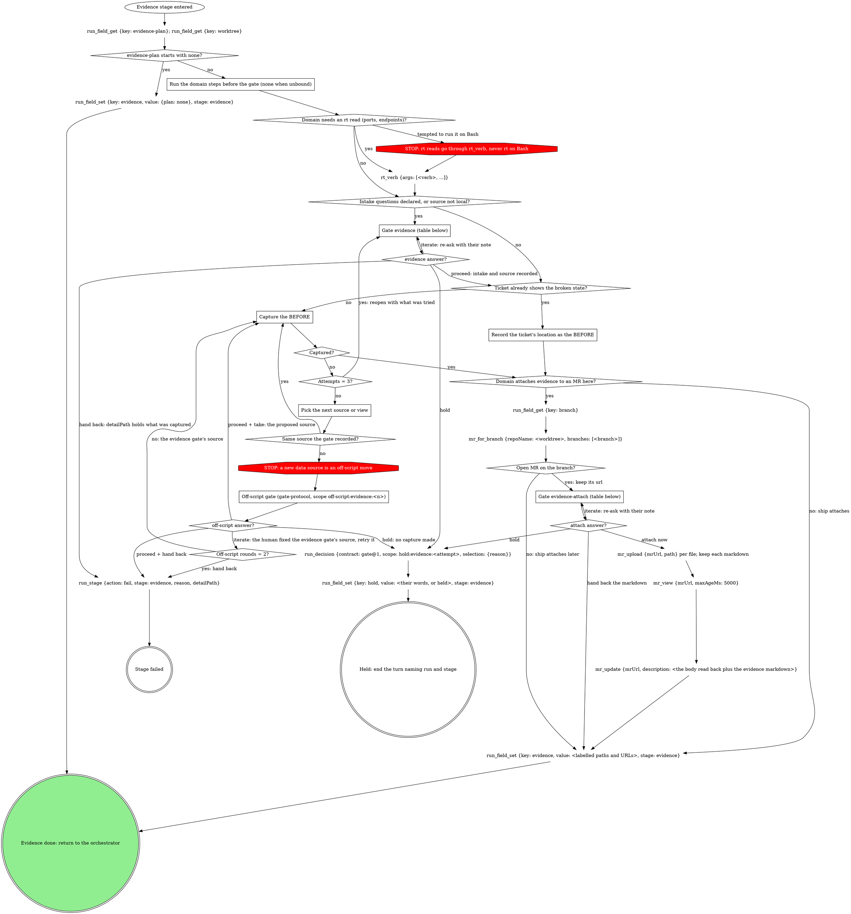

# stage: evidence

{{stage.fields}}

Run state: the orchestrator opens and closes this stage, so never write
`run_stage` `start` or `done` here. Read consumes with `run_field_get`,
write `evidence` with `run_field_set` (`stage: "evidence"`) the moment it
exists, and on failure write `run_stage {action: fail, stage: "evidence",
reason, detailPath}` with `detailPath` = whatever was captured so far.

Capture the BEFORE now, before implementation changes the surface.

### Run the domain steps before the gate (none when unbound)

The domain's gathering steps: resolving the running app's ports and its
data source, and any other fact the gate's own sentence or the `source`
question needs. Their result decides whether `source` fires below. Any rt
read among them goes through `rt_verb`, never Bash.

### Record the ticket's location as the BEFORE

When the ticket already embeds the broken state (a screenshot, a failing
output), that is the before: record where it sits instead of recapturing.

### Capture the BEFORE

Follow the domain's capture method for the plan's evidence type. Never
reconstruct a before by reverting code on a running dev server: it
produces stale, false befores. Unbound, capture what a generic toolchain
can (the failing test output, a CLI transcript, or a screenshot the user
provides) and store it under `~/.mattstack/work/<work-id>/evidence/`.

### Pick the next source or view

A capture that failed (a blank page, a missing record, a wrong route)
gets one different attempt per round: another view, another record, the
same source. The counter is attempts within this pass through the stage.

## What the graph cannot show

- **Off-script answers.** Read `next` first: Hold ends the turn with no
  capture made; Iterate means the human fixed the evidence gate's source
  and ignores `action`; only Proceed applies `action`. Retrying the
  evidence gate's source is Iterate; the proposed new source is only Take;
  rounds count per stage attempt.

## Gate `evidence` (before any capture)

One sentence above the form: what the plan asks for and what is unknown.

| Question | Options (recommended first) | Shown when |
|---|---|---|
| the domain's intake | as the domain words them; an open-ended one is free text in the form | the domain declares them |
| `source` | **Proceed with `<source>`** / **Switch to local** | the data source is not local |
| `next` | **Proceed** / **Iterate here** / **Hold**, plus **Hand back** once three captures have failed | always |

Selection: `{"intake":{<answers>},"source":"<as confirmed>","next":"proceed|iterate|hold|handback","note":"<their words or null>"}`.
Hand back fails the stage with `detailPath` = what was captured so far.

## Gate `evidence-attach` (the domain attaches here and the lookup found an open MR)

One sentence above the form: what was captured and where it sits.

| Question | Options (recommended first) | Shown when |
|---|---|---|
| `annotations` | the proposed annotations, multi-select, all pre-selected; split `annotations-1`, ... over 4 | always |
| `attach` | **Hand back the markdown** (ship attaches) / **Attach to the MR now** | always |
| `next` | **Proceed** / **Iterate here** / **Hold** | always |

Selection: `{"annotations":[...],"attach":"now|handback"}`.

| Thought | Reality |
|---|---|
| "I have no concrete case ids to offer, so I'll explain the gap after the form" | An open-ended intake question needs no invented options: it is free text inside the form. Prose after the form is what the gate forbids. |

## Domain rules

The domain rules below supply the capture method, the intake questions
and the attach format. Where a domain step names a move the graph above
marks STOP (an rt command on Bash, a different data source), the STOP node
wins.

{{slot:domain}}

When nothing is inlined above, the graph and the Capture section are the
whole flow.

Finish with `evidence` as an object of labelled paths or URLs, at minimum
the before. Ship attaches the pair and captures any AFTER.

## Gate protocol

{{include:gate-protocol}}

## Wrap-up form contract

{{include:wrap-up-form}}
