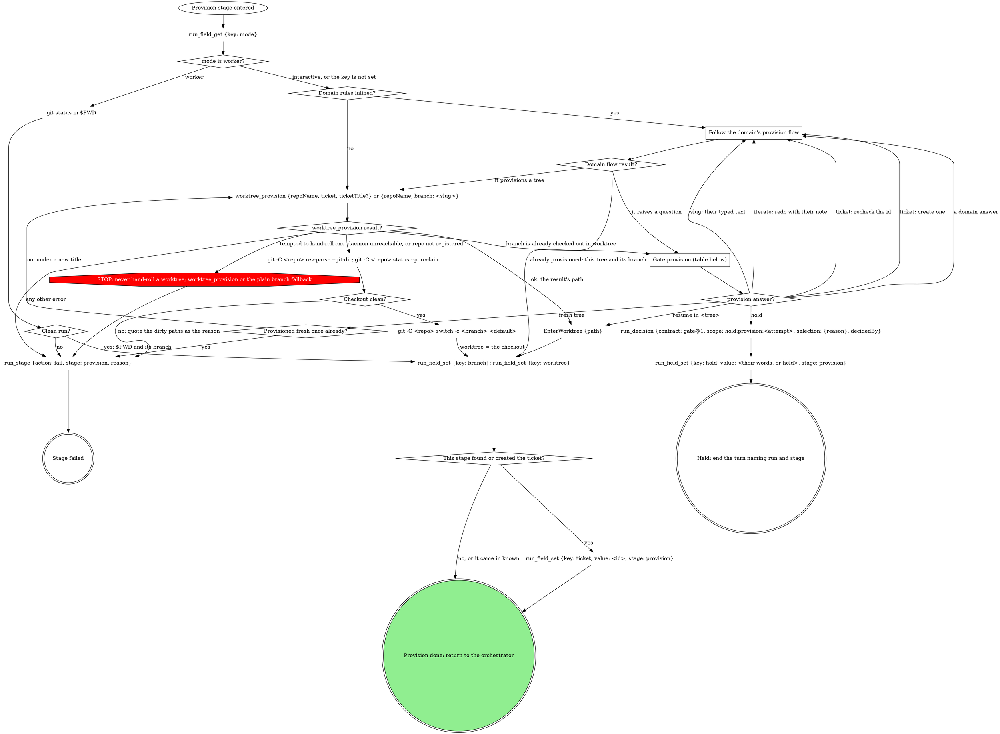

# stage: provision

{{stage.fields}}

Run state: the orchestrator opens and closes this stage, so never write
`run_stage` `start` or `done` here. Read consumes with `run_field_get`,
write each produce with `run_field_set` (`stage: "provision"`) the moment
it exists, and on failure write `run_stage {action: fail, stage:
"provision", reason}` naming what failed.

### Follow the domain's provision flow

The domain's own acquisition: finding or creating the ticket, choosing the
branch name, provisioning its way. Each question it raises goes to the
`provision` gate rather than being asked on its own; when the pane is
already sitting on the ticket's branch in a worktree, the domain confirms
that instead of calling `worktree_provision` again and the graph records
that tree and branch directly.

## What the graph cannot show

- `worktree_provision` takes `repoName` (the repo's checkout path) and
  `ticket`, plus `ticketTitle` whenever a title is known: without it the
  branch gets no slug. With no ticket, pass `branch` = a short kebab slug
  of the task description instead. A cold create can take minutes; say
  that it is provisioning.
- The plain branch fallback derives the branch from the ticket id and a
  kebab slug of its title (or of the task description). It refuses a dirty
  checkout and passes the repo's default branch as the start point. Never
  commit to the default branch.
- `worktree` is always an absolute path: the checkout itself when no
  separate worktree is used.
- `ticket` is not a declared produce: a ticketless run is a finished run.
  Write it only when this stage is what found or created it.

## Gate `provision`

One sentence above the form: what was found (the tree, the missing
ticket, the title).

| Question | Options (recommended first) | Shown when |
|---|---|---|
| `resume_in` | **Resume in `<tree>`** / **Fresh tree** | the branch is already checked out |
| `ticket` | **Create one** / **I will recheck the id** | a ticket was not found |
| `slug` | the slug as their text (a typed slug arrives as the note, or as `text`) | the title is too generic for a slug |
| the domain's own | as the domain words them | the domain declares them |
| `next` | **Proceed** / **Iterate here** / **Hold** | always |

Selection: `{"resume_in":"<tree or null>","ticket":"create|recheck|null","slug":"<text or null>","domain":{<answers>},"next":"proceed|iterate|hold","note":"<their words or null>"}`.

## Domain rules

The domain rules below supply the provision flow, the ticket lookup and
extra gate questions. Where a domain step names a move the graph above
marks STOP (hand-rolling a worktree), the STOP node wins.

{{slot:domain}}

When nothing is inlined above, the graph alone is the flow.

## Gate protocol

{{include:gate-protocol}}

## Wrap-up form contract

{{include:wrap-up-form}}
