# stage: watch-ci

{{stage.fields}}

Run state: the orchestrator opens and closes this stage, so never write
`run_stage` `start` or `done` here. Read consumes with `run_field_get`,
write `ci` with `run_field_set` (`stage: "watch-ci"`) once a verdict
exists, and on failure write `run_stage {action: fail, stage: "watch-ci",
reason, detailPath}` with `detailPath` = the triage report.

`<scripts>` is `{{stage.dir}}/scripts/` and `<forge>` is
`{{stage.dir}}/parts/forge/scripts/ci-forge.sh`: the watcher, triage and
attendant scripts are vendored beside this file. GitLab MR tools take
`repoName` = this worktree's absolute path and `iid` = the iid in `mr`.

```dot
digraph watch_ci {
    rankdir=TB;

    "Watch-ci stage entered" [shape=ellipse];
    "run_field_get {key: mr}; run_field_get {key: branch}" [shape=plaintext];
    "mr set?" [shape=diamond];
    "<scripts>/ci-attendant.sh claim <mr-url> <iid> --branch <branch>" [shape=plaintext];
    "claim exit?" [shape=diamond];
    "Stand down: report it, stop or watch read-only" [shape=doublecircle];
    "STOP: while the doctor holds the lease, every commit, push and retry is the doctor's" [shape=octagon style=filled fillcolor=red fontcolor=white];
    "Which flow?" [shape=diamond];
    "Follow the domain's watch flow" [shape=box];
    "<scripts>/ci-watch.sh --forge <forge> --ref <branch> --timeout 2700 (background)" [shape=plaintext];
    "watcher exit?" [shape=diamond];
    "Read the triage report" [shape=box];
    "Only INFRA blocking failures, none retried yet?" [shape=diamond];
    "Run the report's retry command once per job" [shape=box];
    "Relaunched once already?" [shape=diamond];
    "Verify the branch was pushed" [shape=box];
    "mr_pipeline {repoName, iid}" [shape=plaintext];
    "Settled?" [shape=diamond];
    "Polled 45 minutes?" [shape=diamond];
    "sleep 60 as a background Bash task; ci-attendant.sh heartbeat" [shape=plaintext];
    "mr_job_trace {repoName, iid, jobId} per failed job" [shape=plaintext];
    "Classify each failure REAL or INFRA" [shape=box];
    "INFRA only, each retried under once?" [shape=diamond];
    "mr_retry {repoName, iid, jobId}" [shape=plaintext];
    "gh pr checks <mr> --watch" [shape=plaintext];
    "Checks green?" [shape=diamond];
    "STOP: GitLab CI reads and retries go through mr_pipeline, mr_job_trace and mr_retry, never the GitLab CLI" [shape=octagon style=filled fillcolor=red fontcolor=white];
    "Gate ci (table below)" [shape=box];
    "ci answer?" [shape=diamond];
    "run_field_set {key: ci, value: red: <triage>, stage: watch-ci}" [shape=plaintext];
    "run_status {status: abandoned}" [shape=plaintext];
    "mr_view {repoName, iid, maxAgeMs: 5000}, or gh pr view <mr> --json isDraft on GitHub" [shape=plaintext];
    "MR still a draft?" [shape=diamond];
    "Gate mark-ready (table below)" [shape=box];
    "ready answer?" [shape=diamond];
    "Forge host?" [shape=diamond];
    "Gate clarify: which forge?" [shape=box];
    "mr_ready {repoName, iid}" [shape=plaintext];
    "gh pr ready <number>" [shape=plaintext];
    "run_field_set {key: ci, value: green, stage: watch-ci}" [shape=plaintext];
    "Was a lease claimed?" [shape=diamond];
    "<scripts>/ci-attendant.sh release <mr-url> <iid>" [shape=plaintext];
    "Which exit is this?" [shape=diamond];
    "Fixed the claim call once already?" [shape=diamond];
    "run_stage {action: fail, stage: watch-ci, reason}" [shape=plaintext];
    "run_decision {contract: gate@1, scope: hold:watch-ci:<attempt>, selection: {reason}, decidedBy}" [shape=plaintext];
    "run_field_set {key: hold, value: <their words, or held>, stage: watch-ci}" [shape=plaintext];
    "Stage failed" [shape=doublecircle];
    "Hand Fix and re-push to the orchestrator: Redirect to implement" [shape=doublecircle];
    "Hand the Go back answer to the orchestrator" [shape=doublecircle];
    "Held: end the turn naming run and stage" [shape=doublecircle];
    "Run abandoned" [shape=doublecircle];
    "Watch-ci done: return to the orchestrator" [shape=doublecircle style=filled fillcolor=lightgreen];

    "Watch-ci stage entered" -> "run_field_get {key: mr}; run_field_get {key: branch}";
    "run_field_get {key: mr}; run_field_get {key: branch}" -> "mr set?";
    "mr set?" -> "<scripts>/ci-attendant.sh claim <mr-url> <iid> --branch <branch>" [label="yes"];
    "mr set?" -> "Gate ci (table below)" [label="no: reason is no MR to watch, ship first"];
    "<scripts>/ci-attendant.sh claim <mr-url> <iid> --branch <branch>" -> "claim exit?";
    "claim exit?" -> "Which flow?" [label="0: the MR is yours"];
    "claim exit?" -> "STOP: while the doctor holds the lease, every commit, push and retry is the doctor's" [label="3: the doctor is repairing it"];
    "claim exit?" -> "Fixed the claim call once already?" [label="any other exit: a usage error"];
    "Fixed the claim call once already?" -> "<scripts>/ci-attendant.sh claim <mr-url> <iid> --branch <branch>" [label="no: fix what the usage line names"];
    "Fixed the claim call once already?" -> "run_stage {action: fail, stage: watch-ci, reason}" [label="yes: the usage line is the reason"];
    "run_stage {action: fail, stage: watch-ci, reason}" -> "Stage failed";
    "STOP: while the doctor holds the lease, every commit, push and retry is the doctor's" -> "Stand down: report it, stop or watch read-only";
    "Which flow?" -> "Follow the domain's watch flow" [label="domain rules inlined"];
    "Which flow?" -> "<scripts>/ci-watch.sh --forge <forge> --ref <branch> --timeout 2700 (background)" [label="forge bound, no domain"];
    "Which flow?" -> "mr_pipeline {repoName, iid}" [label="neither, GitLab"];
    "Which flow?" -> "gh pr checks <mr> --watch" [label="neither, GitHub"];
    "Follow the domain's watch flow" -> "mr_view {repoName, iid, maxAgeMs: 5000}, or gh pr view <mr> --json isDraft on GitHub" [label="green"];
    "Follow the domain's watch flow" -> "Gate ci (table below)" [label="red, timeout or no pipeline"];
    "<scripts>/ci-watch.sh --forge <forge> --ref <branch> --timeout 2700 (background)" -> "watcher exit?";
    "watcher exit?" -> "mr_view {repoName, iid, maxAgeMs: 5000}, or gh pr view <mr> --json isDraft on GitHub" [label="0: green"];
    "watcher exit?" -> "Read the triage report" [label="1: red"];
    "watcher exit?" -> "Relaunched once already?" [label="2: timeout"];
    "watcher exit?" -> "Verify the branch was pushed" [label="4: no pipeline appeared"];
    "Read the triage report" -> "Only INFRA blocking failures, none retried yet?";
    "Only INFRA blocking failures, none retried yet?" -> "Run the report's retry command once per job" [label="yes"];
    "Only INFRA blocking failures, none retried yet?" -> "Gate ci (table below)" [label="no: a REAL failure, or retried already"];
    "Run the report's retry command once per job" -> "<scripts>/ci-watch.sh --forge <forge> --ref <branch> --timeout 2700 (background)";
    "Relaunched once already?" -> "<scripts>/ci-watch.sh --forge <forge> --ref <branch> --timeout 2700 (background)" [label="no"];
    "Relaunched once already?" -> "Gate ci (table below)" [label="yes"];
    "Verify the branch was pushed" -> "Gate ci (table below)";
    "mr_pipeline {repoName, iid}" -> "Settled?";
    "Settled?" -> "Polled 45 minutes?" [label="no"];
    "Settled?" -> "mr_view {repoName, iid, maxAgeMs: 5000}, or gh pr view <mr> --json isDraft on GitHub" [label="green"];
    "Settled?" -> "mr_job_trace {repoName, iid, jobId} per failed job" [label="red"];
    "Polled 45 minutes?" -> "sleep 60 as a background Bash task; ci-attendant.sh heartbeat" [label="no"];
    "Polled 45 minutes?" -> "Gate ci (table below)" [label="yes: timeout"];
    "sleep 60 as a background Bash task; ci-attendant.sh heartbeat" -> "mr_pipeline {repoName, iid}";
    "mr_pipeline {repoName, iid}" -> "STOP: GitLab CI reads and retries go through mr_pipeline, mr_job_trace and mr_retry, never the GitLab CLI" [label="tempted by the CLI"];
    "STOP: GitLab CI reads and retries go through mr_pipeline, mr_job_trace and mr_retry, never the GitLab CLI" -> "Settled?";
    "mr_job_trace {repoName, iid, jobId} per failed job" -> "Classify each failure REAL or INFRA";
    "Classify each failure REAL or INFRA" -> "INFRA only, each retried under once?";
    "INFRA only, each retried under once?" -> "mr_retry {repoName, iid, jobId}" [label="yes"];
    "INFRA only, each retried under once?" -> "Gate ci (table below)" [label="no"];
    "mr_retry {repoName, iid, jobId}" -> "mr_pipeline {repoName, iid}";
    "gh pr checks <mr> --watch" -> "Checks green?";
    "Checks green?" -> "mr_view {repoName, iid, maxAgeMs: 5000}, or gh pr view <mr> --json isDraft on GitHub" [label="yes"];
    "Checks green?" -> "Gate ci (table below)" [label="no"];
    "Gate ci (table below)" -> "ci answer?";
    "ci answer?" -> "Hand Fix and re-push to the orchestrator: Redirect to implement" [label="fix and re-push: write no ci"];
    "ci answer?" -> "Which flow?" [label="retry the job, then watch again"];
    "ci answer?" -> "run_field_set {key: ci, value: red: <triage>, stage: watch-ci}" [label="hand back"];
    "ci answer?" -> "Was a lease claimed?" [label="abandon"];
    "ci answer?" -> "Was a lease claimed?" [label="go back"];
    "ci answer?" -> "Was a lease claimed?" [label="hold"];
    "ci answer?" -> "Gate ci (table below)" [label="iterate: re-triage with their note"];
    "run_status {status: abandoned}" -> "Run abandoned";
    "mr_view {repoName, iid, maxAgeMs: 5000}, or gh pr view <mr> --json isDraft on GitHub" -> "MR still a draft?";
    "MR still a draft?" -> "Gate mark-ready (table below)" [label="yes"];
    "MR still a draft?" -> "run_field_set {key: ci, value: green, stage: watch-ci}" [label="no"];
    "Gate mark-ready (table below)" -> "ready answer?";
    "ready answer?" -> "Forge host?" [label="mark ready now"];
    "ready answer?" -> "run_field_set {key: ci, value: green, stage: watch-ci}" [label="keep it draft"];
    "ready answer?" -> "Was a lease claimed?" [label="go back"];
    "ready answer?" -> "Was a lease claimed?" [label="hold"];
    "ready answer?" -> "Gate mark-ready (table below)" [label="iterate: re-ask with their note"];
    "Forge host?" -> "mr_ready {repoName, iid}" [label="GitLab"];
    "Forge host?" -> "gh pr ready <number>" [label="GitHub"];
    "Forge host?" -> "Gate clarify: which forge?" [label="anything else"];
    "Gate clarify: which forge?" -> "Forge host?" [label="answered: the named forge"];
    "mr_ready {repoName, iid}" -> "run_field_set {key: ci, value: green, stage: watch-ci}";
    "gh pr ready <number>" -> "run_field_set {key: ci, value: green, stage: watch-ci}";
    "run_field_set {key: ci, value: green, stage: watch-ci}" -> "Was a lease claimed?";
    "run_field_set {key: ci, value: red: <triage>, stage: watch-ci}" -> "Was a lease claimed?";
    "Was a lease claimed?" -> "<scripts>/ci-attendant.sh release <mr-url> <iid>" [label="yes: mr was set and claimed"];
    "Was a lease claimed?" -> "Which exit is this?" [label="no: mr unset, nothing to release"];
    "<scripts>/ci-attendant.sh release <mr-url> <iid>" -> "Which exit is this?";
    "Which exit is this?" -> "Watch-ci done: return to the orchestrator" [label="ci written"];
    "Which exit is this?" -> "run_decision {contract: gate@1, scope: hold:watch-ci:<attempt>, selection: {reason}, decidedBy}" [label="hold"];
    "run_decision {contract: gate@1, scope: hold:watch-ci:<attempt>, selection: {reason}, decidedBy}" -> "run_field_set {key: hold, value: <their words, or held>, stage: watch-ci}";
    "run_field_set {key: hold, value: <their words, or held>, stage: watch-ci}" -> "Held: end the turn naming run and stage";
    "Which exit is this?" -> "Hand the Go back answer to the orchestrator" [label="go back"];
    "Which exit is this?" -> "run_status {status: abandoned}" [label="abandon"];
}
```

### Follow the domain's watch flow

The domain's own watch and triage for `mr` and `branch`. Its green verdict
goes to the draft check, and its red, timeout or missing pipeline goes to
the `ci` gate.

### Read the triage report

The watcher prints its report on exit 1: one verdict per blocking failure
(REAL or INFRA) and the retry command for each INFRA one.

### Classify each failure REAL or INFRA

REAL: the change broke it (a test, type or lint failure in touched code).
INFRA: unrelated to the change (a runner, network or dependency outage, a
known flake). One retry per INFRA job; a REAL failure goes to the gate.

## The attendant lease

Exactly one actor attends an MR's CI at a time: this stage or the board's
auto-doctor. Both honour the lease files under `~/.mattstack/ci-attendants/`.
Refresh it each poll round with `<scripts>/ci-attendant.sh heartbeat
<mr-url> <iid>`; a lease without heartbeats goes stale after 10 minutes
and the doctor may take over. A crashed session needs no cleanup.
Release it on every exit that leaves the MR unattended (a written `ci`,
Hold, Go back, Abandon); with `mr` unset nothing was claimed, so skip the
release. Fix and re-push keeps it, because the re-run claims it again, and
Stand down never touches it: that lease is the doctor's.

| Thought | Reality |
|---|---|
| "The doctor's on it, but I can fix it faster" | Two actors pushing to one branch race each other's work. Stand down or watch read-only. |
| "I'll just retry the flaky job while the doctor works" | A retry is a repair action. The lease holder does it, not you. |
| "No time for the lease, the pipeline just went red" | The claim is one command and beats untangling two half-pushed fixes. |

## Gate `ci` (red, timeout, or no pipeline)

Scope `ci:watch-ci:<attempt>`. One sentence above the form: the verdict
and a one-line triage per blocking failure.

| Question | Options (recommended first) | Shown when |
|---|---|---|
| `action` | **Fix and re-push** (a REAL failure in your change; from the third one in a run, **Hand back** is recommended instead) / **Retry the job** (a flake not yet retried) / **Hand back** (leave it red for the human) / **Abandon the run** | always |
| `next` | **Proceed** / **Iterate here** / **Go back to `<stage>`** / **Hold** | always |

Selection: `{"next":"fix|retry|handback|abandon|iterate|redirect|hold","to":"<stage or null>","note":"<their words or null>"}`.
Retry, forge bound: the report's retry command. Neither bound: `mr_retry`
on GitLab, `gh run rerun <run-id> --failed` on GitHub (the run id from the
failed check's link in `gh pr checks <mr>`).

## Gate `mark-ready` (green, `mr` set, still a draft)

One sentence above the form: CI is green for the MR's head, and whether
`evidence` is set.

| Question | Options (recommended first) | Shown when |
|---|---|---|
| `ready` | **Mark ready now** (when `evidence` is set and not `-`) / **Keep it draft** | always |
| `next` | **Proceed** / **Iterate here** / **Go back** / **Hold** | always |
| `to` | one option per earlier stage, split `to-1`, ... over 4 | Go back answered and more than one earlier stage row |

Selection: `{"ready":true|false,"next":"proceed|iterate|redirect|hold","to":"<stage or null>","note":"<their words or null>"}`.

## Domain rules

The domain and forge rules below supply the watch flow and triage rules.
Where a domain step names a move the graph above marks STOP (a GitLab CLI
read or retry, a repair while the doctor holds the lease), the STOP node
wins.

{{slot:domain}}

When nothing is inlined above, the graph's other flows apply.

## Forge

{{slot:forge}}

## Gate protocol

{{include:gate-protocol}}

## Wrap-up form contract

{{include:wrap-up-form}}
