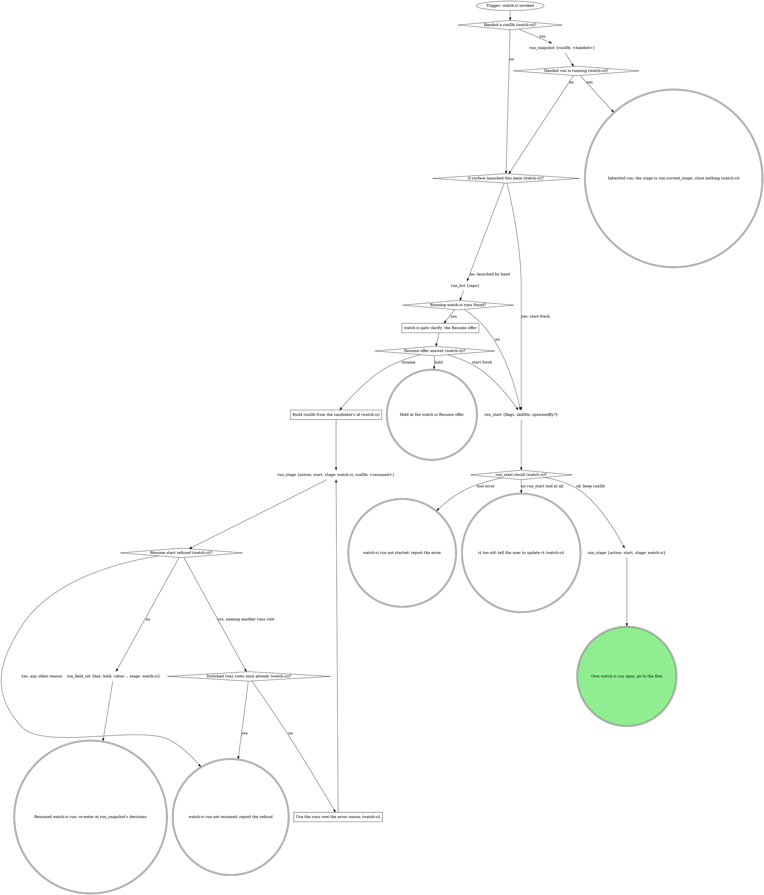

# watch-ci

The standalone entry for CI watching: same watch-and-triage flow as the
pipeline's watch-ci stage, reached directly instead of through a unit of
work. The target comes from the conversation and the checkout, and the
verdict goes to the user. Two graphs: the run graph opens or inherits the
run, the flow graph watches, triages and closes it.

## Run



An own run is a fresh or resumed one: it records identity, fires every gate
below and closes at the end. An inherited run fires no gate beyond `ci`,
records nothing about identity, and hands control back with the verdict.

The flags for this verb, rendered by the compiler:

{{run-start.flags:watch-ci}}

`run_start` takes `flags` = the `watch-ci` flag string from the block above,
verbatim (the value, never its key), `skillDir` = this skill's own
directory, `${CLAUDE_SKILL_DIR}`, as an absolute path, and `spawnedBy` only
when a board or another surface launched this pane. Keep the returned
`runDb` and pass it to every `run_*` call in this verb; nothing is exported.
Every gate below writes its `gate` field and its decision with
`stage: "watch-ci"` in an own run, `stage: run.current_stage` in an
inherited one.

### watch-ci gate clarify: the Resume offer

`run_list` filtered to `status` = `running` and `work_type` = `watch-ci`;
never read the run dbs by hand. Gate `clarify`: one sentence naming each
candidate's `spawned_by`, `started_at` and `current_stage`, then one
**Resume** option per candidate (recommended for a run this session started
earlier; a run another live pane owns is not yours) / **Start fresh**, and
**Hold** in `next`.

### Build runDb from the candidate's id (watch-ci)

`runDb` = `<absolute home>/.mattstack/runs/<repo>/<the candidate row's id>/state.db`.
The run tools refuse `~` and relative paths. The `run_stage` start is a new
attempt that re-records this session.

### Use the runs root the error names (watch-ci)

Rebuild `runDb` under the runs root the refusal names; everything after the
root stays the same.

{{include:run-identity}}

## Flow

`<scripts>` is `${CLAUDE_SKILL_DIR}/scripts/` and `<forge>` is
`${CLAUDE_SKILL_DIR}/parts/forge/scripts/ci-forge.sh`: the watcher, triage
and attendant scripts are vendored inside this compiled skill's own
directory, the forge adapter beside them. Nothing is derived from a plugin
install. `<root>` is the worktree root, the absolute path
`git rev-parse --show-toplevel` prints. Every GitLab MR tool call targets
the MR with `repoName` = `<root>` and `iid` = the MR's iid.

```dot
digraph watch_ci {
    rankdir=TB;

    "Trigger: a watch-ci run is open (own or inherited)" [shape=ellipse];
    "git branch --show-current, unless the user named a branch" [shape=plaintext];
    "git remote get-url origin (watch-ci target)" [shape=plaintext];
    "Forge host (watch-ci target)?" [shape=diamond];
    "mr_for_branch {repoName: <root>, branches: [<branch>]}" [shape=plaintext];
    "gh pr list --head <branch>" [shape=plaintext];
    "watch-ci gate clarify: which forge?" [shape=box];
    "Own run (watch-ci identity)?" [shape=diamond];
    "run_field_set {key: branch, then mr when found, stage: watch-ci}" [shape=plaintext];
    "MR found (watch-ci lease)?" [shape=diamond];
    "<scripts>/ci-attendant.sh claim <mr-url> <iid> --branch <branch>" [shape=plaintext];
    "claim exit (watch-ci)?" [shape=diamond];
    "Fixed the claim call once already (watch-ci)?" [shape=diamond];
    "Fix what the claim usage line names" [shape=box];
    "STOP: while the doctor holds the lease, every commit, push and retry is the doctor's" [shape=octagon style=filled fillcolor=red fontcolor=white];
    "Stand down: report it and stop" [shape=doublecircle];
    "Which flow (watch-ci)?" [shape=diamond];

    "Follow the domain's watch flow" [shape=box];
    "Domain verdict (watch-ci)?" [shape=diamond];
    "Domain repairs = 3 (watch-ci)?" [shape=diamond];
    "Domain repair kind (watch-ci)?" [shape=diamond];
    "git rev-parse HEAD; mr_view and mr_pipeline, or gh pr view <mr> --json headRefOid (sha guard, domain)" [shape=plaintext];
    "Domain's pipeline is for the pushed HEAD (watch-ci)?" [shape=diamond];
    "Sha waits = 5 (domain)?" [shape=diamond];
    "Domain verdict was (watch-ci)?" [shape=diamond];
    "sleep 60 as a background Bash task (sha wait, domain)" [shape=plaintext];

    "<scripts>/ci-watch.sh --forge <forge> --ref <branch> --timeout 2700 (background)" [shape=plaintext];
    "watcher exit (watch-ci)?" [shape=diamond];
    "Read the triage report" [shape=box];
    "Only INFRA blocking failures, none retried yet (watcher)?" [shape=diamond];
    "Relaunched after a timeout once already (watcher)?" [shape=diamond];
    "Verify the branch was pushed" [shape=box];
    "git rev-parse HEAD; mr_view and mr_pipeline, or gh pr view <mr> --json headRefOid (sha guard, watcher)" [shape=plaintext];
    "Watched pipeline is for the pushed HEAD (watch-ci)?" [shape=diamond];
    "Sha waits = 5 (watcher)?" [shape=diamond];
    "Watcher exit was (watch-ci)?" [shape=diamond];
    "sleep 60 as a background Bash task (sha wait, watcher)" [shape=plaintext];

    "mr_pipeline {repoName, iid} (poll)" [shape=plaintext];
    "Settled (GitLab poll)?" [shape=diamond];
    "STOP: GitLab CI reads and retries go through mr_pipeline, mr_job_trace and mr_retry" [shape=octagon style=filled fillcolor=red fontcolor=white];
    "Polled 45 minutes (GitLab poll)?" [shape=diamond];
    "sleep 60 as a background Bash task; ci-attendant.sh heartbeat (GitLab poll)" [shape=plaintext];
    "mr_job_trace {repoName, iid, jobId} per failed job" [shape=plaintext];
    "Classify each failure REAL or INFRA (GitLab)" [shape=box];
    "INFRA only, each retried under once (GitLab)?" [shape=diamond];
    "git rev-parse HEAD; mr_view {repoName, iid, maxAgeMs: 5000} (sha guard, GitLab poll)" [shape=plaintext];
    "Head pipeline is for the pushed HEAD (GitLab poll)?" [shape=diamond];
    "Sha waits = 5 (GitLab poll)?" [shape=diamond];
    "Settled green or red (GitLab poll)?" [shape=diamond];
    "sleep 60 as a background Bash task (sha wait, GitLab poll)" [shape=plaintext];

    "gh pr checks <mr> (poll)" [shape=plaintext];
    "gh pr checks exit (GitHub poll)?" [shape=diamond];
    "Polled 45 minutes (GitHub poll)?" [shape=diamond];
    "sleep 60 as a background Bash task; ci-attendant.sh heartbeat (GitHub poll)" [shape=plaintext];
    "Classify each failing check REAL or INFRA (GitHub)" [shape=box];
    "INFRA only, each retried under once (GitHub)?" [shape=diamond];
    "git rev-parse HEAD; gh pr view <mr> --json headRefOid (sha guard, GitHub poll)" [shape=plaintext];
    "Checks are for the pushed HEAD (GitHub poll)?" [shape=diamond];
    "Sha waits = 5 (GitHub poll)?" [shape=diamond];
    "Checks passed or failed (GitHub poll)?" [shape=diamond];
    "sleep 60 as a background Bash task (sha wait, GitHub poll)" [shape=plaintext];

    "Own run (watch-ci green)?" [shape=diamond];
    "MR found (watch-ci green)?" [shape=diamond];
    "mr_view {repoName, iid, maxAgeMs: 5000}, or gh pr view <mr> --json isDraft on GitHub (draft check)" [shape=plaintext];
    "MR still a draft (watch-ci)?" [shape=diamond];
    "watch-ci gate mark-ready" [shape=box];
    "mark-ready answer (watch-ci)?" [shape=diamond];
    "Forge host (watch-ci mark-ready)?" [shape=diamond];
    "mr_ready {repoName, iid}" [shape=plaintext];
    "gh pr ready <number>" [shape=plaintext];

    "watch-ci gate ci" [shape=box];
    "ci answer (watch-ci)?" [shape=diamond];
    "Fix rounds = 3 (watch-ci)?" [shape=diamond];
    "MR found (before the fix)?" [shape=diamond];
    "<scripts>/ci-attendant.sh claim <mr-url> <iid> --branch <branch> (before the fix)" [shape=plaintext];
    "Re-claim exit (before the fix)?" [shape=diamond];
    "Fix the REAL failure, commit" [shape=box];
    "Which MR (before git_push)?" [shape=diamond];
    "mr_pipeline {repoName, iid} (the prior pipeline id)" [shape=plaintext];
    "<scripts>/ci-attendant.sh claim <mr-url> <iid> --branch <branch> (before git_push)" [shape=plaintext];
    "Re-claim exit (before git_push)?" [shape=diamond];
    "git_push {tree: <root>}" [shape=plaintext];
    "git_push result (watch-ci)?" [shape=diamond];
    "Retried with the printed root (watch-ci)?" [shape=diamond];
    "git_push {tree: <the root the error prints>}" [shape=plaintext];
    "STOP: push only with git_push (watch-ci)" [shape=octagon style=filled fillcolor=red fontcolor=white];
    "watch-ci off-script gate: git_push refused" [shape=box];
    "watch-ci off-script answer (git_push)?" [shape=diamond];
    "Confirm the human's push landed (watch-ci)" [shape=box];
    "Push landed (watch-ci)?" [shape=diamond];
    "Own run (watch-ci new attempt)?" [shape=diamond];
    "run_stage {action: start, stage: watch-ci} (a new attempt)" [shape=plaintext];

    "Retried the failed job once already (ci gate)?" [shape=diamond];
    "MR found (before the retry)?" [shape=diamond];
    "<scripts>/ci-attendant.sh claim <mr-url> <iid> --branch <branch> (before the retry)" [shape=plaintext];
    "Re-claim exit (before the retry)?" [shape=diamond];
    "Retry which way (watch-ci)?" [shape=diamond];
    "Run the report's retry command once per INFRA job" [shape=box];
    "mr_retry {repoName, iid, jobId}" [shape=plaintext];
    "gh run rerun <run-id> --failed" [shape=plaintext];

    "Was a lease claimed (watch-ci exit)?" [shape=diamond];
    "<scripts>/ci-attendant.sh release <mr-url> <iid>" [shape=plaintext];
    "Which exit is this (watch-ci)?" [shape=diamond];
    "run_stage {action: done, stage: watch-ci}" [shape=plaintext];
    "run_status {status: done}" [shape=plaintext];
    "run_stage {action: done, stage: watch-ci} (abandon)" [shape=plaintext];
    "run_status {status: abandoned}" [shape=plaintext];
    "run_stage {action: fail, stage: watch-ci, reason}" [shape=plaintext];
    "run_status {status: failed}" [shape=plaintext];
    "Hand the verdict back to the caller (watch-ci)" [shape=doublecircle];
    "Hand the off-script answer back to the caller (watch-ci)" [shape=doublecircle];
    "Hand the failure back to the caller (watch-ci)" [shape=doublecircle];
    "Hand the Go back answer back (watch-ci)" [shape=doublecircle];
    "Held in watch-ci: the run stays open" [shape=doublecircle];
    "watch-ci run abandoned" [shape=doublecircle];
    "watch-ci failed" [shape=doublecircle];
    "watch-ci done" [shape=doublecircle style=filled fillcolor=lightgreen];

    "Trigger: a watch-ci run is open (own or inherited)" -> "git branch --show-current, unless the user named a branch";
    "git branch --show-current, unless the user named a branch" -> "git remote get-url origin (watch-ci target)";
    "git remote get-url origin (watch-ci target)" -> "Forge host (watch-ci target)?";
    "Forge host (watch-ci target)?" -> "mr_for_branch {repoName: <root>, branches: [<branch>]}" [label="GitLab, MR not named"];
    "Forge host (watch-ci target)?" -> "gh pr list --head <branch>" [label="GitHub, PR not named"];
    "Forge host (watch-ci target)?" -> "Own run (watch-ci identity)?" [label="GitLab or GitHub, the user named the MR"];
    "Forge host (watch-ci target)?" -> "Own run (watch-ci identity)?" [label="inherited: the forge and MR the caller handed"];
    "Forge host (watch-ci target)?" -> "watch-ci gate clarify: which forge?" [label="anything else, nothing handed"];
    "watch-ci gate clarify: which forge?" -> "Forge host (watch-ci target)?" [label="answered: the named forge"];
    "mr_for_branch {repoName: <root>, branches: [<branch>]}" -> "Own run (watch-ci identity)?";
    "gh pr list --head <branch>" -> "Own run (watch-ci identity)?";
    "Own run (watch-ci identity)?" -> "run_field_set {key: branch, then mr when found, stage: watch-ci}" [label="yes"];
    "Own run (watch-ci identity)?" -> "MR found (watch-ci lease)?" [label="no: inherited"];
    "run_field_set {key: branch, then mr when found, stage: watch-ci}" -> "MR found (watch-ci lease)?";
    "MR found (watch-ci lease)?" -> "<scripts>/ci-attendant.sh claim <mr-url> <iid> --branch <branch>" [label="yes"];
    "MR found (watch-ci lease)?" -> "Which flow (watch-ci)?" [label="no: no lease to claim"];
    "<scripts>/ci-attendant.sh claim <mr-url> <iid> --branch <branch>" -> "claim exit (watch-ci)?";
    "claim exit (watch-ci)?" -> "Which flow (watch-ci)?" [label="0: the MR is yours"];
    "claim exit (watch-ci)?" -> "STOP: while the doctor holds the lease, every commit, push and retry is the doctor's" [label="3: the doctor is repairing it"];
    "claim exit (watch-ci)?" -> "Fixed the claim call once already (watch-ci)?" [label="any other exit: a usage error"];
    "Fixed the claim call once already (watch-ci)?" -> "Fix what the claim usage line names" [label="no"];
    "Fixed the claim call once already (watch-ci)?" -> "Was a lease claimed (watch-ci exit)?" [label="yes: a failure, the usage line is the reason"];
    "Fix what the claim usage line names" -> "<scripts>/ci-attendant.sh claim <mr-url> <iid> --branch <branch>";
    "STOP: while the doctor holds the lease, every commit, push and retry is the doctor's" -> "Stand down: report it and stop";

    "Which flow (watch-ci)?" -> "Follow the domain's watch flow" [label="domain rules inlined"];
    "Which flow (watch-ci)?" -> "<scripts>/ci-watch.sh --forge <forge> --ref <branch> --timeout 2700 (background)" [label="forge bound, no domain"];
    "Which flow (watch-ci)?" -> "mr_pipeline {repoName, iid} (poll)" [label="neither, GitLab MR"];
    "Which flow (watch-ci)?" -> "gh pr checks <mr> (poll)" [label="neither, GitHub PR"];
    "Which flow (watch-ci)?" -> "watch-ci gate ci" [label="neither, no MR: no MR to watch, ship first"];

    "Follow the domain's watch flow" -> "Domain verdict (watch-ci)?";
    "Domain verdict (watch-ci)?" -> "git rev-parse HEAD; mr_view and mr_pipeline, or gh pr view <mr> --json headRefOid (sha guard, domain)" [label="green or red"];
    "Domain verdict (watch-ci)?" -> "watch-ci gate ci" [label="timeout or no pipeline"];
    "Domain verdict (watch-ci)?" -> "Domain repairs = 3 (watch-ci)?" [label="the domain asks for a retry or a push"];
    "Domain repairs = 3 (watch-ci)?" -> "Domain repair kind (watch-ci)?" [label="no"];
    "Domain repairs = 3 (watch-ci)?" -> "watch-ci gate ci" [label="yes: budget spent"];
    "Domain repair kind (watch-ci)?" -> "MR found (before the retry)?" [label="retry a job"];
    "Domain repair kind (watch-ci)?" -> "MR found (before the fix)?" [label="fix and push"];
    "git rev-parse HEAD; mr_view and mr_pipeline, or gh pr view <mr> --json headRefOid (sha guard, domain)" -> "Domain's pipeline is for the pushed HEAD (watch-ci)?";
    "Domain's pipeline is for the pushed HEAD (watch-ci)?" -> "Domain verdict was (watch-ci)?" [label="yes"];
    "Domain's pipeline is for the pushed HEAD (watch-ci)?" -> "Domain verdict was (watch-ci)?" [label="no MR: say the commit is not verified"];
    "Domain's pipeline is for the pushed HEAD (watch-ci)?" -> "Sha waits = 5 (domain)?" [label="no"];
    "Sha waits = 5 (domain)?" -> "sleep 60 as a background Bash task (sha wait, domain)" [label="no"];
    "Sha waits = 5 (domain)?" -> "watch-ci gate ci" [label="yes: no pipeline for the pushed HEAD"];
    "sleep 60 as a background Bash task (sha wait, domain)" -> "Follow the domain's watch flow";
    "Domain verdict was (watch-ci)?" -> "Own run (watch-ci green)?" [label="green"];
    "Domain verdict was (watch-ci)?" -> "watch-ci gate ci" [label="red"];

    "<scripts>/ci-watch.sh --forge <forge> --ref <branch> --timeout 2700 (background)" -> "watcher exit (watch-ci)?";
    "watcher exit (watch-ci)?" -> "git rev-parse HEAD; mr_view and mr_pipeline, or gh pr view <mr> --json headRefOid (sha guard, watcher)" [label="0 or 1: green or red"];
    "watcher exit (watch-ci)?" -> "Relaunched after a timeout once already (watcher)?" [label="2: timeout"];
    "watcher exit (watch-ci)?" -> "Verify the branch was pushed" [label="4: no pipeline appeared"];
    "watcher exit (watch-ci)?" -> "Was a lease claimed (watch-ci exit)?" [label="any other exit: the watcher failed; a failure, its output quoted"];
    "Read the triage report" -> "Only INFRA blocking failures, none retried yet (watcher)?";
    "Only INFRA blocking failures, none retried yet (watcher)?" -> "MR found (before the retry)?" [label="yes"];
    "Only INFRA blocking failures, none retried yet (watcher)?" -> "watch-ci gate ci" [label="no: a REAL failure, or retried already"];
    "Relaunched after a timeout once already (watcher)?" -> "<scripts>/ci-watch.sh --forge <forge> --ref <branch> --timeout 2700 (background)" [label="no"];
    "Relaunched after a timeout once already (watcher)?" -> "watch-ci gate ci" [label="yes"];
    "Verify the branch was pushed" -> "watch-ci gate ci";
    "git rev-parse HEAD; mr_view and mr_pipeline, or gh pr view <mr> --json headRefOid (sha guard, watcher)" -> "Watched pipeline is for the pushed HEAD (watch-ci)?";
    "Watched pipeline is for the pushed HEAD (watch-ci)?" -> "Watcher exit was (watch-ci)?" [label="yes"];
    "Watched pipeline is for the pushed HEAD (watch-ci)?" -> "Watcher exit was (watch-ci)?" [label="no MR: say the commit is not verified"];
    "Watched pipeline is for the pushed HEAD (watch-ci)?" -> "Sha waits = 5 (watcher)?" [label="no"];
    "Sha waits = 5 (watcher)?" -> "sleep 60 as a background Bash task (sha wait, watcher)" [label="no"];
    "Sha waits = 5 (watcher)?" -> "watch-ci gate ci" [label="yes: no pipeline for the pushed HEAD"];
    "sleep 60 as a background Bash task (sha wait, watcher)" -> "<scripts>/ci-watch.sh --forge <forge> --ref <branch> --timeout 2700 (background)";
    "Watcher exit was (watch-ci)?" -> "Own run (watch-ci green)?" [label="0: green"];
    "Watcher exit was (watch-ci)?" -> "Read the triage report" [label="1: red"];

    "mr_pipeline {repoName, iid} (poll)" -> "Settled (GitLab poll)?";
    "Settled (GitLab poll)?" -> "Polled 45 minutes (GitLab poll)?" [label="no"];
    "Settled (GitLab poll)?" -> "git rev-parse HEAD; mr_view {repoName, iid, maxAgeMs: 5000} (sha guard, GitLab poll)" [label="settled: green or red"];
    "Settled (GitLab poll)?" -> "STOP: GitLab CI reads and retries go through mr_pipeline, mr_job_trace and mr_retry" [label="tempted to read it with the GitLab CLI"];
    "STOP: GitLab CI reads and retries go through mr_pipeline, mr_job_trace and mr_retry" -> "mr_pipeline {repoName, iid} (poll)";
    "Polled 45 minutes (GitLab poll)?" -> "sleep 60 as a background Bash task; ci-attendant.sh heartbeat (GitLab poll)" [label="no"];
    "Polled 45 minutes (GitLab poll)?" -> "watch-ci gate ci" [label="yes: timeout"];
    "sleep 60 as a background Bash task; ci-attendant.sh heartbeat (GitLab poll)" -> "mr_pipeline {repoName, iid} (poll)";
    "mr_job_trace {repoName, iid, jobId} per failed job" -> "Classify each failure REAL or INFRA (GitLab)";
    "Classify each failure REAL or INFRA (GitLab)" -> "INFRA only, each retried under once (GitLab)?";
    "INFRA only, each retried under once (GitLab)?" -> "MR found (before the retry)?" [label="yes"];
    "INFRA only, each retried under once (GitLab)?" -> "watch-ci gate ci" [label="no"];
    "git rev-parse HEAD; mr_view {repoName, iid, maxAgeMs: 5000} (sha guard, GitLab poll)" -> "Head pipeline is for the pushed HEAD (GitLab poll)?";
    "Head pipeline is for the pushed HEAD (GitLab poll)?" -> "Settled green or red (GitLab poll)?" [label="yes: mr.sha matches, and the id is new when a prior id is held"];
    "Head pipeline is for the pushed HEAD (GitLab poll)?" -> "Sha waits = 5 (GitLab poll)?" [label="no: an old sha, or the prior pipeline id"];
    "Sha waits = 5 (GitLab poll)?" -> "sleep 60 as a background Bash task (sha wait, GitLab poll)" [label="no"];
    "Sha waits = 5 (GitLab poll)?" -> "watch-ci gate ci" [label="yes: no pipeline for the pushed HEAD"];
    "sleep 60 as a background Bash task (sha wait, GitLab poll)" -> "mr_pipeline {repoName, iid} (poll)";
    "Settled green or red (GitLab poll)?" -> "Own run (watch-ci green)?" [label="green"];
    "Settled green or red (GitLab poll)?" -> "mr_job_trace {repoName, iid, jobId} per failed job" [label="red"];

    "gh pr checks <mr> (poll)" -> "gh pr checks exit (GitHub poll)?";
    "gh pr checks exit (GitHub poll)?" -> "git rev-parse HEAD; gh pr view <mr> --json headRefOid (sha guard, GitHub poll)" [label="0, or any other exit with checks reported: passed or failed"];
    "gh pr checks exit (GitHub poll)?" -> "Polled 45 minutes (GitHub poll)?" [label="8, or no checks reported: pending"];
    "Polled 45 minutes (GitHub poll)?" -> "sleep 60 as a background Bash task; ci-attendant.sh heartbeat (GitHub poll)" [label="no"];
    "Polled 45 minutes (GitHub poll)?" -> "watch-ci gate ci" [label="yes: timeout"];
    "sleep 60 as a background Bash task; ci-attendant.sh heartbeat (GitHub poll)" -> "gh pr checks <mr> (poll)";
    "Classify each failing check REAL or INFRA (GitHub)" -> "INFRA only, each retried under once (GitHub)?";
    "INFRA only, each retried under once (GitHub)?" -> "MR found (before the retry)?" [label="yes"];
    "INFRA only, each retried under once (GitHub)?" -> "watch-ci gate ci" [label="no"];
    "git rev-parse HEAD; gh pr view <mr> --json headRefOid (sha guard, GitHub poll)" -> "Checks are for the pushed HEAD (GitHub poll)?";
    "Checks are for the pushed HEAD (GitHub poll)?" -> "Checks passed or failed (GitHub poll)?" [label="yes"];
    "Checks are for the pushed HEAD (GitHub poll)?" -> "Sha waits = 5 (GitHub poll)?" [label="no"];
    "Sha waits = 5 (GitHub poll)?" -> "sleep 60 as a background Bash task (sha wait, GitHub poll)" [label="no"];
    "Sha waits = 5 (GitHub poll)?" -> "watch-ci gate ci" [label="yes: no checks for the pushed HEAD"];
    "sleep 60 as a background Bash task (sha wait, GitHub poll)" -> "gh pr checks <mr> (poll)";
    "Checks passed or failed (GitHub poll)?" -> "Own run (watch-ci green)?" [label="passed"];
    "Checks passed or failed (GitHub poll)?" -> "Classify each failing check REAL or INFRA (GitHub)" [label="failed"];

    "Own run (watch-ci green)?" -> "MR found (watch-ci green)?" [label="yes"];
    "Own run (watch-ci green)?" -> "Was a lease claimed (watch-ci exit)?" [label="no: the verdict goes back to the caller"];
    "MR found (watch-ci green)?" -> "mr_view {repoName, iid, maxAgeMs: 5000}, or gh pr view <mr> --json isDraft on GitHub (draft check)" [label="yes"];
    "MR found (watch-ci green)?" -> "Was a lease claimed (watch-ci exit)?" [label="no: nothing to mark ready"];
    "mr_view {repoName, iid, maxAgeMs: 5000}, or gh pr view <mr> --json isDraft on GitHub (draft check)" -> "MR still a draft (watch-ci)?";
    "MR still a draft (watch-ci)?" -> "watch-ci gate mark-ready" [label="yes"];
    "MR still a draft (watch-ci)?" -> "Was a lease claimed (watch-ci exit)?" [label="no"];
    "watch-ci gate mark-ready" -> "mark-ready answer (watch-ci)?";
    "mark-ready answer (watch-ci)?" -> "Forge host (watch-ci mark-ready)?" [label="mark ready now"];
    "mark-ready answer (watch-ci)?" -> "Was a lease claimed (watch-ci exit)?" [label="keep it draft"];
    "mark-ready answer (watch-ci)?" -> "Was a lease claimed (watch-ci exit)?" [label="go back"];
    "mark-ready answer (watch-ci)?" -> "Was a lease claimed (watch-ci exit)?" [label="hold"];
    "mark-ready answer (watch-ci)?" -> "watch-ci gate mark-ready" [label="iterate: a new gate with their note"];
    "Forge host (watch-ci mark-ready)?" -> "mr_ready {repoName, iid}" [label="GitLab"];
    "Forge host (watch-ci mark-ready)?" -> "gh pr ready <number>" [label="GitHub"];
    "mr_ready {repoName, iid}" -> "Was a lease claimed (watch-ci exit)?";
    "gh pr ready <number>" -> "Was a lease claimed (watch-ci exit)?";

    "watch-ci gate ci" -> "ci answer (watch-ci)?";
    "ci answer (watch-ci)?" -> "Fix rounds = 3 (watch-ci)?" [label="fix and re-push"];
    "ci answer (watch-ci)?" -> "Retried the failed job once already (ci gate)?" [label="retry the job"];
    "ci answer (watch-ci)?" -> "Was a lease claimed (watch-ci exit)?" [label="hand back"];
    "ci answer (watch-ci)?" -> "Was a lease claimed (watch-ci exit)?" [label="abandon (own run only)"];
    "ci answer (watch-ci)?" -> "Was a lease claimed (watch-ci exit)?" [label="hold"];
    "ci answer (watch-ci)?" -> "watch-ci gate ci" [label="iterate: re-triage with their note, a new gate"];
    "Fix rounds = 3 (watch-ci)?" -> "MR found (before the fix)?" [label="no"];
    "Fix rounds = 3 (watch-ci)?" -> "watch-ci gate ci" [label="yes: reopen with Hand back recommended"];
    "MR found (before the fix)?" -> "<scripts>/ci-attendant.sh claim <mr-url> <iid> --branch <branch> (before the fix)" [label="yes"];
    "MR found (before the fix)?" -> "Fix the REAL failure, commit" [label="no: no lease"];
    "<scripts>/ci-attendant.sh claim <mr-url> <iid> --branch <branch> (before the fix)" -> "Re-claim exit (before the fix)?";
    "Re-claim exit (before the fix)?" -> "Fix the REAL failure, commit" [label="0"];
    "Re-claim exit (before the fix)?" -> "STOP: while the doctor holds the lease, every commit, push and retry is the doctor's" [label="3"];
    "Re-claim exit (before the fix)?" -> "Was a lease claimed (watch-ci exit)?" [label="any other exit: a failure"];
    "Fix the REAL failure, commit" -> "Which MR (before git_push)?";
    "Which MR (before git_push)?" -> "mr_pipeline {repoName, iid} (the prior pipeline id)" [label="GitLab MR"];
    "Which MR (before git_push)?" -> "<scripts>/ci-attendant.sh claim <mr-url> <iid> --branch <branch> (before git_push)" [label="GitHub PR"];
    "Which MR (before git_push)?" -> "git_push {tree: <root>}" [label="no MR: no lease"];
    "mr_pipeline {repoName, iid} (the prior pipeline id)" -> "<scripts>/ci-attendant.sh claim <mr-url> <iid> --branch <branch> (before git_push)";
    "<scripts>/ci-attendant.sh claim <mr-url> <iid> --branch <branch> (before git_push)" -> "Re-claim exit (before git_push)?";
    "Re-claim exit (before git_push)?" -> "git_push {tree: <root>}" [label="0"];
    "Re-claim exit (before git_push)?" -> "STOP: while the doctor holds the lease, every commit, push and retry is the doctor's" [label="3"];
    "Re-claim exit (before git_push)?" -> "Was a lease claimed (watch-ci exit)?" [label="any other exit: a failure"];
    "git_push {tree: <root>}" -> "git_push result (watch-ci)?";
    "git_push {tree: <the root the error prints>}" -> "git_push result (watch-ci)?";
    "git_push result (watch-ci)?" -> "Own run (watch-ci new attempt)?" [label="ok"];
    "git_push result (watch-ci)?" -> "Retried with the printed root (watch-ci)?" [label="tree must be the absolute path of the root"];
    "git_push result (watch-ci)?" -> "STOP: push only with git_push (watch-ci)" [label="any other error"];
    "Retried with the printed root (watch-ci)?" -> "git_push {tree: <the root the error prints>}" [label="no"];
    "Retried with the printed root (watch-ci)?" -> "STOP: push only with git_push (watch-ci)" [label="yes"];
    "STOP: push only with git_push (watch-ci)" -> "watch-ci off-script gate: git_push refused";
    "watch-ci off-script gate: git_push refused" -> "watch-ci off-script answer (git_push)?";
    "watch-ci off-script answer (git_push)?" -> "Confirm the human's push landed (watch-ci)" [label="take: the human pushed"];
    "watch-ci off-script answer (git_push)?" -> "Which MR (before git_push)?" [label="take: registration fixed, retry"];
    "watch-ci off-script answer (git_push)?" -> "Was a lease claimed (watch-ci exit)?" [label="hand back"];
    "watch-ci off-script answer (git_push)?" -> "Was a lease claimed (watch-ci exit)?" [label="hold"];
    "watch-ci off-script answer (git_push)?" -> "watch-ci off-script gate: git_push refused" [label="iterate: a new gate with their note"];
    "Confirm the human's push landed (watch-ci)" -> "Push landed (watch-ci)?";
    "Push landed (watch-ci)?" -> "Own run (watch-ci new attempt)?" [label="yes: the remote branch carries HEAD"];
    "Push landed (watch-ci)?" -> "watch-ci off-script gate: git_push refused" [label="no: reopen with what the comparison showed"];
    "Own run (watch-ci new attempt)?" -> "run_stage {action: start, stage: watch-ci} (a new attempt)" [label="yes"];
    "Own run (watch-ci new attempt)?" -> "MR found (watch-ci lease)?" [label="no: re-enter at the claim"];
    "run_stage {action: start, stage: watch-ci} (a new attempt)" -> "MR found (watch-ci lease)?";

    "Retried the failed job once already (ci gate)?" -> "MR found (before the retry)?" [label="no"];
    "Retried the failed job once already (ci gate)?" -> "watch-ci gate ci" [label="yes: reopen, the retry is spent"];
    "MR found (before the retry)?" -> "<scripts>/ci-attendant.sh claim <mr-url> <iid> --branch <branch> (before the retry)" [label="yes"];
    "MR found (before the retry)?" -> "Retry which way (watch-ci)?" [label="no: no lease"];
    "<scripts>/ci-attendant.sh claim <mr-url> <iid> --branch <branch> (before the retry)" -> "Re-claim exit (before the retry)?";
    "Re-claim exit (before the retry)?" -> "Retry which way (watch-ci)?" [label="0"];
    "Re-claim exit (before the retry)?" -> "STOP: while the doctor holds the lease, every commit, push and retry is the doctor's" [label="3"];
    "Re-claim exit (before the retry)?" -> "Was a lease claimed (watch-ci exit)?" [label="any other exit: a failure"];
    "Retry which way (watch-ci)?" -> "Run the report's retry command once per INFRA job" [label="the watcher's report printed a retry command"];
    "Retry which way (watch-ci)?" -> "mr_retry {repoName, iid, jobId}" [label="otherwise, GitLab"];
    "Retry which way (watch-ci)?" -> "gh run rerun <run-id> --failed" [label="otherwise, GitHub"];
    "Run the report's retry command once per INFRA job" -> "Which flow (watch-ci)?";
    "mr_retry {repoName, iid, jobId}" -> "Which flow (watch-ci)?";
    "gh run rerun <run-id> --failed" -> "Which flow (watch-ci)?";

    "Was a lease claimed (watch-ci exit)?" -> "<scripts>/ci-attendant.sh release <mr-url> <iid>" [label="yes"];
    "Was a lease claimed (watch-ci exit)?" -> "Which exit is this (watch-ci)?" [label="no"];
    "<scripts>/ci-attendant.sh release <mr-url> <iid>" -> "Which exit is this (watch-ci)?";
    "Which exit is this (watch-ci)?" -> "run_stage {action: done, stage: watch-ci}" [label="own run: green, ready or kept draft, or hand back"];
    "Which exit is this (watch-ci)?" -> "run_stage {action: done, stage: watch-ci} (abandon)" [label="own run: abandon"];
    "Which exit is this (watch-ci)?" -> "run_stage {action: fail, stage: watch-ci, reason}" [label="own run: a failure or an off-script hand back"];
    "Which exit is this (watch-ci)?" -> "Hand the verdict back to the caller (watch-ci)" [label="inherited run: green, or red after a ci Hand back"];
    "Which exit is this (watch-ci)?" -> "Hand the off-script answer back to the caller (watch-ci)" [label="inherited run: an off-script hand back"];
    "Which exit is this (watch-ci)?" -> "Hand the failure back to the caller (watch-ci)" [label="inherited run: a failure"];
    "Which exit is this (watch-ci)?" -> "Hand the Go back answer back (watch-ci)" [label="own run: go back"];
    "Which exit is this (watch-ci)?" -> "Held in watch-ci: the run stays open" [label="hold"];
    "run_stage {action: done, stage: watch-ci}" -> "run_status {status: done}";
    "run_status {status: done}" -> "watch-ci done";
    "run_stage {action: done, stage: watch-ci} (abandon)" -> "run_status {status: abandoned}";
    "run_status {status: abandoned}" -> "watch-ci run abandoned";
    "run_stage {action: fail, stage: watch-ci, reason}" -> "run_status {status: failed}";
    "run_status {status: failed}" -> "watch-ci failed";
}
```

### watch-ci gate clarify: which forge?

The origin host is neither GitLab nor GitHub. Ask which forge it is, quoting
the `git remote get-url origin` line as the context.

### Fix what the claim usage line names

Exit 2 prints a usage line; correct the arguments it names (the MR URL, the
iid, `--branch`) and claim again, once.

### Follow the domain's watch flow

The domain rules below say how to read and triage this MR's CI; the graph
says what happens with the result. A green or red verdict goes to the sha
guard first; a timeout or missing pipeline goes to the `ci` gate. A retry
or push the domain
asks for leaves this box through "Domain verdict?": a retry goes to the
graph's retry nodes, a fix and push to its fix and push nodes, each behind
the lease re-claim, never run inside the box. The domain's own polling
stops at 45 minutes, like the graph's polls, and a timeout is the `ci`
gate.

### Read the triage report

The watcher prints its report on every exit: the pipeline id and `url`,
then one verdict per blocking failure (REAL or INFRA) and the retry command
for each INFRA one. Any exit other than 0, 1, 2 or 4 (a missing adapter or
triage script, a failed adapter verb, a usage error) is a failure with the
watcher's output as the reason, never a reason to read CI with a forge CLI.

### Verify the branch was pushed

Compare `git rev-parse HEAD` with the remote branch. Unpushed: the `ci`
gate says so ("ship first"). Pushed: the `ci` gate quotes the watcher's
"no pipeline appeared" line.

### Classify each failure REAL or INFRA (GitLab)

REAL: the change broke it (a test, type or lint failure in touched code).
INFRA: unrelated to the change (a runner, network or dependency outage, a
known flake). One retry per INFRA job; a REAL failure goes to the gate.

### Classify each failing check REAL or INFRA (GitHub)

Read the failing checks' logs from the links `gh pr checks <mr>` prints,
then classify as for GitLab: REAL goes to the gate, INFRA gets one retry.

### watch-ci gate mark-ready

Own run only, green, the MR still a draft. One sentence above the form: CI
is green for the MR's head.

| Question | Options (recommended first) | Shown when |
|---|---|---|
| `ready` | **Mark ready now** / **Keep it draft** | always |
| `next` | **Proceed** / **Iterate here** / **Go back** / **Hold** | always |
| `to` | one option per earlier stage, split `to-1`, `to-2`, ... over 4; with exactly one candidate it labels **Go back to `<stage>`** in `next` instead | Go back answered and `run_snapshot` shows more than one earlier stage row |

Scope `mark-ready`. Selection: `{"ready":true|false,"next":"proceed|iterate|redirect|hold","to":"<stage or null>","note":"<their words or null>"}`.

### watch-ci gate ci

Red, timeout, no pipeline, or no pipeline for the pushed HEAD. Scope
`ci:<stage>:<attempt>`. One sentence above the form: the verdict and a
one-line triage per blocking failure.

| Question | Options (recommended first) | Shown when |
|---|---|---|
| `action` | **Fix and re-push** (a REAL failure in the change; after the third fix round, **Hand back** is recommended instead) / **Retry the job** (a flake not yet retried) / **Hand back** / **Abandon the run** (own run only) | always |
| `next` | **Proceed** / **Iterate here** / **Hold** | always |

Selection: `{"next":"fix|retry|handback|abandon|iterate|hold","note":"<their words or null>"}`.
Hand back leaves the MR red for the human: an own run closes `done`, an
inherited one hands the verdict back.

### Fix the REAL failure, commit

Fix what the triage names as REAL, test-first where a test can catch it,
and commit the named files. The counter is fix rounds within this run.

### watch-ci off-script gate: git_push refused

Scope `off-script:<stage>:<n>` (`n` counts from 1 within the stage
attempt), `context` quoting the refusal.

| Question | Options |
|---|---|
| `action` | **Take the proposed move** (the value spells the move in full, such as the human pushing, or a fixed tree registration and a retry) / **Hand back** |
| `next` | **Proceed** (Recommended) / **Iterate here** / **Hold** |

Selection: `{"move":"<the move>","why":"<the refusal>","action":"take|handback","next":"proceed|iterate|hold","note":"<their words or null>"}`.

### Confirm the human's push landed (watch-ci)

The human pushed outside this verb. Compare `git rev-parse HEAD` with the
remote branch and say what it shows; never push from here. The push landed
when the remote branch carries HEAD; otherwise the off-script gate reopens
with the comparison as its context.

### Run the report's retry command once per INFRA job

The retry command the triage report printed for each INFRA blocking job,
each once, then the watcher relaunches.

## What the graph cannot show

- **The sha guard.** It runs before every settled verdict, green or red:
  a red read for an older sha is as stale as a green one. After a push in
  this run the pushed HEAD is `git rev-parse HEAD` at the push (the push
  that landed, this verb's or the human's), or the pushed sha ship handed
  over when it invoked this verb. Only a run that pushed nothing compares
  against the upstream, the remote branch's sha (unpushed commits have no
  pipeline). GitLab: `mr.sha` from `mr_view` must equal it, and
  `mr_pipeline` returns that sha's head pipeline in the same snapshot.
  GitLab can move `mr.sha` before it creates the new pipeline, so after a
  push that moved the branch the head pipeline's `pipeline.id` must also
  differ from the prior id: the one read just before `git_push`, or the one
  ship handed over. With no prior id handed over, the guard checks the sha
  alone. The forge-bound watcher reports its pipeline's `url`, which must
  equal `mr_pipeline`'s `pipeline.webUrl`. GitHub: `headRefOid` must equal
  it, and "no checks reported" is pending, not red. A forge-bound watch
  with no MR has no sha source: the verdict says "green (or red) on the
  newest pipeline for `<branch>`; commit not verified (no MR)".
- **Heartbeats.** Each poll round's `sleep 60` runs as a background Bash
  task (never a foreground sleep) beside
  `<scripts>/ci-attendant.sh heartbeat <mr-url> <iid>` when a lease is
  held. The background watcher never heartbeats, which is why every repair
  re-claims first.
- **Retry on GitHub.** The run id for `gh run rerun` comes from the failed
  check's link in `gh pr checks <mr>`.

## The attendant lease

Exactly one actor attends an MR's CI at a time: this verb or the board's
auto-doctor. Both honour the lease files under `~/.mattstack/ci-attendants/`.
A lease without heartbeats goes stale after 10 minutes and the doctor may
take over, so a long fix or a long watch can lose it: re-claim before every
repair (the fix itself, a push, a retry). A crashed session needs no
cleanup. Every exit that leaves the MR unattended releases it; the
stand-down never touches it, because that lease is the doctor's.

| Thought | Reality |
|---|---|
| "The doctor's on it, but I can fix it faster" | Two actors pushing to one branch race each other's work. Stand down and stop. |
| "I'll just retry the flaky job while the doctor works" | A retry is a repair action. The lease holder does it, not you. |
| "I claimed it at the start, so the push is mine" | The watcher does not heartbeat; the lease may be stale. Re-claim before the push. |
| "The pipeline says success, that's green" | Only for the pushed HEAD, and a red read likewise. Check the sha, and after a push that moved the branch, the pipeline id. |

## Domain rules

If a rule below asks for a move this graph marks STOP, take the off-script edge instead.

{{slot:domain}}

When nothing is inlined above, the graph's other flows apply.

## Forge

If a rule below asks for a move this graph marks STOP, take the off-script edge instead.

{{slot:forge}}

Both slots are optional; when neither is inlined above, the graph's
unbound flows apply.

## Gate protocol

{{include:gate-protocol}}

## Wrap-up form contract

{{include:wrap-up-form}}
