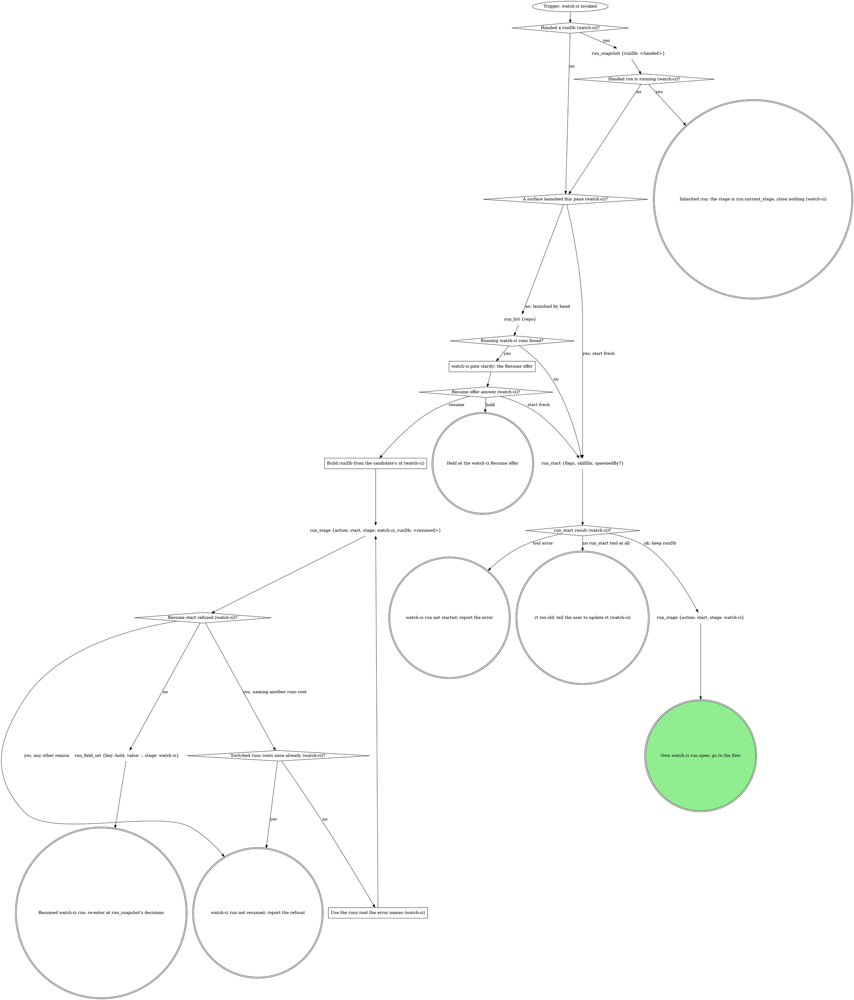

# watch-ci

The standalone entry for CI watching: same watch-and-triage flow as the
pipeline's watch-ci stage, reached directly instead of through a unit of
work. The target comes from the conversation and the checkout, and the
verdict goes to the user. Two graphs: the run graph opens or inherits the
run, the flow graph watches, triages and closes it.

## Run



An own run is a fresh or resumed one: it records identity, fires every gate
below and closes at the end. An inherited run fires no gate beyond `ci`,
records nothing about identity, and hands control back with the verdict.

The flags for this verb, rendered by the compiler:

{{run-start.flags:watch-ci}}

`run_start` takes `flags` = the `watch-ci` flag string from the block above,
verbatim (the value, never its key), `skillDir` = this skill's own
directory, `${CLAUDE_SKILL_DIR}`, as an absolute path, and `spawnedBy` only
when a board or another surface launched this pane. Keep the returned
`runDb` and pass it to every `run_*` call in this verb; nothing is exported.
Every gate below writes its `gate` field and its decision with
`stage: "watch-ci"` in an own run, `stage: run.current_stage` in an
inherited one.

### watch-ci gate clarify: the Resume offer

`run_list` filtered to `status` = `running` and `work_type` = `watch-ci`;
never read the run dbs by hand. Gate `clarify`: one sentence naming each
candidate's `spawned_by`, `started_at` and `current_stage`, then one
**Resume** option per candidate (recommended for a run this session started
earlier; a run another live pane owns is not yours) / **Start fresh**, and
**Hold** in `next`.

### Build runDb from the candidate's id (watch-ci)

`runDb` = `<absolute home>/.mattstack/runs/<repo>/<the candidate row's id>/state.db`.
The run tools refuse `~` and relative paths. The `run_stage` start is a new
attempt that re-records this session.

### Use the runs root the error names (watch-ci)

Rebuild `runDb` under the runs root the refusal names; everything after the
root stays the same.

{{include:run-identity}}

## Flow

`<scripts>` is `${CLAUDE_SKILL_DIR}/scripts/` and `<forge>` is
`${CLAUDE_SKILL_DIR}/parts/forge/scripts/ci-forge.sh`: the triage script is
vendored inside this compiled skill's own directory, the forge adapter
beside it. Nothing is derived from a plugin install. `<root>` is the
worktree root, the absolute path `git rev-parse --show-toplevel` prints.
Every GitLab MR tool call and `ci_watch` target the MR with `repoName` =
`<root>` and `iid` = the MR's iid; the lease tools take `mrUrl` = the MR's
or PR's https URL.

```dot
digraph watch_ci {
    rankdir=TB;

    "Trigger: a watch-ci run is open (own or inherited)" [shape=ellipse];
    "git branch --show-current, unless the user named a branch" [shape=plaintext];
    "git remote get-url origin (watch-ci target)" [shape=plaintext];
    "Forge host (watch-ci target)?" [shape=diamond];
    "mr_for_branch {repoName: <root>, branches: [<branch>]}" [shape=plaintext];
    "gh pr list --head <branch> --json number,url" [shape=plaintext];
    "watch-ci gate clarify: which forge?" [shape=box];
    "Own run (watch-ci identity)?" [shape=diamond];
    "run_field_set {key: branch, then mr when found, stage: watch-ci}" [shape=plaintext];
    "MR found (watch-ci lease)?" [shape=diamond];
    "ci_lease_claim {mrUrl, branch}" [shape=plaintext];
    "ci_lease_claim result (watch-ci)?" [shape=diamond];
    "STOP: claim the lease only with ci_lease_claim (watch-ci)" [shape=octagon style=filled fillcolor=red fontcolor=white];
    "Fixed the claim call once already (watch-ci)?" [shape=diamond];
    "Fix what the claim error names" [shape=box];
    "STOP: while another attendant holds the lease, every commit, push and retry is theirs" [shape=octagon style=filled fillcolor=red fontcolor=white];
    "Stand down: report it and stop" [shape=doublecircle];
    "watch-ci off-script gate: ci_lease_claim refused" [shape=box];
    "watch-ci off-script answer (ci_lease_claim)?" [shape=diamond];
    "Off-script rounds = 2 (ci_lease_claim)?" [shape=diamond];
    "watch-ci off-script gate: re-claim refused before the fix" [shape=box];
    "watch-ci off-script answer (re-claim before the fix)?" [shape=diamond];
    "Off-script rounds = 2 (re-claim before the fix)?" [shape=diamond];
    "watch-ci off-script gate: re-claim refused before git_push" [shape=box];
    "watch-ci off-script answer (re-claim before git_push)?" [shape=diamond];
    "Off-script rounds = 2 (re-claim before git_push)?" [shape=diamond];
    "watch-ci off-script gate: re-claim refused before the retry" [shape=box];
    "watch-ci off-script answer (re-claim before the retry)?" [shape=diamond];
    "Off-script rounds = 2 (re-claim before the retry)?" [shape=diamond];
    "Fix committed (watch-ci)?" [shape=diamond];
    "Fix heartbeats = 12 (watch-ci)?" [shape=diamond];
    "ci_lease_heartbeat {mrUrl} (during the fix)" [shape=plaintext];
    "Heartbeat result (during the fix)?" [shape=diamond];
    "Watched sha known (watch-ci)?" [shape=diamond];
    "git ls-remote origin refs/heads/<branch> (the watched sha)" [shape=plaintext];
    "Which forge watches (watch-ci)?" [shape=diamond];

    "ci_watch {repoName: <root>, iid, sha, priorPipelineId?}" [shape=plaintext];
    "ci_watch state (watch-ci)?" [shape=diamond];
    "STOP: GitLab CI watches go through ci_watch, reads through mr_job_trace, retries through mr_retry" [shape=octagon style=filled fillcolor=red fontcolor=white];
    "Watch calls = 9 (watch-ci)?" [shape=diamond];
    "Re-claims after a lost lease = 2 (watch-ci)?" [shape=diamond];
    "Verify the branch was pushed" [shape=box];
    "Fixed the ci_watch call once already (watch-ci)?" [shape=diamond];
    "Fix what the ci_watch error names" [shape=box];
    "watch-ci off-script gate: ci_watch refused" [shape=box];
    "watch-ci off-script answer (ci_watch)?" [shape=diamond];
    "Verdict the human reported (watch-ci)?" [shape=diamond];
    "Off-script rounds = 2 (ci_watch)?" [shape=diamond];

    "gh pr checks <mr> (poll)" [shape=plaintext];
    "gh pr checks exit (GitHub poll)?" [shape=diamond];
    "Polled 45 minutes (GitHub poll)?" [shape=diamond];
    "ci_lease_heartbeat {mrUrl} (GitHub poll)" [shape=plaintext];
    "Heartbeat result (GitHub poll)?" [shape=diamond];
    "sleep 60 as a background Bash task (GitHub poll)" [shape=plaintext];
    "gh pr view <mr> --json headRefOid (sha guard, GitHub poll)" [shape=plaintext];
    "Checks are for the watched sha (GitHub poll)?" [shape=diamond];
    "Sha waits = 5 (GitHub poll)?" [shape=diamond];
    "sleep 60 as a background Bash task (sha wait, GitHub poll)" [shape=plaintext];
    "Checks passed or failed (GitHub poll)?" [shape=diamond];

    "Triage with what (watch-ci)?" [shape=diamond];
    "Triage with the domain's rules" [shape=box];
    "<scripts>/ci-triage.sh --forge <forge> --pipeline <N>" [shape=plaintext];
    "Read the triage report" [shape=box];
    "Trace tails enough to classify (GitLab)?" [shape=diamond];
    "mr_job_trace {repoName, iid, jobId} per failed job" [shape=plaintext];
    "Classify each failure REAL or INFRA (GitLab)" [shape=box];
    "Classify each failing check REAL or INFRA (GitHub)" [shape=box];
    "Only INFRA blocking failures, none retried yet (watch-ci)?" [shape=diamond];

    "Own run (watch-ci green)?" [shape=diamond];
    "MR found (watch-ci green)?" [shape=diamond];
    "Forge host (watch-ci draft check)?" [shape=diamond];
    "mr_view {repoName, iid, maxAgeMs: 5000} (draft check)" [shape=plaintext];
    "gh pr view <mr> --json isDraft (draft check)" [shape=plaintext];
    "MR still a draft (watch-ci)?" [shape=diamond];
    "watch-ci gate mark-ready" [shape=box];
    "mark-ready answer (watch-ci)?" [shape=diamond];
    "mark-ready iterations = 2 (watch-ci)?" [shape=diamond];
    "Forge host (watch-ci mark-ready)?" [shape=diamond];
    "mr_ready {repoName, iid}" [shape=plaintext];
    "gh pr ready <number>" [shape=plaintext];

    "watch-ci gate ci" [shape=box];
    "ci answer (watch-ci)?" [shape=diamond];
    "ci gate iterations = 3 (watch-ci)?" [shape=diamond];
    "Fix rounds = 3 (watch-ci)?" [shape=diamond];
    "MR found (before the fix)?" [shape=diamond];
    "ci_lease_claim {mrUrl, branch} (before the fix)" [shape=plaintext];
    "Re-claim result (before the fix)?" [shape=diamond];
    "Fix the REAL failure, commit" [shape=box];
    "Which MR (before git_push)?" [shape=diamond];
    "mr_pipeline {repoName, iid} (the prior pipeline id)" [shape=plaintext];
    "ci_lease_claim {mrUrl, branch} (before git_push)" [shape=plaintext];
    "Re-claim result (before git_push)?" [shape=diamond];
    "git_push {tree: <root>}" [shape=plaintext];
    "git_push result (watch-ci)?" [shape=diamond];
    "Retried with the printed root (watch-ci)?" [shape=diamond];
    "git_push {tree: <the root the error prints>}" [shape=plaintext];
    "STOP: push only with git_push (watch-ci)" [shape=octagon style=filled fillcolor=red fontcolor=white];
    "watch-ci off-script gate: git_push refused" [shape=box];
    "watch-ci off-script answer (git_push)?" [shape=diamond];
    "Off-script rounds = 2 (git_push)?" [shape=diamond];
    "Confirm the human's push landed (watch-ci)" [shape=box];
    "Push landed (watch-ci)?" [shape=diamond];
    "git rev-parse HEAD (the pushed sha, watch-ci)" [shape=plaintext];
    "Own run (watch-ci new attempt)?" [shape=diamond];
    "run_stage {action: start, stage: watch-ci} (a new attempt)" [shape=plaintext];

    "Retried the failed job once already (ci gate)?" [shape=diamond];
    "MR found (before the retry)?" [shape=diamond];
    "ci_lease_claim {mrUrl, branch} (before the retry)" [shape=plaintext];
    "Re-claim result (before the retry)?" [shape=diamond];
    "Retry on which forge (watch-ci)?" [shape=diamond];
    "mr_retry {repoName, iid, jobId} per INFRA job" [shape=plaintext];
    "gh run rerun <run-id> --failed" [shape=plaintext];

    "Was a lease claimed (watch-ci exit)?" [shape=diamond];
    "ci_lease_release {mrUrl}" [shape=plaintext];
    "Which exit is this (watch-ci)?" [shape=diamond];
    "run_stage {action: done, stage: watch-ci}" [shape=plaintext];
    "run_status {status: done}" [shape=plaintext];
    "run_stage {action: done, stage: watch-ci} (abandon)" [shape=plaintext];
    "run_status {status: abandoned}" [shape=plaintext];
    "run_stage {action: fail, stage: watch-ci, reason}" [shape=plaintext];
    "run_status {status: failed}" [shape=plaintext];
    "Hand the verdict back to the caller (watch-ci)" [shape=doublecircle];
    "Hand the off-script answer back to the caller (watch-ci)" [shape=doublecircle];
    "Hand the failure back to the caller (watch-ci)" [shape=doublecircle];
    "Hand the Go back answer back (watch-ci)" [shape=doublecircle];
    "Held in watch-ci: the run stays open" [shape=doublecircle];
    "watch-ci run abandoned" [shape=doublecircle];
    "watch-ci failed" [shape=doublecircle];
    "watch-ci done" [shape=doublecircle style=filled fillcolor=lightgreen];

    "Trigger: a watch-ci run is open (own or inherited)" -> "git branch --show-current, unless the user named a branch";
    "git branch --show-current, unless the user named a branch" -> "git remote get-url origin (watch-ci target)";
    "git remote get-url origin (watch-ci target)" -> "Forge host (watch-ci target)?";
    "Forge host (watch-ci target)?" -> "mr_for_branch {repoName: <root>, branches: [<branch>]}" [label="GitLab, MR not named"];
    "Forge host (watch-ci target)?" -> "gh pr list --head <branch> --json number,url" [label="GitHub, PR not named"];
    "Forge host (watch-ci target)?" -> "Own run (watch-ci identity)?" [label="GitLab or GitHub, the user named the MR"];
    "Forge host (watch-ci target)?" -> "Own run (watch-ci identity)?" [label="inherited: the forge and MR the caller handed"];
    "Forge host (watch-ci target)?" -> "watch-ci gate clarify: which forge?" [label="anything else, nothing handed"];
    "watch-ci gate clarify: which forge?" -> "Forge host (watch-ci target)?" [label="answered: the named forge"];
    "mr_for_branch {repoName: <root>, branches: [<branch>]}" -> "Own run (watch-ci identity)?";
    "gh pr list --head <branch> --json number,url" -> "Own run (watch-ci identity)?";
    "Own run (watch-ci identity)?" -> "run_field_set {key: branch, then mr when found, stage: watch-ci}" [label="yes"];
    "Own run (watch-ci identity)?" -> "MR found (watch-ci lease)?" [label="no: inherited"];
    "run_field_set {key: branch, then mr when found, stage: watch-ci}" -> "MR found (watch-ci lease)?";
    "MR found (watch-ci lease)?" -> "ci_lease_claim {mrUrl, branch}" [label="yes"];
    "MR found (watch-ci lease)?" -> "watch-ci gate ci" [label="no: no MR to watch, ship first"];
    "ci_lease_claim {mrUrl, branch}" -> "ci_lease_claim result (watch-ci)?";
    "ci_lease_claim result (watch-ci)?" -> "Watched sha known (watch-ci)?" [label="claimed: true, the MR is yours"];
    "ci_lease_claim result (watch-ci)?" -> "STOP: while another attendant holds the lease, every commit, push and retry is theirs" [label="claimed: false, holder named"];
    "ci_lease_claim result (watch-ci)?" -> "Fixed the claim call once already (watch-ci)?" [label="tool error"];
    "ci_lease_claim result (watch-ci)?" -> "STOP: claim the lease only with ci_lease_claim (watch-ci)" [label="tempted to write the lease by hand or with a script"];
    "STOP: claim the lease only with ci_lease_claim (watch-ci)" -> "ci_lease_claim {mrUrl, branch}";
    "Fixed the claim call once already (watch-ci)?" -> "Fix what the claim error names" [label="no"];
    "Fixed the claim call once already (watch-ci)?" -> "watch-ci off-script gate: ci_lease_claim refused" [label="yes"];
    "Fix what the claim error names" -> "ci_lease_claim {mrUrl, branch}";
    "STOP: while another attendant holds the lease, every commit, push and retry is theirs" -> "Stand down: report it and stop";
    "Watched sha known (watch-ci)?" -> "Which forge watches (watch-ci)?" [label="yes: handed by ship, or read at this run's push"];
    "Watched sha known (watch-ci)?" -> "git ls-remote origin refs/heads/<branch> (the watched sha)" [label="no: nothing pushed in this run"];
    "git ls-remote origin refs/heads/<branch> (the watched sha)" -> "Which forge watches (watch-ci)?";
    "Which forge watches (watch-ci)?" -> "ci_watch {repoName: <root>, iid, sha, priorPipelineId?}" [label="GitLab"];
    "Which forge watches (watch-ci)?" -> "gh pr checks <mr> (poll)" [label="GitHub"];

    "ci_watch {repoName: <root>, iid, sha, priorPipelineId?}" -> "ci_watch state (watch-ci)?";
    "ci_watch state (watch-ci)?" -> "Watch calls = 9 (watch-ci)?" [label="running or waiting"];
    "ci_watch state (watch-ci)?" -> "Own run (watch-ci green)?" [label="success or success_with_warnings"];
    "ci_watch state (watch-ci)?" -> "Triage with what (watch-ci)?" [label="failed"];
    "ci_watch state (watch-ci)?" -> "watch-ci gate ci" [label="canceled, skipped, manual, superseded or aborted"];
    "ci_watch state (watch-ci)?" -> "STOP: while another attendant holds the lease, every commit, push and retry is theirs" [label="lease_lost, holder named"];
    "ci_watch state (watch-ci)?" -> "Re-claims after a lost lease = 2 (watch-ci)?" [label="lease_lost, no holder: no lease held"];
    "Re-claims after a lost lease = 2 (watch-ci)?" -> "ci_lease_claim {mrUrl, branch}" [label="no: claim it again"];
    "Re-claims after a lost lease = 2 (watch-ci)?" -> "watch-ci gate ci" [label="yes: the lease keeps vanishing"];
    "ci_watch state (watch-ci)?" -> "Fixed the ci_watch call once already (watch-ci)?" [label="tool error"];
    "ci_watch state (watch-ci)?" -> "STOP: GitLab CI watches go through ci_watch, reads through mr_job_trace, retries through mr_retry" [label="tempted to watch with a script or the GitLab CLI"];
    "STOP: GitLab CI watches go through ci_watch, reads through mr_job_trace, retries through mr_retry" -> "ci_watch {repoName: <root>, iid, sha, priorPipelineId?}";
    "Watch calls = 9 (watch-ci)?" -> "ci_watch {repoName: <root>, iid, sha, priorPipelineId?}" [label="no: call again"];
    "Watch calls = 9 (watch-ci)?" -> "Verify the branch was pushed" [label="yes, still waiting: no pipeline for the sha"];
    "Watch calls = 9 (watch-ci)?" -> "watch-ci gate ci" [label="yes, still running: timeout"];
    "Verify the branch was pushed" -> "watch-ci gate ci";
    "Fixed the ci_watch call once already (watch-ci)?" -> "Fix what the ci_watch error names" [label="no"];
    "Fixed the ci_watch call once already (watch-ci)?" -> "watch-ci off-script gate: ci_watch refused" [label="yes"];
    "Fix what the ci_watch error names" -> "ci_watch {repoName: <root>, iid, sha, priorPipelineId?}";
    "watch-ci off-script gate: ci_watch refused" -> "watch-ci off-script answer (ci_watch)?";
    "watch-ci off-script answer (ci_watch)?" -> "Verdict the human reported (watch-ci)?" [label="take: the human read the pipeline"];
    "watch-ci off-script answer (ci_watch)?" -> "Off-script rounds = 2 (ci_watch)?" [label="iterate: the human fixed it"];
    "watch-ci off-script answer (ci_watch)?" -> "Was a lease claimed (watch-ci exit)?" [label="hold"];
    "watch-ci off-script answer (ci_watch)?" -> "Was a lease claimed (watch-ci exit)?" [label="hand back"];
    "Verdict the human reported (watch-ci)?" -> "Own run (watch-ci green)?" [label="green for the watched sha"];
    "Verdict the human reported (watch-ci)?" -> "watch-ci gate ci" [label="red, or not for the watched sha"];
    "Off-script rounds = 2 (ci_watch)?" -> "ci_watch {repoName: <root>, iid, sha, priorPipelineId?}" [label="no: watch again"];
    "Off-script rounds = 2 (ci_watch)?" -> "Was a lease claimed (watch-ci exit)?" [label="yes: a failure, the refusals are the reason"];

    "gh pr checks <mr> (poll)" -> "gh pr checks exit (GitHub poll)?";
    "gh pr checks exit (GitHub poll)?" -> "gh pr view <mr> --json headRefOid (sha guard, GitHub poll)" [label="0, or any other exit with checks reported: passed or failed"];
    "gh pr checks exit (GitHub poll)?" -> "Polled 45 minutes (GitHub poll)?" [label="8, or no checks reported: pending"];
    "Polled 45 minutes (GitHub poll)?" -> "ci_lease_heartbeat {mrUrl} (GitHub poll)" [label="no"];
    "Polled 45 minutes (GitHub poll)?" -> "watch-ci gate ci" [label="yes: timeout"];
    "ci_lease_heartbeat {mrUrl} (GitHub poll)" -> "Heartbeat result (GitHub poll)?";
    "Heartbeat result (GitHub poll)?" -> "sleep 60 as a background Bash task (GitHub poll)" [label="ok: true"];
    "Heartbeat result (GitHub poll)?" -> "STOP: while another attendant holds the lease, every commit, push and retry is theirs" [label="lost"];
    "Heartbeat result (GitHub poll)?" -> "ci_lease_claim {mrUrl, branch}" [label="none: claim it again"];
    "Heartbeat result (GitHub poll)?" -> "watch-ci gate ci" [label="tool error"];
    "sleep 60 as a background Bash task (GitHub poll)" -> "gh pr checks <mr> (poll)";
    "gh pr view <mr> --json headRefOid (sha guard, GitHub poll)" -> "Checks are for the watched sha (GitHub poll)?";
    "Checks are for the watched sha (GitHub poll)?" -> "Checks passed or failed (GitHub poll)?" [label="yes"];
    "Checks are for the watched sha (GitHub poll)?" -> "Sha waits = 5 (GitHub poll)?" [label="no"];
    "Sha waits = 5 (GitHub poll)?" -> "sleep 60 as a background Bash task (sha wait, GitHub poll)" [label="no"];
    "Sha waits = 5 (GitHub poll)?" -> "watch-ci gate ci" [label="yes: no checks for the watched sha"];
    "sleep 60 as a background Bash task (sha wait, GitHub poll)" -> "gh pr checks <mr> (poll)";
    "Checks passed or failed (GitHub poll)?" -> "Own run (watch-ci green)?" [label="passed"];
    "Checks passed or failed (GitHub poll)?" -> "Triage with what (watch-ci)?" [label="failed"];

    "Triage with what (watch-ci)?" -> "Triage with the domain's rules" [label="domain rules inlined"];
    "Triage with what (watch-ci)?" -> "<scripts>/ci-triage.sh --forge <forge> --pipeline <N>" [label="forge bound, no domain"];
    "Triage with what (watch-ci)?" -> "Trace tails enough to classify (GitLab)?" [label="neither, GitLab"];
    "Triage with what (watch-ci)?" -> "Classify each failing check REAL or INFRA (GitHub)" [label="neither, GitHub"];
    "Triage with the domain's rules" -> "Only INFRA blocking failures, none retried yet (watch-ci)?";
    "<scripts>/ci-triage.sh --forge <forge> --pipeline <N>" -> "Read the triage report";
    "Read the triage report" -> "Only INFRA blocking failures, none retried yet (watch-ci)?";
    "Trace tails enough to classify (GitLab)?" -> "Classify each failure REAL or INFRA (GitLab)" [label="yes"];
    "Trace tails enough to classify (GitLab)?" -> "mr_job_trace {repoName, iid, jobId} per failed job" [label="no"];
    "mr_job_trace {repoName, iid, jobId} per failed job" -> "Classify each failure REAL or INFRA (GitLab)";
    "Classify each failure REAL or INFRA (GitLab)" -> "Only INFRA blocking failures, none retried yet (watch-ci)?";
    "Classify each failing check REAL or INFRA (GitHub)" -> "Only INFRA blocking failures, none retried yet (watch-ci)?";
    "Only INFRA blocking failures, none retried yet (watch-ci)?" -> "MR found (before the retry)?" [label="yes"];
    "Only INFRA blocking failures, none retried yet (watch-ci)?" -> "watch-ci gate ci" [label="no: a REAL or unclassified failure, or retried already"];

    "Own run (watch-ci green)?" -> "MR found (watch-ci green)?" [label="yes"];
    "Own run (watch-ci green)?" -> "Was a lease claimed (watch-ci exit)?" [label="no: the verdict goes back to the caller"];
    "MR found (watch-ci green)?" -> "Forge host (watch-ci draft check)?" [label="yes"];
    "MR found (watch-ci green)?" -> "Was a lease claimed (watch-ci exit)?" [label="no: nothing to mark ready"];
    "Forge host (watch-ci draft check)?" -> "mr_view {repoName, iid, maxAgeMs: 5000} (draft check)" [label="GitLab"];
    "Forge host (watch-ci draft check)?" -> "gh pr view <mr> --json isDraft (draft check)" [label="GitHub"];
    "mr_view {repoName, iid, maxAgeMs: 5000} (draft check)" -> "MR still a draft (watch-ci)?";
    "gh pr view <mr> --json isDraft (draft check)" -> "MR still a draft (watch-ci)?";
    "MR still a draft (watch-ci)?" -> "watch-ci gate mark-ready" [label="yes"];
    "MR still a draft (watch-ci)?" -> "Was a lease claimed (watch-ci exit)?" [label="no"];
    "watch-ci gate mark-ready" -> "mark-ready answer (watch-ci)?";
    "mark-ready answer (watch-ci)?" -> "Forge host (watch-ci mark-ready)?" [label="mark ready now"];
    "mark-ready answer (watch-ci)?" -> "Was a lease claimed (watch-ci exit)?" [label="keep it draft"];
    "mark-ready answer (watch-ci)?" -> "Was a lease claimed (watch-ci exit)?" [label="go back"];
    "mark-ready answer (watch-ci)?" -> "Was a lease claimed (watch-ci exit)?" [label="hold"];
    "mark-ready answer (watch-ci)?" -> "mark-ready iterations = 2 (watch-ci)?" [label="iterate"];
    "mark-ready iterations = 2 (watch-ci)?" -> "watch-ci gate mark-ready" [label="no: a new gate with their note"];
    "mark-ready iterations = 2 (watch-ci)?" -> "Was a lease claimed (watch-ci exit)?" [label="yes: keep it draft"];
    "Forge host (watch-ci mark-ready)?" -> "mr_ready {repoName, iid}" [label="GitLab"];
    "Forge host (watch-ci mark-ready)?" -> "gh pr ready <number>" [label="GitHub"];
    "mr_ready {repoName, iid}" -> "Was a lease claimed (watch-ci exit)?";
    "gh pr ready <number>" -> "Was a lease claimed (watch-ci exit)?";

    "watch-ci gate ci" -> "ci answer (watch-ci)?";
    "ci answer (watch-ci)?" -> "Fix rounds = 3 (watch-ci)?" [label="fix and re-push"];
    "ci answer (watch-ci)?" -> "Retried the failed job once already (ci gate)?" [label="retry the job"];
    "ci answer (watch-ci)?" -> "Was a lease claimed (watch-ci exit)?" [label="hand back"];
    "ci answer (watch-ci)?" -> "Was a lease claimed (watch-ci exit)?" [label="abandon (own run only)"];
    "ci answer (watch-ci)?" -> "Was a lease claimed (watch-ci exit)?" [label="hold"];
    "ci answer (watch-ci)?" -> "ci gate iterations = 3 (watch-ci)?" [label="iterate"];
    "ci gate iterations = 3 (watch-ci)?" -> "watch-ci gate ci" [label="no: re-triage with their note, a new gate"];
    "ci gate iterations = 3 (watch-ci)?" -> "Was a lease claimed (watch-ci exit)?" [label="yes: hand back"];
    "Fix rounds = 3 (watch-ci)?" -> "MR found (before the fix)?" [label="no"];
    "Fix rounds = 3 (watch-ci)?" -> "ci gate iterations = 3 (watch-ci)?" [label="yes: reopen with Hand back recommended"];
    "MR found (before the fix)?" -> "ci_lease_claim {mrUrl, branch} (before the fix)" [label="yes"];
    "MR found (before the fix)?" -> "Fix the REAL failure, commit" [label="no: no lease"];
    "ci_lease_claim {mrUrl, branch} (before the fix)" -> "Re-claim result (before the fix)?";
    "Re-claim result (before the fix)?" -> "Fix the REAL failure, commit" [label="claimed: true"];
    "Re-claim result (before the fix)?" -> "STOP: while another attendant holds the lease, every commit, push and retry is theirs" [label="claimed: false"];
    "Re-claim result (before the fix)?" -> "watch-ci off-script gate: re-claim refused before the fix" [label="tool error"];
    "Fix the REAL failure, commit" -> "Fix committed (watch-ci)?";
    "Fix committed (watch-ci)?" -> "Which MR (before git_push)?" [label="yes"];
    "Fix committed (watch-ci)?" -> "Fix heartbeats = 12 (watch-ci)?" [label="not yet: five minutes since the lease was refreshed"];
    "Fix heartbeats = 12 (watch-ci)?" -> "ci_lease_heartbeat {mrUrl} (during the fix)" [label="no"];
    "Fix heartbeats = 12 (watch-ci)?" -> "watch-ci gate ci" [label="yes: an hour on this fix"];
    "ci_lease_heartbeat {mrUrl} (during the fix)" -> "Heartbeat result (during the fix)?";
    "Heartbeat result (during the fix)?" -> "Fix the REAL failure, commit" [label="ok: true"];
    "Heartbeat result (during the fix)?" -> "STOP: while another attendant holds the lease, every commit, push and retry is theirs" [label="lost"];
    "Heartbeat result (during the fix)?" -> "ci_lease_claim {mrUrl, branch} (before the fix)" [label="none: claim it again"];
    "Heartbeat result (during the fix)?" -> "watch-ci gate ci" [label="tool error"];
    "watch-ci off-script gate: ci_lease_claim refused" -> "watch-ci off-script answer (ci_lease_claim)?";
    "watch-ci off-script answer (ci_lease_claim)?" -> "Was a lease claimed (watch-ci exit)?" [label="take: the human attends the MR"];
    "watch-ci off-script answer (ci_lease_claim)?" -> "Off-script rounds = 2 (ci_lease_claim)?" [label="iterate: the human fixed it"];
    "watch-ci off-script answer (ci_lease_claim)?" -> "Was a lease claimed (watch-ci exit)?" [label="hold"];
    "watch-ci off-script answer (ci_lease_claim)?" -> "Was a lease claimed (watch-ci exit)?" [label="hand back"];
    "Off-script rounds = 2 (ci_lease_claim)?" -> "ci_lease_claim {mrUrl, branch}" [label="no: claim again"];
    "Off-script rounds = 2 (ci_lease_claim)?" -> "Was a lease claimed (watch-ci exit)?" [label="yes: a failure, the refusals are the reason"];
    "watch-ci off-script gate: re-claim refused before the fix" -> "watch-ci off-script answer (re-claim before the fix)?";
    "watch-ci off-script answer (re-claim before the fix)?" -> "Was a lease claimed (watch-ci exit)?" [label="take: the human attends the MR"];
    "watch-ci off-script answer (re-claim before the fix)?" -> "Off-script rounds = 2 (re-claim before the fix)?" [label="iterate: the human fixed it"];
    "watch-ci off-script answer (re-claim before the fix)?" -> "Was a lease claimed (watch-ci exit)?" [label="hold"];
    "watch-ci off-script answer (re-claim before the fix)?" -> "Was a lease claimed (watch-ci exit)?" [label="hand back"];
    "Off-script rounds = 2 (re-claim before the fix)?" -> "ci_lease_claim {mrUrl, branch} (before the fix)" [label="no: claim again"];
    "Off-script rounds = 2 (re-claim before the fix)?" -> "Was a lease claimed (watch-ci exit)?" [label="yes: a failure, the refusals are the reason"];
    "watch-ci off-script gate: re-claim refused before git_push" -> "watch-ci off-script answer (re-claim before git_push)?";
    "watch-ci off-script answer (re-claim before git_push)?" -> "Was a lease claimed (watch-ci exit)?" [label="take: the human attends the MR"];
    "watch-ci off-script answer (re-claim before git_push)?" -> "Off-script rounds = 2 (re-claim before git_push)?" [label="iterate: the human fixed it"];
    "watch-ci off-script answer (re-claim before git_push)?" -> "Was a lease claimed (watch-ci exit)?" [label="hold"];
    "watch-ci off-script answer (re-claim before git_push)?" -> "Was a lease claimed (watch-ci exit)?" [label="hand back"];
    "Off-script rounds = 2 (re-claim before git_push)?" -> "ci_lease_claim {mrUrl, branch} (before git_push)" [label="no: claim again"];
    "Off-script rounds = 2 (re-claim before git_push)?" -> "Was a lease claimed (watch-ci exit)?" [label="yes: a failure, the refusals are the reason"];
    "watch-ci off-script gate: re-claim refused before the retry" -> "watch-ci off-script answer (re-claim before the retry)?";
    "watch-ci off-script answer (re-claim before the retry)?" -> "Was a lease claimed (watch-ci exit)?" [label="take: the human attends the MR"];
    "watch-ci off-script answer (re-claim before the retry)?" -> "Off-script rounds = 2 (re-claim before the retry)?" [label="iterate: the human fixed it"];
    "watch-ci off-script answer (re-claim before the retry)?" -> "Was a lease claimed (watch-ci exit)?" [label="hold"];
    "watch-ci off-script answer (re-claim before the retry)?" -> "Was a lease claimed (watch-ci exit)?" [label="hand back"];
    "Off-script rounds = 2 (re-claim before the retry)?" -> "ci_lease_claim {mrUrl, branch} (before the retry)" [label="no: claim again"];
    "Off-script rounds = 2 (re-claim before the retry)?" -> "Was a lease claimed (watch-ci exit)?" [label="yes: a failure, the refusals are the reason"];
    "Which MR (before git_push)?" -> "mr_pipeline {repoName, iid} (the prior pipeline id)" [label="GitLab MR"];
    "Which MR (before git_push)?" -> "ci_lease_claim {mrUrl, branch} (before git_push)" [label="GitHub PR"];
    "Which MR (before git_push)?" -> "git_push {tree: <root>}" [label="no MR: no lease"];
    "mr_pipeline {repoName, iid} (the prior pipeline id)" -> "ci_lease_claim {mrUrl, branch} (before git_push)";
    "ci_lease_claim {mrUrl, branch} (before git_push)" -> "Re-claim result (before git_push)?";
    "Re-claim result (before git_push)?" -> "git_push {tree: <root>}" [label="claimed: true"];
    "Re-claim result (before git_push)?" -> "STOP: while another attendant holds the lease, every commit, push and retry is theirs" [label="claimed: false"];
    "Re-claim result (before git_push)?" -> "watch-ci off-script gate: re-claim refused before git_push" [label="tool error"];
    "git_push {tree: <root>}" -> "git_push result (watch-ci)?";
    "git_push {tree: <the root the error prints>}" -> "git_push result (watch-ci)?";
    "git_push result (watch-ci)?" -> "git rev-parse HEAD (the pushed sha, watch-ci)" [label="ok"];
    "git_push result (watch-ci)?" -> "Retried with the printed root (watch-ci)?" [label="tree must be the absolute path of the root"];
    "git_push result (watch-ci)?" -> "STOP: push only with git_push (watch-ci)" [label="any other error"];
    "Retried with the printed root (watch-ci)?" -> "git_push {tree: <the root the error prints>}" [label="no"];
    "Retried with the printed root (watch-ci)?" -> "STOP: push only with git_push (watch-ci)" [label="yes"];
    "STOP: push only with git_push (watch-ci)" -> "watch-ci off-script gate: git_push refused";
    "watch-ci off-script gate: git_push refused" -> "watch-ci off-script answer (git_push)?";
    "watch-ci off-script answer (git_push)?" -> "Confirm the human's push landed (watch-ci)" [label="take: the human pushed"];
    "watch-ci off-script answer (git_push)?" -> "Off-script rounds = 2 (git_push)?" [label="iterate: registration fixed, retry"];
    "watch-ci off-script answer (git_push)?" -> "Was a lease claimed (watch-ci exit)?" [label="hand back"];
    "watch-ci off-script answer (git_push)?" -> "Was a lease claimed (watch-ci exit)?" [label="hold"];
    "Off-script rounds = 2 (git_push)?" -> "Which MR (before git_push)?" [label="no: re-claim and push again"];
    "Off-script rounds = 2 (git_push)?" -> "Was a lease claimed (watch-ci exit)?" [label="yes: a failure, the refusals are the reason"];
    "Confirm the human's push landed (watch-ci)" -> "Push landed (watch-ci)?";
    "Push landed (watch-ci)?" -> "git rev-parse HEAD (the pushed sha, watch-ci)" [label="yes: the remote branch carries HEAD"];
    "Push landed (watch-ci)?" -> "Off-script rounds = 2 (git_push)?" [label="no: say what the comparison showed"];
    "git rev-parse HEAD (the pushed sha, watch-ci)" -> "Own run (watch-ci new attempt)?";
    "Own run (watch-ci new attempt)?" -> "run_stage {action: start, stage: watch-ci} (a new attempt)" [label="yes"];
    "Own run (watch-ci new attempt)?" -> "MR found (watch-ci lease)?" [label="no: re-enter at the claim"];
    "run_stage {action: start, stage: watch-ci} (a new attempt)" -> "MR found (watch-ci lease)?";

    "Retried the failed job once already (ci gate)?" -> "MR found (before the retry)?" [label="no"];
    "Retried the failed job once already (ci gate)?" -> "ci gate iterations = 3 (watch-ci)?" [label="yes: reopen, the retry is spent"];
    "MR found (before the retry)?" -> "ci_lease_claim {mrUrl, branch} (before the retry)" [label="yes"];
    "MR found (before the retry)?" -> "ci gate iterations = 3 (watch-ci)?" [label="no: nothing to retry"];
    "ci_lease_claim {mrUrl, branch} (before the retry)" -> "Re-claim result (before the retry)?";
    "Re-claim result (before the retry)?" -> "Retry on which forge (watch-ci)?" [label="claimed: true"];
    "Re-claim result (before the retry)?" -> "STOP: while another attendant holds the lease, every commit, push and retry is theirs" [label="claimed: false"];
    "Re-claim result (before the retry)?" -> "watch-ci off-script gate: re-claim refused before the retry" [label="tool error"];
    "Retry on which forge (watch-ci)?" -> "mr_retry {repoName, iid, jobId} per INFRA job" [label="GitLab"];
    "Retry on which forge (watch-ci)?" -> "gh run rerun <run-id> --failed" [label="GitHub"];
    "mr_retry {repoName, iid, jobId} per INFRA job" -> "Which forge watches (watch-ci)?";
    "gh run rerun <run-id> --failed" -> "Which forge watches (watch-ci)?";

    "Was a lease claimed (watch-ci exit)?" -> "ci_lease_release {mrUrl}" [label="yes"];
    "Was a lease claimed (watch-ci exit)?" -> "Which exit is this (watch-ci)?" [label="no"];
    "ci_lease_release {mrUrl}" -> "Which exit is this (watch-ci)?";
    "Which exit is this (watch-ci)?" -> "run_stage {action: done, stage: watch-ci}" [label="own run: green, ready or kept draft, a ci Hand back, or a lease gate take"];
    "Which exit is this (watch-ci)?" -> "run_stage {action: done, stage: watch-ci} (abandon)" [label="own run: abandon"];
    "Which exit is this (watch-ci)?" -> "run_stage {action: fail, stage: watch-ci, reason}" [label="own run: a failure or an off-script hand back"];
    "Which exit is this (watch-ci)?" -> "Hand the verdict back to the caller (watch-ci)" [label="inherited run: green, or red after a ci Hand back"];
    "Which exit is this (watch-ci)?" -> "Hand the off-script answer back to the caller (watch-ci)" [label="inherited run: an off-script take or hand back"];
    "Which exit is this (watch-ci)?" -> "Hand the failure back to the caller (watch-ci)" [label="inherited run: a failure"];
    "Which exit is this (watch-ci)?" -> "Hand the Go back answer back (watch-ci)" [label="own run: go back"];
    "Which exit is this (watch-ci)?" -> "Held in watch-ci: the run stays open" [label="hold"];
    "run_stage {action: done, stage: watch-ci}" -> "run_status {status: done}";
    "run_status {status: done}" -> "watch-ci done";
    "run_stage {action: done, stage: watch-ci} (abandon)" -> "run_status {status: abandoned}";
    "run_status {status: abandoned}" -> "watch-ci run abandoned";
    "run_stage {action: fail, stage: watch-ci, reason}" -> "run_status {status: failed}";
    "run_status {status: failed}" -> "watch-ci failed";
}

```

### watch-ci gate clarify: which forge?

The origin host is neither GitLab nor GitHub. Ask which forge it is, quoting
the `git remote get-url origin` line as the context.

### Fix what the claim error names

`ci_lease_claim` refused its input. Correct what the error names (`mrUrl`
must be the MR's or PR's https URL, `.../-/merge_requests/<iid>` or
`.../pull/<n>`; `branch` the MR's source branch) and claim again, once.
An error that names none of these inputs (no session id, for example) has
nothing to correct: claim again unchanged, once, and the off-script gate
follows.

### watch-ci off-script gate: ci_lease_claim refused

Scope `off-script:<stage>:<n>` (`n` counts from 1 within the stage
attempt), `context` quoting both errors.

| Question | Options |
|---|---|
| `action` | **Take** (the human attends this MR themselves) / **Iterate** (the human fixed it: claim again) / **Hand back** |
| `next` | **Proceed** (Recommended) / **Hold** |

Take closes an own run `done` with the report saying the human has the MR,
and an inherited run hands the answer back. Iterate passes `Off-script
rounds = 2 (ci_lease_claim)` before claiming again.

### watch-ci off-script gate: re-claim refused before the fix

The re-claim before a fix failed with a tool error. Same scope, table and
answers as `watch-ci off-script gate: ci_lease_claim refused`; Iterate
re-claims before the fix.

### watch-ci off-script gate: re-claim refused before git_push

As above; Iterate re-claims before `git_push`.

### watch-ci off-script gate: re-claim refused before the retry

As above; Iterate re-claims before the retry.

### Verify the branch was pushed

Nine `ci_watch` calls found no pipeline for the watched sha. Compare the
watched sha with the remote branch. Unpushed: the `ci` gate says so ("ship
first"). Pushed: the `ci` gate says no pipeline ran for that sha.

### Fix what the ci_watch error names

`ci_watch` refused its input. Correct what the error names (`repoName` the
absolute root, `iid` a number, `sha` 7 to 40 hex characters,
`priorPipelineId` the number `N` of a `gitlab:pipeline:N` id) and call
again, once. An error is never a reason to watch with a script or the
GitLab CLI. An error that names none of these inputs (the repo is not
registered with rt, for example) has nothing to correct: call again
unchanged, once, and the off-script gate follows.

### watch-ci off-script gate: ci_watch refused

Scope `off-script:<stage>:<n>`, `context` quoting both errors.

| Question | Options |
|---|---|
| `action` | **Take** (the human reads the pipeline and reports green or red for the watched sha) / **Iterate** (the human fixed it, for example registered the repo with rt: watch again) / **Hand back** |
| `next` | **Proceed** (Recommended) / **Hold** |

Iterate passes `Off-script rounds = 2 (ci_watch)` before watching again.

### Triage with the domain's rules

The domain rules below say how to read this red: REAL or INFRA, whether the
failure is this branch's or inherited, which jobs block. Where they run
`ci-triage.sh`, pass `--pipeline <N>`, the number `N` in `ci_watch`'s
`pipeline.id` (`gitlab:pipeline:N`), never `--ref` (the newest pipeline for
the ref, not the watched sha). The box classifies and nothing else: no
claim, no watch, no retry, no push inside it.

### Read the triage report

`ci-triage.sh --pipeline <N>` prints one verdict per blocking failure (REAL
or INFRA) with its job id. `<N>` is the number in `ci_watch`'s
`pipeline.id` on GitLab, and the run id from the failing check's link on
GitHub. A script that fails instead of reporting: quote its output and
classify from `failedJobs` as the unbound flow does, including its rule
for blocking failures `failedJobs` does not return. INFRA job ids go to
`mr_retry` (GitLab) or `gh run rerun` (GitHub); the adapter's printed
retry command is not run.

### Classify each failure REAL or INFRA (GitLab)

Read each failed job's `traceTail` in `ci_watch`'s `failedJobs`; a tail too
short to classify is what `mr_job_trace` is for. REAL: the change broke it
(a test, type or lint failure in touched code). INFRA: unrelated to the
change (a runner, network or dependency outage, a known flake). One retry
per INFRA job; a REAL failure goes to the gate.

`ci_watch` details at most five blocking failures. When `blockingFailures`
is larger than the blocking jobs in `failedJobs`, the rest are
unclassified, so the red is not INFRA only: answer no at `Only INFRA
blocking failures, none retried yet (watch-ci)?` and let the `ci`
gate name the count.

### Classify each failing check REAL or INFRA (GitHub)

Read the failing checks' logs from the links `gh pr checks <mr>` prints,
then classify as for GitLab: REAL goes to the gate, INFRA gets one retry.

### watch-ci gate mark-ready

Own run only, green, the MR still a draft. One sentence above the form: CI
is green for the MR's head.

| Question | Options (recommended first) | Shown when |
|---|---|---|
| `ready` | **Mark ready now** / **Keep it draft** | always |
| `next` | **Proceed** / **Iterate here** / **Go back** / **Hold** | always |
| `to` | one option per earlier stage, split `to-1`, `to-2`, ... over 4; with exactly one candidate it labels **Go back to `<stage>`** in `next` instead | Go back answered and `run_snapshot` shows more than one earlier stage row |

Scope `mark-ready`. Selection: `{"ready":true|false,"next":"proceed|iterate|redirect|hold","to":"<stage or null>","note":"<their words or null>"}`.
An iterate passes `mark-ready iterations = 2 (watch-ci)`; at two, the MR
stays draft.

### watch-ci gate ci

Red, timeout, no pipeline, or no pipeline for the pushed HEAD. Scope
`ci:<stage>:<attempt>`. One sentence above the form: the verdict and a
one-line triage per blocking failure. A `ci_lease_heartbeat` tool error
also reaches it, quoted in the sentence above the form.

| Question | Options (recommended first) | Shown when |
|---|---|---|
| `action` | **Fix and re-push** (a REAL failure in the change; after the third fix round, **Hand back** is recommended instead) / **Retry the job** (a flake not yet retried) / **Hand back** / **Abandon the run** (own run only) | always |
| `next` | **Proceed** / **Iterate here** / **Hold** | always |

Selection: `{"next":"fix|retry|handback|abandon|iterate|hold","note":"<their words or null>"}`.
An iterate passes `ci gate iterations = 3 (watch-ci)`; at three, the run
hands back. Hand back leaves the MR red for the human: an own run closes
`done`, an inherited one hands the verdict back.

### Fix the REAL failure, commit

Fix what the triage names as REAL, test-first where a test can catch it,
and commit the named files. The counter is fix rounds within this run.
While the fix runs, every five minutes without a commit leaves through
`Fix committed (watch-ci)?` to `ci_lease_heartbeat {mrUrl} (during the
fix)`, so a long fix keeps the lease; twelve of those is an hour, and the
`ci` gate decides what happens next. With no MR there is no lease to keep.

### watch-ci off-script gate: git_push refused

Scope `off-script:<stage>:<n>` (`n` counts from 1 within the stage
attempt), `context` quoting the refusal.

| Question | Options |
|---|---|
| `action` | **Take the proposed move** (the value spells the move in full, such as the human pushing) / **Iterate** (registration fixed: re-claim and push again) / **Hand back** |
| `next` | **Proceed** (Recommended) / **Hold** |

Selection: `{"move":"<the move>","why":"<the refusal>","action":"take|iterate|handback","next":"proceed|hold","note":"<their words or null>"}`.
Iterate, and a human push that did not land, each pass `Off-script rounds =
2 (git_push)`.

### Confirm the human's push landed (watch-ci)

The human pushed outside this verb. Compare `git rev-parse HEAD` with the
remote branch and say what it shows; never push from here. The push landed
when the remote branch carries HEAD; otherwise the off-script gate reopens
with the comparison as its context.

## What the graph cannot show

- **The watched sha.** Ship hands it over (`git rev-parse HEAD` after its
  push), or this run's push sets it (`git rev-parse HEAD (the pushed sha,
  watch-ci)`). A run that pushed nothing watches the remote branch's sha
  (`git ls-remote origin refs/heads/<branch>`): unpushed commits have no
  pipeline.
- **The prior pipeline id.** Ship hands over the MR's head pipeline id read
  before its push when the push moved the branch; this verb reads it again
  before its own push (`mr_pipeline ... (the prior pipeline id)`).
  `ci_watch` takes the number `N` of that `gitlab:pipeline:N` as
  `priorPipelineId`, so a new pipeline is told from the old one. Pass only
  that handed or read id, or a `priorPipelineId` field a `ci_watch` result
  itself returns; the watched pipeline's own `pipeline.id` is never a prior
  id.
- **The sha guard.** On GitLab it is inside `ci_watch`: only a pipeline for
  `sha` counts, a head that moved past it returns `superseded`, and green or
  red is never read off an older pipeline. On GitHub, `headRefOid` from `gh
  pr view` must equal the watched sha, and "no checks reported" is pending,
  not red.
- **The watch budget.** `Watch calls = 9` is 45 minutes of 300 second
  calls; it resets when the watched sha changes and after a job retry.
- **Retry on GitHub.** The run id for `gh run rerun` comes from the failed
  check's link in `gh pr checks <mr>`.

## The attendant lease

Exactly one actor attends an MR's CI at a time: this verb, the pipeline's
watch-ci stage, or the board's doctor. The `ci_lease_*` tools own the
lease; the owner is this session, so any other fresh lease (a doctor or
another watch-ci session) refuses the claim. `ci_watch` heartbeats on every
poll and returns `lease_lost` the moment someone else holds the MR; the
GitHub poll and a long fix heartbeat with `ci_lease_heartbeat`. A
`lease_lost` with no `holder` means no lease is held at all (its `next`
says to claim first): claim again, twice at most, never a stand-down. A
lease with no heartbeat goes stale after 10 minutes and may then be taken
over, so re-claim before every repair (the fix itself, a push, a retry). A
crashed session needs no cleanup. Every exit that leaves the MR unattended
releases it with `ci_lease_release`; the stand-down never touches it,
because that lease is someone else's.

| Thought | Reality |
|---|---|
| "The doctor's on it, but I can fix it faster" | Two actors pushing to one branch race each other's work. Stand down and stop. |
| "I'll just retry the flaky job while the doctor works" | A retry is a repair action. The lease holder does it, not you. |
| "I claimed it at the start, so the push is mine" | The lease may have lapsed or moved. Re-claim before the push. |
| "The claim tool errored, so I'll run the attendant script" | The script is retired. Fix the input once, then the off-script gate. |
| "ci_watch errored, so I'll poll with the GitLab CLI or a watch script" | Fix the input once, then the off-script gate. The STOP on `ci_watch state (watch-ci)?` names it. |
| "The pipeline says success, that's green" | Only for the watched sha. `ci_watch` checks it; on GitHub, check `headRefOid`. |

## Domain rules

If a rule below asks for a move this graph marks STOP, take the off-script edge instead.

The domain supplies triage: how to read a red, REAL or INFRA, ownership,
noise. It never watches, claims, releases or pushes; the graph does.

The slot contract stays `watch-ci-domain@1`. A fill written for the
script-based engine still compiles: its text may name `ci-attendant.sh` and
`ci-watch.sh`, which this skill no longer vendors, and may triage with
`--ref`. The STOPs on `ci_lease_claim result (watch-ci)?` and `ci_watch
state (watch-ci)?` redirect those moves to `ci_lease_claim` and `ci_watch`;
triage with `--pipeline <N>`.

{{slot:domain}}

When nothing is inlined above, the graph's other flows apply.

## Forge

If a rule below asks for a move this graph marks STOP, take the off-script edge instead.

{{slot:forge}}

Both slots are optional; when neither is inlined above, the graph's
unbound flows apply.

## Gate protocol

{{include:gate-protocol}}

## Wrap-up form contract

{{include:wrap-up-form}}
