# Self-review (your own branch)

Reviewing the change you just made, at any checkpoint between tasks or right
before shipping. This is the self-facing caller of the review flow inlined
below: point the engine at the current branch, then act on the draft it
returns. The graph below is the run: follow its edges, and treat a move it
does not show as a question for a gate, never as a judgment call.

## Run

Outside a pipeline this verb is its own run, so the console shows it and
the Stop hook covers its pane. A caller that hands you a `runDb` whose
`run_snapshot` shows `run.status` = `running` owns the run: you inherit
it, `run.current_stage` is your stage, and you pass that handed `runDb`
on every `run_*` call. Otherwise the graph starts or resumes a run of your
own, and your stage is `self-review`.

`run_list` takes `repo`, the `--repo` value in the flags block below, and
you keep the rows whose `status` is `running` and `work_type` is
`self-review`. Never read the run dbs by hand. `run_start` takes `flags`
(this verb's value in the block below, verbatim), `skillDir` (this skill's
own directory) and `spawnedBy` when a board or another surface launched
this pane.

{{run-start.flags:self-review}}

Keep `runDb` and pass it to every `run_*` call; nothing is exported. Every
gate in this verb writes its `gate` field with `stage: <stage>` and its
decision.

Whoever wrote the code re-derives the same assumptions while reading it back
and nods at them; a bug on the page reads as the intent that produced it. The
judgment does not happen here -- it happens in the fresh context that
the review flow dispatches.

<HARD-GATE>
Do not form the code-quality judgment yourself -- not even a careful first
pass meant to be backed up by a fresh review later. The fresh-context
reviewer is the PRIMARY reviewer, not an optional escalation, and this skill
owns dispatching it (via the review flow below) rather than suggesting the
developer get a review elsewhere. Objective checks (tests, type checks,
linters) are fine and expected -- authorship does not bias a compiler.
Reading the diff and deciding whether it is "solid" is not; that is the
reviewer's job.

A request to skip the dispatch -- "don't burn tokens on subagents," a late
hour, a partner who just wants a gut check -- does not waive this gate; the
gate outranks it. The fresh review is one dispatch, not a proliferation of
subagents; skipping it does not save the partner's time, it moves the cost
downstream to production. Diligence performed inside the biased context is
still the biased context, so checking carefully before the inline verdict
does not launder it into independence. And a plausible issue turned up
inline is evidence of what surfaced, not of what a fresh, unbiased read would
catch that this one missed.
</HARD-GATE>

{{include:run-identity}}

## The self-review graph

```dot
digraph self_review {
    rankdir=TB;

    "Trigger: self-review the current branch" [shape=ellipse];
    "runDb handed in by a caller of self-review?" [shape=diamond];
    "run_snapshot {runDb: <handed to self-review>}" [shape=plaintext];
    "Handed self-review run is running?" [shape=diamond];
    "A surface launched this self-review pane?" [shape=diamond];
    "run_list {repo}, keep running self-review runs" [shape=plaintext];
    "Running self-review runs in this repo?" [shape=diamond];
    "Gate self-review clarify: Resume / Start fresh / Hold" [shape=box];
    "Self-review resume answer?" [shape=diamond];
    "run_stage {action: start, stage: self-review} on the resumed runDb" [shape=plaintext];
    "run_field_set {key: hold, value: -, stage: self-review}" [shape=plaintext];
    "run_snapshot {runDb: <resumed self-review>}" [shape=plaintext];
    "run_start {flags, skillDir, spawnedBy?} for self-review" [shape=plaintext];
    "self-review run_start ok: true with a runDb?" [shape=diamond];
    "STOP: rt predates the run tools; tell the user to update rt before a self-review" [shape=octagon style=filled fillcolor=red fontcolor=white];
    "run_stage {action: start, stage: self-review}" [shape=plaintext];

    "Find the self-review merge-base" [shape=box];
    "Own self-review run: record the branch?" [shape=diamond];
    "Record the self-review branch and any ticket" [shape=box];
    "Requirements known: a ticket or the task text?" [shape=diamond];
    "Gate self-review clarify: which requirements source?" [shape=box];
    "Requirements source answer?" [shape=diamond];
    "Print the self-review depth block" [shape=box];
    "Run the checks the self-review depth names" [shape=box];
    "Who forms the self-review judgment?" [shape=diamond];
    "STOP: never judge your own diff inline; dispatch the fresh reviewer" [shape=octagon style=filled fillcolor=red fontcolor=white];
    "Dispatch the fresh reviewer on your own diff" [shape=box];
    "Open the self-review off-script gate: a fill asks for a move this graph forbids" [shape=box];
    "Self-review off-script answer?" [shape=diamond];
    "Make the recorded self-review move once" [shape=box];
    "Assemble the self-review draft" [shape=box];
    "Gate self-review: fix and next, after the draft" [shape=box];
    "Gate self-review again: quote the failing output" [shape=box];
    "Self-review next answer?" [shape=diamond];
    "Self-review fix answer?" [shape=diamond];
    "Next selected finding to fix?" [shape=diamond];
    "Is the finding testable?" [shape=diamond];
    "Write a failing test for the finding" [shape=box];
    "Does the new test fail on the current code?" [shape=diamond];
    "Record the finding as not reproduced; no fix" [shape=box];
    "Fix the finding and run the tests" [shape=box];
    "Tests green after the fix?" [shape=diamond];
    "Fix attempts on this finding = 3?" [shape=diamond];
    "Reopened gates on this finding = 1?" [shape=diamond];
    "Self-review stuck finding answer?" [shape=diamond];
    "Record the finding as left open" [shape=box];
    "Hand back with the Minor findings listed" [shape=box];
    "Own self-review run: close it?" [shape=diamond];
    "run_stage {action: done, stage: self-review}" [shape=plaintext];
    "run_status {status: done} for self-review" [shape=plaintext];
    "Own self-review run: close it as abandoned?" [shape=diamond];
    "run_stage {action: fail, stage: self-review, reason: <their words>}" [shape=plaintext];
    "run_status {status: abandoned} for self-review" [shape=plaintext];
    "run_stage {action: fail, stage: <run.current_stage>, reason: <their words>} for self-review" [shape=plaintext];
    "run_decision {contract: gate@1, scope: hold:<stage>:<attempt>, selection: {reason}, decidedBy} for self-review" [shape=plaintext];
    "run_field_set {key: hold, value: <their words>, stage: <self-review stage>}" [shape=plaintext];
    "Self-review held: end the turn" [shape=doublecircle];
    "Self-review abandoned" [shape=doublecircle];
    "Self-review done: the calling flow continues" [shape=doublecircle style=filled fillcolor=lightgreen];

    "Trigger: self-review the current branch" -> "runDb handed in by a caller of self-review?";
    "runDb handed in by a caller of self-review?" -> "run_snapshot {runDb: <handed to self-review>}" [label="yes"];
    "runDb handed in by a caller of self-review?" -> "A surface launched this self-review pane?" [label="no"];
    "run_snapshot {runDb: <handed to self-review>}" -> "Handed self-review run is running?";
    "Handed self-review run is running?" -> "Find the self-review merge-base" [label="yes: inherit it, stage is run.current_stage"];
    "Handed self-review run is running?" -> "A surface launched this self-review pane?" [label="no"];
    "A surface launched this self-review pane?" -> "run_start {flags, skillDir, spawnedBy?} for self-review" [label="yes: start fresh"];
    "A surface launched this self-review pane?" -> "run_list {repo}, keep running self-review runs" [label="no: typed by hand"];
    "run_list {repo}, keep running self-review runs" -> "Running self-review runs in this repo?";
    "Running self-review runs in this repo?" -> "run_start {flags, skillDir, spawnedBy?} for self-review" [label="none"];
    "Running self-review runs in this repo?" -> "Gate self-review clarify: Resume / Start fresh / Hold" [label="found"];
    "Gate self-review clarify: Resume / Start fresh / Hold" -> "Self-review resume answer?";
    "Self-review resume answer?" -> "run_stage {action: start, stage: self-review} on the resumed runDb" [label="resume"];
    "Self-review resume answer?" -> "run_start {flags, skillDir, spawnedBy?} for self-review" [label="start fresh"];
    "Self-review resume answer?" -> "Self-review held: end the turn" [label="hold: no run yet, record nothing"];
    "run_stage {action: start, stage: self-review} on the resumed runDb" -> "run_field_set {key: hold, value: -, stage: self-review}";
    "run_field_set {key: hold, value: -, stage: self-review}" -> "run_snapshot {runDb: <resumed self-review>}";
    "run_snapshot {runDb: <resumed self-review>}" -> "Find the self-review merge-base" [label="re-enter, reuse every recorded answer"];
    "run_start {flags, skillDir, spawnedBy?} for self-review" -> "self-review run_start ok: true with a runDb?";
    "self-review run_start ok: true with a runDb?" -> "run_stage {action: start, stage: self-review}" [label="yes: keep runDb"];
    "self-review run_start ok: true with a runDb?" -> "STOP: rt predates the run tools; tell the user to update rt before a self-review" [label="no"];
    "run_stage {action: start, stage: self-review}" -> "Find the self-review merge-base";

    "Find the self-review merge-base" -> "Own self-review run: record the branch?";
    "Own self-review run: record the branch?" -> "Record the self-review branch and any ticket" [label="yes"];
    "Own self-review run: record the branch?" -> "Requirements known: a ticket or the task text?" [label="no: inherited"];
    "Record the self-review branch and any ticket" -> "Requirements known: a ticket or the task text?";
    "Requirements known: a ticket or the task text?" -> "Print the self-review depth block" [label="yes"];
    "Requirements known: a ticket or the task text?" -> "Gate self-review clarify: which requirements source?" [label="no"];
    "Gate self-review clarify: which requirements source?" -> "Requirements source answer?";
    "Requirements source answer?" -> "Print the self-review depth block" [label="a source picked"];
    "Requirements source answer?" -> "run_decision {contract: gate@1, scope: hold:<stage>:<attempt>, selection: {reason}, decidedBy} for self-review" [label="hold"];
    "Print the self-review depth block" -> "Run the checks the self-review depth names";
    "Run the checks the self-review depth names" -> "Who forms the self-review judgment?";
    "Who forms the self-review judgment?" -> "Dispatch the fresh reviewer on your own diff" [label="a fresh reviewer, always"];
    "Who forms the self-review judgment?" -> "STOP: never judge your own diff inline; dispatch the fresh reviewer" [label="tempted to give your own read"];
    "STOP: never judge your own diff inline; dispatch the fresh reviewer" -> "Dispatch the fresh reviewer on your own diff";
    "Who forms the self-review judgment?" -> "Open the self-review off-script gate: a fill asks for a move this graph forbids" [label="a bound fill asks for another move"];
    "Open the self-review off-script gate: a fill asks for a move this graph forbids" -> "Self-review off-script answer?";
    "Self-review off-script answer?" -> "Make the recorded self-review move once" [label="take"];
    "Self-review off-script answer?" -> "Who forms the self-review judgment?" [label="iterate here: decide again with their note"];
    "Self-review off-script answer?" -> "run_decision {contract: gate@1, scope: hold:<stage>:<attempt>, selection: {reason}, decidedBy} for self-review" [label="hold"];
    "Self-review off-script answer?" -> "Own self-review run: close it as abandoned?" [label="hand back"];
    "Make the recorded self-review move once" -> "Assemble the self-review draft";
    "Dispatch the fresh reviewer on your own diff" -> "Assemble the self-review draft";
    "Assemble the self-review draft" -> "Gate self-review: fix and next, after the draft";
    "Gate self-review: fix and next, after the draft" -> "Self-review next answer?";
    "Gate self-review again: quote the failing output" -> "Self-review stuck finding answer?";
    "Self-review stuck finding answer?" -> "Fix the finding and run the tests" [label="try again: its attempt count resets"];
    "Self-review stuck finding answer?" -> "Record the finding as left open" [label="leave it open"];
    "Self-review stuck finding answer?" -> "run_decision {contract: gate@1, scope: hold:<stage>:<attempt>, selection: {reason}, decidedBy} for self-review" [label="hold"];
    "Self-review stuck finding answer?" -> "Own self-review run: close it as abandoned?" [label="abandon"];
    "Self-review next answer?" -> "Self-review fix answer?" [label="proceed"];
    "Self-review next answer?" -> "Print the self-review depth block" [label="iterate here: redo from the depth block with their note"];
    "Self-review next answer?" -> "run_decision {contract: gate@1, scope: hold:<stage>:<attempt>, selection: {reason}, decidedBy} for self-review" [label="hold"];
    "Self-review next answer?" -> "Own self-review run: close it as abandoned?" [label="abandon"];
    "Self-review fix answer?" -> "Next selected finding to fix?" [label="fix the blocking findings, or the minors too"];
    "Self-review fix answer?" -> "Hand back with the Minor findings listed" [label="ship as is"];
    "Next selected finding to fix?" -> "Is the finding testable?" [label="yes"];
    "Is the finding testable?" -> "Write a failing test for the finding" [label="yes: it has behavior"];
    "Is the finding testable?" -> "Fix the finding and run the tests" [label="no: naming, docs, structure"];
    "Next selected finding to fix?" -> "Own self-review run: close it?" [label="none left"];
    "Write a failing test for the finding" -> "Does the new test fail on the current code?";
    "Does the new test fail on the current code?" -> "Fix the finding and run the tests" [label="yes: reproduced"];
    "Does the new test fail on the current code?" -> "Record the finding as not reproduced; no fix" [label="no: it passes before any fix"];
    "Record the finding as not reproduced; no fix" -> "Next selected finding to fix?";
    "Fix the finding and run the tests" -> "Tests green after the fix?";
    "Tests green after the fix?" -> "Next selected finding to fix?" [label="yes"];
    "Tests green after the fix?" -> "Fix attempts on this finding = 3?" [label="no"];
    "Fix attempts on this finding = 3?" -> "Fix the finding and run the tests" [label="no"];
    "Fix attempts on this finding = 3?" -> "Reopened gates on this finding = 1?" [label="yes"];
    "Reopened gates on this finding = 1?" -> "Gate self-review again: quote the failing output" [label="no: reopen as a new gate"];
    "Reopened gates on this finding = 1?" -> "Record the finding as left open" [label="yes: budget spent"];
    "Record the finding as left open" -> "Next selected finding to fix?";
    "Hand back with the Minor findings listed" -> "Own self-review run: close it?";
    "Own self-review run: close it?" -> "run_stage {action: done, stage: self-review}" [label="yes: own run, started or resumed"];
    "Own self-review run: close it?" -> "Self-review done: the calling flow continues" [label="no: inherited"];
    "run_stage {action: done, stage: self-review}" -> "run_status {status: done} for self-review";
    "run_status {status: done} for self-review" -> "Self-review done: the calling flow continues";
    "Own self-review run: close it as abandoned?" -> "run_stage {action: fail, stage: self-review, reason: <their words>}" [label="yes: own run, started or resumed"];
    "Own self-review run: close it as abandoned?" -> "run_stage {action: fail, stage: <run.current_stage>, reason: <their words>} for self-review" [label="no: inherited, the caller decides"];
    "run_stage {action: fail, stage: self-review, reason: <their words>}" -> "run_status {status: abandoned} for self-review";
    "run_stage {action: fail, stage: <run.current_stage>, reason: <their words>} for self-review" -> "Self-review abandoned";
    "run_status {status: abandoned} for self-review" -> "Self-review abandoned";
    "run_decision {contract: gate@1, scope: hold:<stage>:<attempt>, selection: {reason}, decidedBy} for self-review" -> "run_field_set {key: hold, value: <their words>, stage: <self-review stage>}";
    "run_field_set {key: hold, value: <their words>, stage: <self-review stage>}" -> "Self-review held: end the turn";
}
```

### Gate self-review clarify: Resume / Start fresh / Hold

No run of yours exists yet, so this gate is the structured-question tool
in the pane. One sentence naming each candidate's `spawned_by`,
`started_at` and `current_stage`, then one **Resume** option per candidate
(recommended for a run this session started earlier; a run another live
pane owns is not yours), **Start fresh**, **Hold**. A surface-launched pane
never reaches this gate: another pane's live run is not yours to resume.
Resume: your `runDb` is `<home>/.mattstack/runs/<repo>/<its id>/state.db`
(the candidate row's `id`, the home directory written out, never `~`). Hold
here records nothing (no run has started or been resumed to record it
against) and ends the turn.

### Find the self-review merge-base

Run `git merge-base origin/HEAD HEAD`; when `origin/HEAD` is unset, use the
default branch by name instead. The diff runs from that base through the
working tree, uncommitted changes included.

### Record the self-review branch and any ticket

`run_field_set {key: branch, value: <branch>, stage: self-review}`, and
`run_field_set {key: ticket, value: <ticket>, stage: self-review}` only when
the branch names one; never guess a ticket.

### Gate self-review clarify: which requirements source?

The branch carries no ticket and the session holds no task text: never
review against nothing. Bracket with `run_field_set {key: gate, value:
clarify, stage: <stage>}`, say in one sentence what is missing, then run
gate-protocol's Runs integration with kind `clarify` and two questions:
`source`, the candidate sources (the task as stated, a linked doc, or
their text), and `next`: **Proceed** (recommended) / **Hold**. Record
`run_decision {contract: gate@1, scope: clarify, selection: {"source":
"<picked>"}, decidedBy: <the answer's by>}`.

### Print the self-review depth block

The review flow's "Commit to a review depth" below is this step: the
REVIEW DEPTH and EVIDENCE CHECK block, plus the provider triage lines when
Criteria is bound, printed before any check runs. You are already in the
worktree, so `verify` and `repro` need no provisioning.

### Run the checks the self-review depth names

The review flow's "Set up for the depth": the tests, type checks and
linters the depth names, in this worktree. Record each command and its
result; they travel to the reviewer as setup observations.

### Dispatch the fresh reviewer on your own diff

Review the work as it stands now, on the diff the merge-base step found.
Hand the review flow's "Dispatch the review" the diff, the requirements,
and a label (the branch or task name). One dispatch, never skipped,
however small the change.

### Open the self-review off-script gate: a fill asks for a move this graph forbids

A rule under Criteria or Reviewer below asks for a move the graph marks
STOP (an inline verdict in place of the dispatch, say). Open a gate per the
gate protocol, scope `off-script:self-review:<n>` (`n` counts from 1 in
this run), `context` quoting the rule. Questions: `action` (**Take the
proposed move**, the value spelling the move in full / **Hand back**) and
`next` (**Proceed** (recommended) / **Iterate here** / **Hold**).
Selection: `{"move": "<the move>", "why": "<the rule>", "action":
"take|handback", "next": "proceed|iterate|hold", "note": "<their words or
null>"}`. `action: handback` is hand back whatever `next` says; otherwise
`next: iterate` is iterate here, `next: hold` is hold, and `next: proceed`
is take.

### Make the recorded self-review move once

Exactly the move the gate recorded, once; its result stands in for the
fresh reviewer's draft.

### Assemble the self-review draft

Strengths / Issues (Critical / Important / Minor) / Assessment, per the
review flow's "Assemble the draft". Present it; the draft is the sentence
and the gate that follows is the close.

### Gate self-review: fix and next, after the draft

Bracket with `run_field_set {key: gate, value: self-review, stage:
<stage>}`, then run gate-protocol's Runs integration with kind
`self-review` and these questions, each its own question (never fold one
list into another: a question over 4 options sends the whole gate to the
wait queue):

- `fix`: **Fix the blocking findings now** (recommended when any Critical
  or Important exists) / **Fix the minors too** / **Ship as is**
- `next`: **Proceed** (recommended) / **Iterate here** / **Hold** /
  **Abandon**

Record `run_decision {contract: gate@1, scope: self-review, selection:
{"fix": "blocking|all|none", "note": "<their words or null>"}, decidedBy:
<the answer's by>}`. Blocking means Critical and Important; the minors
answer fixes every finding.

A resumed run whose snapshot records the latest `self-review` decision
carrying `fix` reuses that decision's `fix` answer, treats `next` as
proceed, and asks nothing here.

### Gate self-review again: quote the failing output

A new gate, never the old one reopened: the same bracket and kind
`self-review`, with `context` quoting the failing test output and naming
the finding. Questions, each its own: `finding`: **Try this finding
again** / **Leave it open and move on**; `next`: **Proceed** (recommended)
/ **Hold** / **Abandon**. `next: hold` is hold and `next: abandon` is
abandon whatever `finding` says; otherwise the `finding` answer decides.
Record `run_decision {contract: gate@1, scope: self-review, selection:
{"finding": "<its id or file:line>", "retry": true|false, "note": "<their
words or null>"}, decidedBy: <the answer's by>}`. Try again resets that
finding's attempt count to 0; each finding gets one reopened gate, after
which it is left open.

### Next selected finding to fix?

One finding at a time, in draft order: the next finding the fix answer
selected that is not yet fixed, recorded not reproduced, or left open.

### Is the finding testable?

A finding with behavior (a wrong value, a crash, a missing case) is
testable. Naming, docs and structure findings are not: fix them directly,
and the suite plus a re-read of the finding is their check.

### Write a failing test for the finding

The test states the finding's claim against the current code, before any
fix. Before the first fix attempt on this finding, save a patch of every
file the attempts will touch: a copy in a scratch directory outside the
repo, so its own attempts can be undone.

### Record the finding as not reproduced; no fix

A test that passes before any fix means the claim did not hold on this
code. Make no fix; list the finding as not reproduced, with the test that
showed it, in what you hand back.

### Fix the finding and run the tests

The smallest fix, then the finding's test and the checks the depth ran.
The counter is attempts on this finding within this pass.

### Record the finding as left open

No more attempts on it in this run; keep its last failing output. It is
listed as left open, with that output, in the final message and any
hand-back. Undo only this finding's own fix attempts, from the patch
saved before the first attempt; never restore a file from HEAD or the
index, since the diff under review includes uncommitted work. Mark the
finding's failing test skipped, the finding id in its name or reason (or
remove it), and keep its last output for the final message, so the suite
is green before the next finding.

### Hand back with the Minor findings listed

Ship as is: hand back to the flow that called this verb with the Minor
findings listed for the record, plus any finding left open or not
reproduced. Every unfixed Critical or Important finding counts as left
open.

## What the graph cannot show

- Where the domain defines ship-time gates, this self-review complements
  them and never checks their box.
- A hold records `run_decision {contract: gate@1, scope:
  hold:<stage>:<attempt>, selection: {"reason": "<their words>"},
  decidedBy: <the answer's by>}` and `run_field_set {key: hold, value:
  "<their words>", stage: <stage>}`, then ends the turn.
- After fixes, the flow that called this verb continues (ship, or the
  next task); the close runs only after the fixes the gate selected are
  verified.
- Before the close, the final message lists every selected finding as
  fixed, not reproduced (with the test that showed it), or left open. On
  ship as is that list includes every Critical and Important finding,
  which stay open.

## The review flow

The boxes from **Print the self-review depth block** through **Assemble the
self-review draft** follow this flow, with the diff, the requirements and
the label above.

{{include:review-core-body}}

If a rule below asks for a move this graph marks STOP, take the off-script edge instead.

## Criteria

{{slot:criteria}}

{{include:review-core-body-after}}

{{include:review-dispatch-body}}

If a rule below asks for a move this graph marks STOP, take the off-script edge instead.

## Reviewer

{{slot:reviewer}}

{{include:review-dispatch-body-after}}

{{include:review-core-body-tail}}

## Gate protocol

{{include:gate-protocol}}

## Wrap-up form contract

{{include:wrap-up-form}}

## Red flags

| Thought | Reality |
|---|---|
| "For a change this small I'll just give my own read" | Small, own-authored changes are peak author bias, not an exemption. Dispatch the fresh reviewer. |
| "I'll do a first-pass read myself and a fresh review can back it up" | The fresh reviewer IS the review, not a backup for one already formed. Don't pre-empt it with an inline verdict. |
| "I'll suggest the developer get a review elsewhere" | This skill owns the dispatch; don't outsource it back to whoever is waiting. |
| "Re-reading my own lines is low-value, I'll just eyeball and ship" | Right that re-reading is low-value -- which is why a fresh context, not this eyeball, does the reading. |
| "I know what this does, I just wrote it" | That is the bias stated as a qualification. Dispatch the reviewer. |
