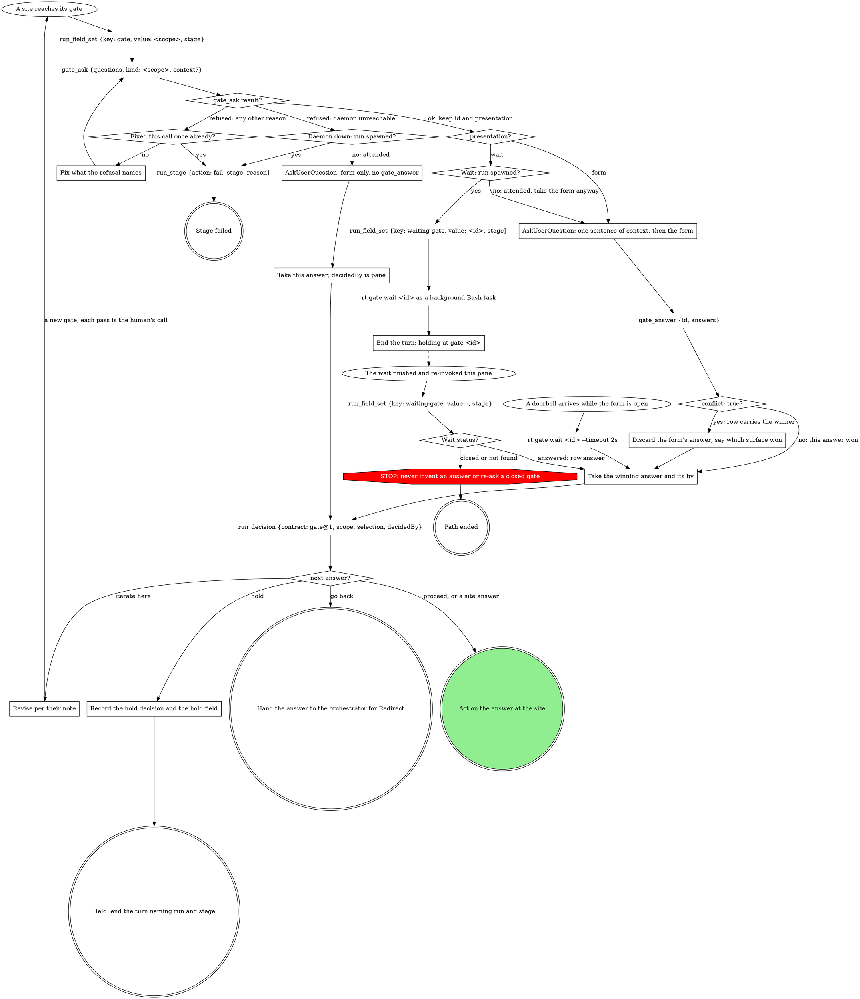

# Run gate

Every gate in the work-next pipeline runs this graph. The site names the
scope, the questions and the `run_decision` selection; this part publishes,
answers and records. Every `run_*` call passes `runDb`.

## What the graph cannot show

- **Questions.** At most 4 options each, or the daemon sends the whole gate
  to the wait queue. Navigation (Iterate here, Go back, Hold) is its own
  `next` question. A selection list over 4 splits into `<id>-1`, `<id>-2`,
  ... of up to 4 each, in order, read as one union.
- **Options** are `{value, label, description}`, the recommended one first
  with `(Recommended)` in its label. A label is at most 200 bytes:
  middle-truncate a long path, never alter the value.
- **Context** is a verbatim quote of the material under decision (the task
  text, the printed block, the failing output), or omitted. Never blank,
  never a fresh summary. It shares one 8192-byte UTF-8 budget with every
  question's own context; over it the daemon drops content and the result
  carries `contextOmitted: true`.
- **Answers** are option values, verbatim. Nuance rides
  `{"value": ..., "note": "..."}`; a question with no options takes the
  typed text. Several form chunks still send one `gate_answer`, after the
  last.
- **decidedBy** is the answer's `by` (`pane`, `board`, `console`,
  `shepherd`), never a verb name.
- **Attendance** comes from the run's `spawnedBy`, never from asking.
- **The form is the reply**: one sentence of context above it, no option
  list in prose, nothing after it.
- **Hold** records `run_decision {contract: gate@1, scope: hold:<stage>:<attempt>, selection: {reason}}`
  and `run_field_set {key: hold, value: <their words, or held>}`.
- `rt gate wait` is the one rt command this pipeline runs on Bash: no tool
  blocks on a gate.

## Off-script gate

Leaving a stage graph is legal when it is explicit. Every STOP node that
routes here opens this gate, scope `off-script:<stage>:<n>` (`n` counts
from 1 within the stage attempt), with `context` quoting the refusal or
the domain line that asks for the move:

| Question | Options |
|---|---|
| `action` | **Take the proposed move** (the value spells the move in full) / **Hand back** |
| `next` | **Proceed** (Recommended) / **Iterate here** / **Hold** |

Selection: `{"move":"<the move>","why":"<the refusal or line>","action":"take|handback","next":"proceed|iterate|hold","note":"<their words or null>"}`.
Take: make exactly that move, once, then continue from the node after it.
Hand back: `run_stage {action: fail}` with the why as the reason.
