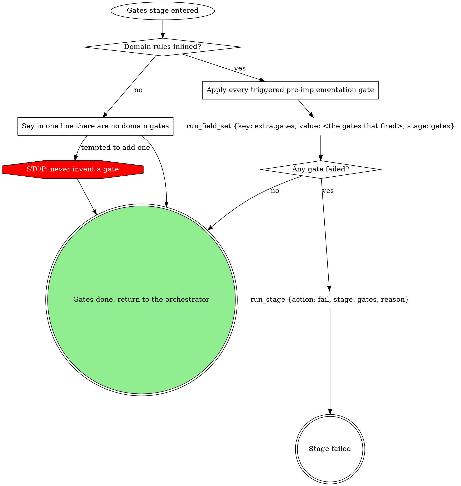

# stage: gates

{{stage.fields}}

Run state: the orchestrator opens and closes this stage, so never write
`run_stage` `start` or `done` here. Read consumes with `run_field_get`; on
failure write `run_stage {action: fail, stage: "gates", reason}` naming
which gate failed and what it found.

### Apply every triggered pre-implementation gate

Each gate the domain rules below trigger for the paths this work touches,
now, before implement. Ship-time gates run again inside the ship stage's
domain flow: firing here does not discharge them.

## Domain rules

The domain rules below supply the gates and the paths that trigger them.
Where a domain step names a move the graph above marks STOP (inventing a
gate), the STOP node wins.

{{slot:domain}}
