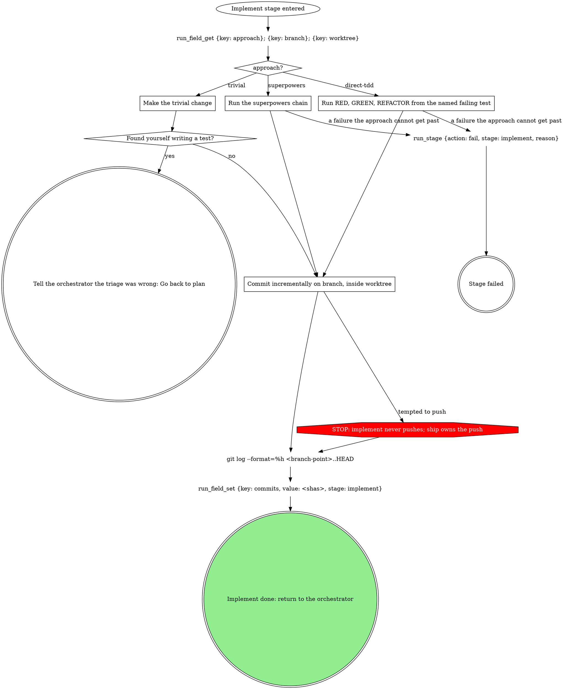

# stage: implement

{{stage.fields}}

Run state: the orchestrator opens and closes this stage, so never write
`run_stage` `start` or `done` here. Read consumes with `run_field_get`,
write `commits` with `run_field_set` (`stage: "implement"`), and on
failure write `run_stage {action: fail, stage: "implement", reason}`
naming what failed.

### Make the trivial change

No test, because there is no runtime behavior: docs, config, a rename.

### Run RED, GREEN, REFACTOR from the named failing test

**REQUIRED SUB-SKILL:** superpowers:test-driven-development, inline,
starting from the FAILING TEST the plan stage named. No spec doc, no
subagents.

### Run the superpowers chain

superpowers:brainstorming, then the spec, then superpowers:writing-plans,
then subagent execution. TDD still holds inside every task. When
dispatching sub-agents, apply the orchestrator's resolved tiering skill if
it announced one.

## What the graph cannot show

- **A failure the approach cannot get past** (a test that cannot be made
  to run, a dependency that will not resolve, a question the plan left
  open) ends the stage with `run_stage {action: fail, stage: "implement",
  reason}` naming it. Switching approach inside this stage is not a way
  past it.
- **Go back to plan** is a Redirect, not a failure: hand it to the
  orchestrator with `to: plan`, `decidedBy: "pane"`, and the triage
  mismatch (what made the trivial change need a test) as the reason.
