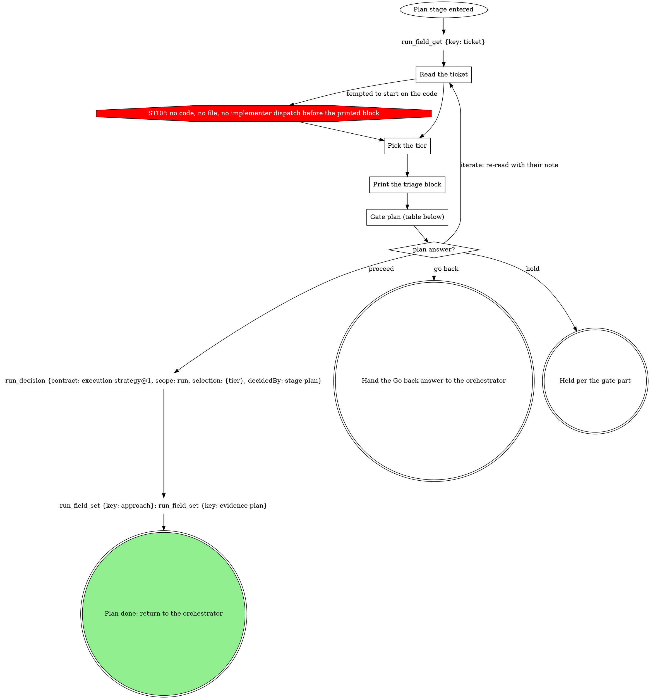

# stage: plan

{{stage.fields}}

Run state: the orchestrator opens and closes this stage, so never write
`run_stage` `start` or `done` here. Read consumes with `run_field_get`,
write each produce with `run_field_set` (`stage: "plan"`) the moment it
exists, and on failure write `run_stage {action: fail, stage: "plan",
reason}` naming what failed.

### Read the ticket

The ticket, or the task description standing in for one, and whatever the
domain rules below say to read alongside it.

### Pick the tier

**REQUIRED SUB-FLOW:** follow the strategy flow below to pick the tier.
The three tiers are its strategies of the same names; its other
strategies are not tiers of this stage. The domain may set a tier floor.

{{include:execution-strategy}}

### Print the triage block

<HARD-GATE>
Print the block before any implementation action: before writing or
editing code, before creating a file, before dispatching an implementer
subagent. Not optional, not internal reasoning, not skippable for
"obvious" work.
</HARD-GATE>

Print verbatim, one tier, plus every line the domain policy defines,
exactly as it specifies:

> APPROACH: trivial -- <one-line reason>
> EVIDENCE: <per the domain policy; "none -- no policy bound" otherwise>

> APPROACH: direct-tdd -- <one-line reason>
> FAILING TEST: <the test you will write first, named>
> EVIDENCE: <as above>

> APPROACH: superpowers -- <one-line reason>
> EVIDENCE: <as above>

On direct-tdd the FAILING TEST line is mandatory: naming the test before
touching code is the point. Record nothing yet: the printed block is the
proposal, and the gate records the decision.

| Thought | Reality |
|---|---|
| "This is an obvious one-line fix, I'll just do it" | Print the block. An obvious fix is `direct-tdd`, not an exemption. |
| "I'll state the approach after I look at the code" | The gate is before code, not after. Print it now. |
| "It's basically trivial" | Only docs, config or a rename are trivial. Behavior change is direct-tdd. |
| "I already know this is a superpowers job" | Say so. The block is how the human and the run verify the triage. |
| "I'll skip the FAILING TEST line, I know what I'll test" | Then writing it costs nothing. Skipping it is how TDD becomes tests-after. |
| "The tier is obvious, I'll record it and move on" | Printing is the proposal. Recording without the gate takes the human's decision. |

## Gate `plan`

One sentence above the form: the printed tier and why.

| Question | Options (recommended first) | Shown when |
|---|---|---|
| `tier` | the printed tier `(Recommended)`, then the other two | always |
| `failing_test` | the FAILING TEST line to keep, or their rename as text | direct-tdd |
| the domain's own | as the domain policy words them | the domain declares them |
| `next` | **Proceed** / **Iterate here** / **Go back** / **Hold** | always |
| `to` | one option per earlier stage, split `to-1`, ... over 4 | Go back answered and more than one earlier stage row |

Selection: `{"tier":"<picked>","failing_test":"<as confirmed or null>","domain":{<answers>},"next":"proceed|iterate|redirect|hold","to":"<stage or null>","note":"<their words or null>"}`.
Write `approach` = the tier the gate recorded and `evidence-plan` = the
EVIDENCE value.

## Domain rules

The domain policy below supplies extra block lines, evidence rules, a tier
floor and extra gate questions. Where a domain step names a move the graph
above marks STOP (code or files before the printed block), the STOP node
wins.

{{slot:domain}}

## Gates

{{include:work-next-gate}}
