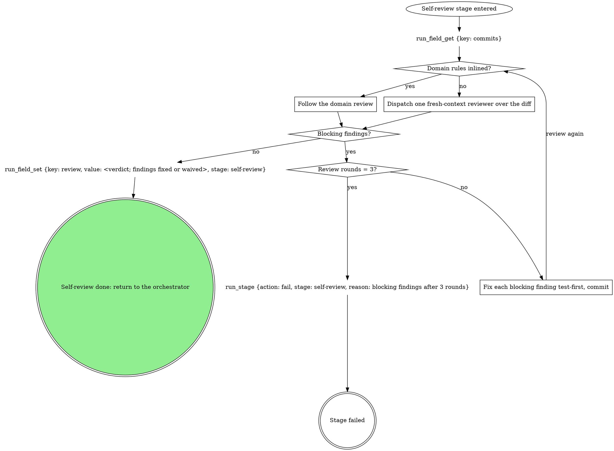

# stage: self-review

{{stage.fields}}

Run state: the orchestrator opens and closes this stage, so never write
`run_stage` `start` or `done` here. Read consumes with `run_field_get`,
write `review` with `run_field_set` (`stage: "self-review"`), and on
failure write `run_stage {action: fail, stage: "self-review", reason}`
naming what failed.

### Dispatch one fresh-context reviewer over the diff

The unbound review: one subagent reads `git diff <branch-point>..HEAD`
against the ticket or task description for correctness, tests present and
honest, and scope drift.

### Follow the domain review

The domain's own review pass, as it words it.

## Domain rules

{{slot:domain}}
