# stage: ship

{{stage.fields}}

Run state: the orchestrator opens and closes this stage, so never write
`run_stage` `start` or `done` here. Read consumes with `run_field_get`,
write `mr` with `run_field_set` (`stage: "ship"`) the moment it exists,
and on failure write `run_stage {action: fail, stage: "ship", reason}`
naming what failed. `<root>` is the worktree root, the absolute path
`git rev-parse --show-toplevel` prints.

The domain rules below run their own steps in their own order. This graph
is where every mechanical move in them lands.

```dot
digraph ship {
    rankdir=TB;

    "Ship stage entered" [shape=ellipse];
    "Run the domain steps before the gate (none when unbound)" [shape=box];
    "git status --porcelain; git log --oneline @{upstream}.. or -5" [shape=plaintext];
    "Gate ship (table below)" [shape=box];
    "ship answer?" [shape=diamond];
    "dirty answer?" [shape=diamond];
    "Commit named files, ticket-prefixed subject" [shape=box];
    "Stash them; nothing in this stage pops it" [shape=box];
    "Run the domain's fast checks (none when unbound)" [shape=box];
    "Checks pass?" [shape=diamond];
    "Fix rounds = 3?" [shape=diamond];
    "Fix test-first, commit, rerun" [shape=box];
    "Domain rebases, and no rebase finished this pass?" [shape=diamond];
    "git_rebase {tree: <root>, onto: origin/<default>}" [shape=plaintext];
    "Rebase status?" [shape=diamond];
    "Conflict rounds = 3?" [shape=diamond];
    "Resolve the files, then git rebase --continue on Bash" [shape=box];
    "Continue result?" [shape=diamond];
    "git_push {tree: <root>, setUpstream: true}" [shape=plaintext];
    "git_push result?" [shape=diamond];
    "Retried with the printed root?" [shape=diamond];
    "git_push {tree: <the root the error prints>, setUpstream: true}" [shape=plaintext];
    "STOP: push only with git_push; a shell push is off-script" [shape=octagon style=filled fillcolor=red fontcolor=white];
    "Off-script gate (gate part)" [shape=box];
    "off-script answer?" [shape=diamond];
    "Make the recorded move once" [shape=box];
    "git remote get-url origin" [shape=plaintext];
    "Forge host?" [shape=diamond];
    "mr_for_branch {repoName: <root>, branches: [<branch>]}" [shape=plaintext];
    "Open MR on the branch?" [shape=diamond];
    "Created once already?" [shape=diamond];
    "mr_create {repoName: <root>, sourceBranch, targetBranch, title, description, draft, squash?, labels?}" [shape=plaintext];
    "mr_create result?" [shape=diamond];
    "mr_update {mrUrl, squash: true}" [shape=plaintext];
    "STOP: GitLab reads and writes go through mr_* tools, never the GitLab CLI" [shape=octagon style=filled fillcolor=red fontcolor=white];
    "gh pr create, draft unless the gate said ready" [shape=plaintext];
    "gh pr create result?" [shape=diamond];
    "Gate clarify: which forge?" [shape=box];
    "run_field_set {key: mr, value: <url>, stage: ship}" [shape=plaintext];
    "Capture the AFTER when the domain names one" [shape=box];
    "AFTER captured, or none named?" [shape=diamond];
    "AFTER attempts = 3?" [shape=diamond];
    "Files to attach?" [shape=diamond];
    "mr_upload {mrUrl, path} per file; keep each markdown" [shape=plaintext];
    "mr_view {mrUrl, maxAgeMs: 5000}, or gh pr view <mr> --json title,body on GitHub" [shape=plaintext];
    "Write the title and description" [shape=box];
    "mr_update {mrUrl, title, description}, or gh pr edit on GitHub" [shape=plaintext];
    "run_stage {action: fail, stage: ship, reason}" [shape=plaintext];
    "Held per the gate part" [shape=doublecircle];
    "Hand the Go back answer to the orchestrator" [shape=doublecircle];
    "Stage failed" [shape=doublecircle];
    "Ship done: return to the orchestrator" [shape=doublecircle style=filled fillcolor=lightgreen];

    "Ship stage entered" -> "Run the domain steps before the gate (none when unbound)";
    "Run the domain steps before the gate (none when unbound)" -> "git status --porcelain; git log --oneline @{upstream}.. or -5";
    "git status --porcelain; git log --oneline @{upstream}.. or -5" -> "Gate ship (table below)";
    "Gate ship (table below)" -> "ship answer?";
    "ship answer?" -> "dirty answer?" [label="proceed"];
    "ship answer?" -> "Run the domain steps before the gate (none when unbound)" [label="iterate: redo with their note"];
    "ship answer?" -> "Hand the Go back answer to the orchestrator" [label="go back"];
    "ship answer?" -> "Held per the gate part" [label="hold"];
    "ship answer?" -> "run_stage {action: fail, stage: ship, reason}" [label="dirty = abort: reason 'aborted at the ship gate'"];
    "dirty answer?" -> "Commit named files, ticket-prefixed subject" [label="commit"];
    "dirty answer?" -> "Stash them; nothing in this stage pops it" [label="stash"];
    "dirty answer?" -> "Run the domain's fast checks (none when unbound)" [label="clean tree"];
    "Commit named files, ticket-prefixed subject" -> "Run the domain's fast checks (none when unbound)";
    "Stash them; nothing in this stage pops it" -> "Run the domain's fast checks (none when unbound)";
    "Run the domain's fast checks (none when unbound)" -> "Checks pass?";
    "Checks pass?" -> "Domain rebases, and no rebase finished this pass?" [label="yes"];
    "Checks pass?" -> "Fix rounds = 3?" [label="no"];
    "Fix rounds = 3?" -> "Fix test-first, commit, rerun" [label="no"];
    "Fix rounds = 3?" -> "Gate ship (table below)" [label="yes: reopen, failing output quoted"];
    "Fix test-first, commit, rerun" -> "Run the domain's fast checks (none when unbound)";
    "Domain rebases, and no rebase finished this pass?" -> "git_rebase {tree: <root>, onto: origin/<default>}" [label="yes"];
    "Domain rebases, and no rebase finished this pass?" -> "git_push {tree: <root>, setUpstream: true}" [label="no"];
    "git_rebase {tree: <root>, onto: origin/<default>}" -> "Rebase status?";
    "Rebase status?" -> "git_push {tree: <root>, setUpstream: true}" [label="clean"];
    "Rebase status?" -> "Conflict rounds = 3?" [label="conflict"];
    "Rebase status?" -> "run_stage {action: fail, stage: ship, reason}" [label="any other error: quote it as the reason"];
    "Conflict rounds = 3?" -> "Resolve the files, then git rebase --continue on Bash" [label="no"];
    "Conflict rounds = 3?" -> "Gate ship (table below)" [label="yes: reopen, conflicted files quoted"];
    "Resolve the files, then git rebase --continue on Bash" -> "Continue result?";
    "Continue result?" -> "Conflict rounds = 3?" [label="another commit conflicted"];
    "Continue result?" -> "Run the domain's fast checks (none when unbound)" [label="rebase finished"];
    "git_push {tree: <root>, setUpstream: true}" -> "git_push result?";
    "git_push {tree: <the root the error prints>, setUpstream: true}" -> "git_push result?";
    "git_push result?" -> "git remote get-url origin" [label="ok"];
    "git_push result?" -> "Retried with the printed root?" [label="tree must be the absolute path of the root"];
    "git_push result?" -> "STOP: push only with git_push; a shell push is off-script" [label="any other error"];
    "Retried with the printed root?" -> "git_push {tree: <the root the error prints>, setUpstream: true}" [label="no"];
    "Retried with the printed root?" -> "STOP: push only with git_push; a shell push is off-script" [label="yes"];
    "STOP: push only with git_push; a shell push is off-script" -> "Off-script gate (gate part)";
    "Off-script gate (gate part)" -> "off-script answer?";
    "off-script answer?" -> "Make the recorded move once" [label="take"];
    "off-script answer?" -> "run_stage {action: fail, stage: ship, reason}" [label="hand back"];
    "Make the recorded move once" -> "git remote get-url origin";
    "git remote get-url origin" -> "Forge host?";
    "Forge host?" -> "mr_for_branch {repoName: <root>, branches: [<branch>]}" [label="GitLab"];
    "Forge host?" -> "gh pr create, draft unless the gate said ready" [label="GitHub"];
    "Forge host?" -> "Gate clarify: which forge?" [label="anything else"];
    "Gate clarify: which forge?" -> "Forge host?" [label="answered: the named forge"];
    "mr_for_branch {repoName: <root>, branches: [<branch>]}" -> "Open MR on the branch?";
    "Open MR on the branch?" -> "run_field_set {key: mr, value: <url>, stage: ship}" [label="yes: keep its url"];
    "Open MR on the branch?" -> "Created once already?" [label="no"];
    "Created once already?" -> "mr_create {repoName: <root>, sourceBranch, targetBranch, title, description, draft, squash?, labels?}" [label="no"];
    "Created once already?" -> "run_stage {action: fail, stage: ship, reason}" [label="yes: the mr_create error is the reason"];
    "mr_create {repoName: <root>, sourceBranch, targetBranch, title, description, draft, squash?, labels?}" -> "mr_create result?";
    "mr_create result?" -> "run_field_set {key: mr, value: <url>, stage: ship}" [label="url, squash applied or not asked"];
    "mr_create result?" -> "mr_update {mrUrl, squash: true}" [label="squashApplied: false"];
    "mr_create result?" -> "STOP: GitLab reads and writes go through mr_* tools, never the GitLab CLI" [label="error, or url null"];
    "STOP: GitLab reads and writes go through mr_* tools, never the GitLab CLI" -> "mr_for_branch {repoName: <root>, branches: [<branch>]}" [label="read it back; never create twice"];
    "mr_update {mrUrl, squash: true}" -> "run_field_set {key: mr, value: <url>, stage: ship}";
    "gh pr create, draft unless the gate said ready" -> "gh pr create result?";
    "gh pr create result?" -> "run_field_set {key: mr, value: <url>, stage: ship}" [label="url printed"];
    "gh pr create result?" -> "run_field_set {key: mr, value: <url>, stage: ship}" [label="already exists: keep the url it prints"];
    "gh pr create result?" -> "run_stage {action: fail, stage: ship, reason}" [label="any other error: quote it as the reason"];
    "run_field_set {key: mr, value: <url>, stage: ship}" -> "Capture the AFTER when the domain names one";
    "Capture the AFTER when the domain names one" -> "AFTER captured, or none named?";
    "AFTER captured, or none named?" -> "Files to attach?" [label="yes"];
    "AFTER captured, or none named?" -> "AFTER attempts = 3?" [label="no: the capture failed"];
    "AFTER attempts = 3?" -> "Capture the AFTER when the domain names one" [label="no: another attempt"];
    "AFTER attempts = 3?" -> "Files to attach?" [label="yes: go on without it; the description names the gap"];
    "Files to attach?" -> "mr_upload {mrUrl, path} per file; keep each markdown" [label="yes, GitLab"];
    "Files to attach?" -> "mr_view {mrUrl, maxAgeMs: 5000}, or gh pr view <mr> --json title,body on GitHub" [label="no, or GitHub: link the paths"];
    "mr_upload {mrUrl, path} per file; keep each markdown" -> "mr_view {mrUrl, maxAgeMs: 5000}, or gh pr view <mr> --json title,body on GitHub";
    "mr_view {mrUrl, maxAgeMs: 5000}, or gh pr view <mr> --json title,body on GitHub" -> "Write the title and description";
    "Write the title and description" -> "mr_update {mrUrl, title, description}, or gh pr edit on GitHub";
    "mr_update {mrUrl, title, description}, or gh pr edit on GitHub" -> "Ship done: return to the orchestrator";
    "run_stage {action: fail, stage: ship, reason}" -> "Stage failed";
}
```

### Run the domain steps before the gate (none when unbound)

The domain's gathering steps: sanity of the diff against the ticket, the
branch and ticket checks, an existing-MR lookup, any mandatory pre-ship
review. Each one that raises a question adds it to the `ship` gate rather
than asking on its own.

### Run the domain's fast checks (none when unbound)

Only the checks the domain names, on the changed files. Revert generated
drift the checks leave behind before continuing. A full suite the domain
rules out stays out: CI runs it.

### Fix test-first, commit, rerun

Each fix gets its failing test first, then the fix, then a commit. The
counter is fix rounds within this pass through the stage.

### Resolve the files, then git rebase --continue on Bash

Resolve each conflicted file `git_rebase` returned, then continue the
rebase on Bash (no tool continues one). A later commit that conflicts
counts as another round. Once the rebase finishes, the fast checks run
again because the tree changed under them, and then the push follows:
this pass never starts a second rebase.

### Capture the AFTER when the domain names one

The same view as the BEFORE in `evidence`, on the sha you pushed. The
counter is attempts within this pass through the stage; after the third
failure, ship without it and say in the description what was tried.
Unbound, there is no AFTER.

### Write the title and description

Title from the ticket or the first commit subject; the body links the
ticket and every `evidence` entry, with the upload markdown where it
exists. The update replaces the whole body, so start from the one just
read back: keep what is already there (evidence the evidence stage
attached, a teammate's edits) and change only what this stage owns. The
domain's title, template and voice rules win over this paragraph.

## What the graph cannot show

- After a rebase that rewrote already-pushed commits, push with
  `git_push {tree: <root>, forceWithLease: true}` instead. Never force
  otherwise, and never push a branch whose tests you have not seen pass in
  this session.
- `targetBranch` is the default branch read from git, never guessed. Keep
  the `url` `mr_create` returns as `mrUrl` for every later write.

## Gate `ship` (before the push)

One sentence above the form: the branch, the commits about to go, and
whether the tree is dirty.

| Question | Options (recommended first) | Shown when |
|---|---|---|
| `dirty` | **Commit the changes** / **Stash them** / **Abort** | the tree is dirty |
| `open_as` | **Push and open as draft** / **Push and open ready** | always |
| the domain's own | as the domain rules word them (a ticket mismatch, an MR already open) | the domain declares them |
| `next` | **Proceed** / **Iterate here** / **Go back to `<stage>`** / **Hold** | always |

Selection: `{"dirty":"commit|stash|abort|null","open_as":"draft|ready","domain":{<answers>},"next":"proceed|iterate|redirect|hold","to":"<stage or null>","note":"<their words or null>"}`.

## Domain rules

The domain rules below supply content, checks and extra gate questions.
Where a domain step names a move the graph above marks STOP (a shell push
fallback, a forge CLI write), the STOP node wins: open the off-script gate
instead.

{{slot:domain}}

When nothing is inlined above, the graph alone is the flow: no steps
before the gate, no fast checks, no rebase, no AFTER.

## Gates

{{include:work-next-gate}}
