# work-next -- the digraph pipeline orchestrator

You run one unit of work through eight stages. The graph below is the run:
follow its edges, and treat a move it does not show as a question for a
gate, never as a judgment call. Every `run_*` call passes `runDb`.

## Stages

Walk them in this order. Each file sits beside this one; read it when its
stage starts, and follow it.

| Stage | Read | Consumes | Produces |
|---|---|---|---|
| `provision` | `${CLAUDE_SKILL_DIR}/{{verb.path:work-next-provision}}` | `ticket` `repo` | `branch` `worktree` |
| `plan` | `${CLAUDE_SKILL_DIR}/{{verb.path:work-next-plan}}` | `ticket` | `approach` `evidence-plan` |
| `gates` | `${CLAUDE_SKILL_DIR}/{{verb.path:work-next-gates}}` | `approach` `worktree` | nothing |
| `evidence` | `${CLAUDE_SKILL_DIR}/{{verb.path:work-next-evidence}}` | `evidence-plan` `worktree` | `evidence` |
| `implement` | `${CLAUDE_SKILL_DIR}/{{verb.path:work-next-implement}}` | `approach` `branch` `worktree` | `commits` |
| `self-review` | `${CLAUDE_SKILL_DIR}/{{verb.path:work-next-self-review}}` | `commits` | `review` |
| `ship` | `${CLAUDE_SKILL_DIR}/{{verb.path:work-next-ship}}` | `commits` `ticket` | `mr` |
| `watch-ci` | `${CLAUDE_SKILL_DIR}/{{verb.path:work-next-watch-ci}}` | `mr` `branch` | `ci` |

`run_start` takes these flags verbatim:

{{run-start.flags:work-next}}

```dot
digraph work_next {
    rankdir=TB;

    "Request: run this unit of work" [shape=ellipse];
    "Existing work, and no runDb in context?" [shape=diamond];
    "run_list {repo}" [shape=plaintext];
    "Newest running run in this repo?" [shape=diamond];
    "Gate clarify, AskUserQuestion only: Resume it / Start fresh / Hold" [shape=box];
    "clarify answer?" [shape=diamond];
    "runDb = absolute runs root/<repo>/<id>/state.db" [shape=box];
    "run_snapshot" [shape=plaintext];
    "run_start {flags, skillDir, ticket?, spawnedBy?}" [shape=plaintext];
    "ok: true with a runDb?" [shape=diamond];
    "STOP: report the tool's message; no run_start tool means rt needs an update" [shape=octagon style=filled fillcolor=red fontcolor=white];
    "Ticket named?" [shape=diamond];
    "Tracker: In Progress, assigned to the operator" [shape=box];
    "Spawn-time account pick made?" [shape=diamond];
    "run_decision {contract: account-pool@1, scope: run, selection, decidedBy}" [shape=plaintext];
    "Take the next stage in the table" [shape=box];

    subgraph cluster_stage {
        label="Per stage";
        "run_stage {action: start, stage}" [shape=plaintext];
        "Resuming a held stage?" [shape=diamond];
        "run_field_set {key: hold, value: -, stage}" [shape=plaintext];
        "Read the stage file and follow it" [shape=box];
        "How did the stage end?" [shape=diamond];
        "run_snapshot: every produce set and not -?" [shape=diamond];
        "run_stage {action: fail, stage, reason: <missing field>}" [shape=plaintext];
        "run_stage {action: done, stage}" [shape=plaintext];
    }

    "Last stage done?" [shape=diamond];
    "Gate <stage>-failed:<attempt>" [shape=box];
    "failure answer?" [shape=diamond];
    "Gate close" [shape=box];
    "close answer?" [shape=diamond];
    "run_status {status: done}" [shape=plaintext];
    "run_status {status: abandoned}" [shape=plaintext];

    subgraph cluster_redirect {
        label="Redirect to <to>";
        "run_decision {contract: gate@1, scope: redirect:<from>:<attempt>, selection: {from, to, reason}}" [shape=plaintext];
        "Is the <from> row still running?" [shape=diamond];
        "run_stage {action: redirect, stage: <from>, to, reason}" [shape=plaintext];
        "run_field_set {key: <each produce from <to> on>, value: -}" [shape=plaintext];
    }

    "Held: end the turn naming run and stage" [shape=doublecircle];
    "Run abandoned" [shape=doublecircle];
    "Run done" [shape=doublecircle style=filled fillcolor=lightgreen];

    "Request: run this unit of work" -> "Existing work, and no runDb in context?";
    "Existing work, and no runDb in context?" -> "run_list {repo}" [label="yes"];
    "Existing work, and no runDb in context?" -> "run_start {flags, skillDir, ticket?, spawnedBy?}" [label="no: new work"];
    "run_list {repo}" -> "Newest running run in this repo?";
    "Newest running run in this repo?" -> "Gate clarify, AskUserQuestion only: Resume it / Start fresh / Hold" [label="found"];
    "Newest running run in this repo?" -> "run_start {flags, skillDir, ticket?, spawnedBy?}" [label="none"];
    "Gate clarify, AskUserQuestion only: Resume it / Start fresh / Hold" -> "clarify answer?";
    "clarify answer?" -> "runDb = absolute runs root/<repo>/<id>/state.db" [label="resume"];
    "clarify answer?" -> "run_start {flags, skillDir, ticket?, spawnedBy?}" [label="start fresh"];
    "clarify answer?" -> "Held: end the turn naming run and stage" [label="hold"];
    "runDb = absolute runs root/<repo>/<id>/state.db" -> "run_snapshot";
    "run_snapshot" -> "run_stage {action: start, stage}" [label="at run.current_stage"];
    "run_start {flags, skillDir, ticket?, spawnedBy?}" -> "ok: true with a runDb?";
    "ok: true with a runDb?" -> "Ticket named?" [label="yes: keep runDb"];
    "ok: true with a runDb?" -> "STOP: report the tool's message; no run_start tool means rt needs an update" [label="no"];
    "Ticket named?" -> "Tracker: In Progress, assigned to the operator" [label="yes"];
    "Ticket named?" -> "Spawn-time account pick made?" [label="no"];
    "Tracker: In Progress, assigned to the operator" -> "Spawn-time account pick made?";
    "Spawn-time account pick made?" -> "run_decision {contract: account-pool@1, scope: run, selection, decidedBy}" [label="yes"];
    "Spawn-time account pick made?" -> "Take the next stage in the table" [label="no"];
    "run_decision {contract: account-pool@1, scope: run, selection, decidedBy}" -> "Take the next stage in the table";
    "Take the next stage in the table" -> "run_stage {action: start, stage}";
    "run_stage {action: start, stage}" -> "Resuming a held stage?";
    "Resuming a held stage?" -> "run_field_set {key: hold, value: -, stage}" [label="yes"];
    "Resuming a held stage?" -> "Read the stage file and follow it" [label="no"];
    "run_field_set {key: hold, value: -, stage}" -> "Read the stage file and follow it";
    "Read the stage file and follow it" -> "How did the stage end?";
    "How did the stage end?" -> "run_snapshot: every produce set and not -?" [label="finished"];
    "How did the stage end?" -> "Gate <stage>-failed:<attempt>" [label="it wrote run_stage fail"];
    "How did the stage end?" -> "run_decision {contract: gate@1, scope: redirect:<from>:<attempt>, selection: {from, to, reason}}" [label="a Go back or Fix answer: no produce check"];
    "How did the stage end?" -> "Held: end the turn naming run and stage" [label="held at a gate"];
    "How did the stage end?" -> "Run abandoned" [label="the stage abandoned the run"];
    "run_snapshot: every produce set and not -?" -> "run_stage {action: done, stage}" [label="yes"];
    "run_snapshot: every produce set and not -?" -> "run_stage {action: fail, stage, reason: <missing field>}" [label="no"];
    "run_stage {action: fail, stage, reason: <missing field>}" -> "Gate <stage>-failed:<attempt>";
    "run_stage {action: done, stage}" -> "Last stage done?";
    "Last stage done?" -> "Take the next stage in the table" [label="no"];
    "Last stage done?" -> "Gate close" [label="yes"];
    "Gate <stage>-failed:<attempt>" -> "failure answer?";
    "failure answer?" -> "run_stage {action: start, stage}" [label="retry: a new attempt"];
    "failure answer?" -> "run_decision {contract: gate@1, scope: redirect:<from>:<attempt>, selection: {from, to, reason}}" [label="go back, or iterate here (to = this stage)"];
    "failure answer?" -> "Held: end the turn naming run and stage" [label="hold"];
    "failure answer?" -> "run_status {status: abandoned}" [label="abandon"];
    "Gate close" -> "close answer?";
    "close answer?" -> "run_status {status: done}" [label="done"];
    "close answer?" -> "run_decision {contract: gate@1, scope: redirect:<from>:<attempt>, selection: {from, to, reason}}" [label="iterate (to = implement) or go back"];
    "close answer?" -> "Held: end the turn naming run and stage" [label="hold"];
    "run_decision {contract: gate@1, scope: redirect:<from>:<attempt>, selection: {from, to, reason}}" -> "Is the <from> row still running?";
    "Is the <from> row still running?" -> "run_stage {action: redirect, stage: <from>, to, reason}" [label="yes: a Go back or Fix handed back mid-stage"];
    "Is the <from> row still running?" -> "run_field_set {key: <each produce from <to> on>, value: -}" [label="no: done (Close) or failed (failure gate): no redirect call"];
    "run_stage {action: redirect, stage: <from>, to, reason}" -> "run_field_set {key: <each produce from <to> on>, value: -}";
    "run_field_set {key: <each produce from <to> on>, value: -}" -> "run_stage {action: start, stage}" [label="stage = <to>, walk forward"];
    "run_status {status: done}" -> "Run done";
    "run_status {status: abandoned}" -> "Run abandoned";
}
```

## What the graph cannot show

- **One owner for stage rows.** This file writes every `run_stage`
  `start`, `done` and `redirect`; a stage writes only its fields and, on
  failure, its own `fail`. Every `start` inserts a new attempt row, so a
  second one leaves a row running forever.
- **Tracker.** For Linear: `save_issue` with state In Progress and
  assignee `me`. Never fabricate a ticket.
- **skillDir** is this skill's own directory, `${CLAUDE_SKILL_DIR}`, as an
  absolute path, passed to `run_start`.
- **Resume path.** `runDb` is `<absolute home>/.mattstack/runs/<repo>/<id>/state.db`,
  `<repo>` being the `--repo` value in the flags above and `<id>` the
  `run_list` row's `id`; the run tools refuse `~` and relative paths. An
  error naming a different runs root wins. Decided questions stay decided.
  Starting fresh leaves the found run's own status untouched.
- **State lives in the DB.** `run_field_set` and `run_snapshot` state
  survives context compaction; carrying it forward in prose instead does
  not.
- **The cleared sentinel.** `-` marks a produce a Redirect cleared, so the
  completeness check re-runs honestly. Later stages re-run as new attempts;
  a ship re-run pushes new commits to the same MR.
- **Redirect reasons** are the human's words, never a category. A redirect
  typed in the pane with no open gate records `decidedBy: "pane"`. The
  `redirect` call closes a row that is still running; after Close (the
  last row is done) or a failure gate (the row is failed) there is nothing
  to close, so the decision record alone carries the move. A `redirect`
  refused anyway because the row was not running: say so in one line and
  continue.
- **A finished run stays finished.** Only Close's answer or Abandon ends
  it; a green `ci` does not. Never carry a finished run's `runDb` into new
  work: its next `run_stage start` would write into it.
- **Clarify comes before the run.** No `runDb` exists yet, so `clarify`
  is AskUserQuestion alone: no `gate_*` and no `run_*` call.
- **This file's own gates** (`<stage>-failed`, `close`) take the gate
  part minus its `run_stage {action: fail}` exits: a gate the daemon
  cannot open here ends the turn with a one-line report, and the run stays
  `running`.
- **The gate is the form.** About to end the turn with the run still
  `running` and no form on screen? Stop: the Stop hook sends you back.
- **Account back-fill** (a pick made before the DB existed):
  `selection` is the pick as an object, `decidedBy` the spawning surface.

## Gate questions

Each question is its own; never fold one list into another.

| Gate | Question | Options (recommended first) | Shown when |
|---|---|---|---|
| `clarify` | `resume` | **Resume it** / **Start fresh** / **Hold** | a running run was found |
| `<stage>-failed:<attempt>` | `action` | **Retry the stage** (when the reason names something fixable) / **Abandon the run** | always |
| | `next` | **Proceed** / **Iterate here** / **Go back** / **Hold** | always |
| | `to` | one option per earlier stage, split `to-1`, `to-2`, ... over 4 | Go back answered and more than one earlier stage row |
| `close` | `next` | **Done** (when `ci` is green and the MR ready) / **Iterate here** / **Go back** / **Hold** | always |
| | `to` | one option per stage, split over 4 | Go back answered and more than one stage row |

With exactly one candidate stage, label the option **Go back to
`<stage>`** in `next` and skip `to`. One sentence above each form: the
stage and the failure reason (and detail path), or the MR link, its state
and the `ci` verdict.

Selections:

- failure: `{"next":"retry|redirect|iterate|hold|abandon","to":"<stage or null>","note":"<their words or null>"}`
- close: `{"next":"done|iterate|redirect|hold","to":"<stage or null>","note":"<their words or null>"}`

## Sub-agent tiering

{{slot:tiering}}

## Gates

{{include:work-next-gate}}
