# Creating a pack

A pack is a plugin in the team's zone: a verb roster, a bindings fragment,
and (later) domain fills. `rt skills init` writes all of it; this skill runs
that verb, proves the result, and offers the first rules. One zone holds
one pack, named after the zone's namespace.

Walk this map to the end; a pack is not done until it is published.

```dot
digraph create_pack {
    rankdir=TB;

    "Trigger: a team wants the pipeline on a repo with no pack" [shape=ellipse];
    "rt_verb {args: [\"daemon\", \"status\"]}" [shape=plaintext];
    "claude plugin list --json" [shape=plaintext];
    "git remote get-url origin" [shape=plaintext];
    "Every prerequisite passes?" [shape=diamond];
    "Name each miss and the command that installs it" [shape=box];
    "STOP: never improvise a substitute" [shape=octagon style=filled fillcolor=red fontcolor=white];
    "Team and its zone known?" [shape=diamond];
    "Ask the author: which team, and a remote it owns" [shape=box];
    "The team's own zone exists?" [shape=diamond];
    "rt team create <Name> --remote <url>" [shape=plaintext];
    "rt skills init --json --zone <slug> --repo <repo-path>" [shape=plaintext];
    "Envelope?" [shape=diamond];
    "Relay error.message verbatim" [shape=box];
    "Refusal code?" [shape=diamond];
    "Init runs = 2?" [shape=diamond];
    "Gate: init budget spent" [shape=box];
    "Relay error.message and error.wrote" [shape=box];
    "write-failed?" [shape=diamond];
    "Removed the pack dir once already?" [shape=diamond];
    "Remove the pack dir" [shape=box];
    "STOP: never re-run init on a written pack" [shape=octagon style=filled fillcolor=red fontcolor=white];
    "Follow the printed remedy" [shape=box];
    "The remedy completed the pack?" [shape=diamond];
    "Gate: remedy did not complete the pack" [shape=box];
    "In a herdr pane?" [shape=diamond];
    "rt pane send self --text \"/reload-plugins\" --then \"Continue: <tryNext> with a small real ticket\"" [shape=plaintext];
    "End the turn" [shape=box];
    "The queued Continue line resumes this pane" [shape=ellipse];
    "Run tryNext on a small real ticket" [shape=box];
    "The run reached a CI verdict?" [shape=diamond];
    "Name each fallback the run took" [shape=box];
    "Ask the author to type /reload-plugins, then paste tryNext" [shape=box];
    "Report: scaffolded, proof pending" [shape=box];
    "Ask the first-rules question once" [shape=box];
    "Rules written down?" [shape=diamond];
    "Hand each rule to extending-a-pack, one per round" [shape=box];
    "Say rules can be added any time" [shape=box];
    "git status -sb" [shape=plaintext];
    "Zone state?" [shape=diamond];
    "Push the zone's default branch" [shape=box];
    "Zone push landed?" [shape=diamond];
    "Gate: zone push rejected" [shape=box];
    "Status checks = 3?" [shape=diamond];
    "Wait for the daemon's snapshot commit" [shape=box];
    "Gate: snapshot never landed" [shape=box];
    "Stopped at prerequisites" [shape=doublecircle];
    "Stopped: refusal relayed" [shape=doublecircle];
    "Handed to the author" [shape=doublecircle];
    "Pack published" [shape=doublecircle style=filled fillcolor=lightgreen];

    "Trigger: a team wants the pipeline on a repo with no pack" -> "rt_verb {args: [\"daemon\", \"status\"]}";
    "rt_verb {args: [\"daemon\", \"status\"]}" -> "claude plugin list --json";
    "claude plugin list --json" -> "git remote get-url origin";
    "git remote get-url origin" -> "Every prerequisite passes?";
    "Every prerequisite passes?" -> "Team and its zone known?" [label="yes"];
    "Every prerequisite passes?" -> "Name each miss and the command that installs it" [label="no"];
    "Name each miss and the command that installs it" -> "STOP: never improvise a substitute";
    "STOP: never improvise a substitute" -> "Stopped at prerequisites";
    "Team and its zone known?" -> "rt skills init --json --zone <slug> --repo <repo-path>" [label="yes"];
    "Team and its zone known?" -> "Ask the author: which team, and a remote it owns" [label="team unclear, or no zone yet"];
    "Ask the author: which team, and a remote it owns" -> "The team's own zone exists?";
    "The team's own zone exists?" -> "rt skills init --json --zone <slug> --repo <repo-path>" [label="yes"];
    "The team's own zone exists?" -> "rt team create <Name> --remote <url>" [label="no: their remote, never an invented one"];
    "rt team create <Name> --remote <url>" -> "rt skills init --json --zone <slug> --repo <repo-path>";
    "rt skills init --json --zone <slug> --repo <repo-path>" -> "Envelope?";
    "Envelope?" -> "In a herdr pane?" [label="ok: true"];
    "Envelope?" -> "Relay error.message verbatim" [label="refused: true"];
    "Envelope?" -> "Relay error.message and error.wrote" [label="refused: false, after a write"];
    "Relay error.message verbatim" -> "Refusal code?";
    "Refusal code?" -> "Init runs = 2?" [label="zone-missing or zone-has-pack"];
    "Refusal code?" -> "Stopped: refusal relayed" [label="any other code"];
    "Init runs = 2?" -> "Ask the author: which team, and a remote it owns" [label="no"];
    "Init runs = 2?" -> "Gate: init budget spent" [label="yes"];
    "Gate: init budget spent" -> "rt skills init --json --zone <slug> --repo <repo-path>" [label="retry: author fixed it"];
    "Gate: init budget spent" -> "Handed to the author" [label="author takes over"];
    "Relay error.message and error.wrote" -> "write-failed?";
    "write-failed?" -> "Removed the pack dir once already?" [label="yes"];
    "write-failed?" -> "Follow the printed remedy" [label="no"];
    "write-failed?" -> "STOP: never re-run init on a written pack" [label="tempted to re-run init"];
    "STOP: never re-run init on a written pack" -> "Follow the printed remedy";
    "Removed the pack dir once already?" -> "Remove the pack dir" [label="no"];
    "Removed the pack dir once already?" -> "Gate: init budget spent" [label="yes"];
    "Remove the pack dir" -> "rt skills init --json --zone <slug> --repo <repo-path>";
    "Follow the printed remedy" -> "The remedy completed the pack?";
    "The remedy completed the pack?" -> "In a herdr pane?" [label="yes"];
    "The remedy completed the pack?" -> "Gate: remedy did not complete the pack" [label="no"];
    "Gate: remedy did not complete the pack" -> "Follow the printed remedy" [label="retry with their note"];
    "Gate: remedy did not complete the pack" -> "Handed to the author" [label="author takes over"];
    "In a herdr pane?" -> "rt pane send self --text \"/reload-plugins\" --then \"Continue: <tryNext> with a small real ticket\"" [label="yes"];
    "In a herdr pane?" -> "Ask the author to type /reload-plugins, then paste tryNext" [label="no"];
    "rt pane send self --text \"/reload-plugins\" --then \"Continue: <tryNext> with a small real ticket\"" -> "End the turn";
    "End the turn" -> "The queued Continue line resumes this pane" [style=dashed];
    "The queued Continue line resumes this pane" -> "Run tryNext on a small real ticket";
    "Run tryNext on a small real ticket" -> "The run reached a CI verdict?";
    "The run reached a CI verdict?" -> "Name each fallback the run took" [label="yes"];
    "The run reached a CI verdict?" -> "Report: scaffolded, proof pending" [label="no"];
    "Name each fallback the run took" -> "Ask the first-rules question once";
    "Ask the author to type /reload-plugins, then paste tryNext" -> "Report: scaffolded, proof pending";
    "Report: scaffolded, proof pending" -> "Ask the first-rules question once";
    "Ask the first-rules question once" -> "Rules written down?";
    "Rules written down?" -> "Hand each rule to extending-a-pack, one per round" [label="yes"];
    "Rules written down?" -> "Say rules can be added any time" [label="no"];
    "Hand each rule to extending-a-pack, one per round" -> "git status -sb";
    "Say rules can be added any time" -> "git status -sb";
    "git status -sb" -> "Zone state?";
    "Zone state?" -> "Pack published" [label="clean, not ahead"];
    "Zone state?" -> "Push the zone's default branch" [label="ahead"];
    "Zone state?" -> "Status checks = 3?" [label="the snapshot has not committed yet"];
    "Push the zone's default branch" -> "Zone push landed?";
    "Zone push landed?" -> "Pack published" [label="yes"];
    "Zone push landed?" -> "Gate: zone push rejected" [label="no: quote the rejection"];
    "Gate: zone push rejected" -> "Push the zone's default branch" [label="retry: author fixed it"];
    "Gate: zone push rejected" -> "Handed to the author" [label="author takes over"];
    "Status checks = 3?" -> "Wait for the daemon's snapshot commit" [label="no"];
    "Status checks = 3?" -> "Gate: snapshot never landed" [label="yes"];
    "Wait for the daemon's snapshot commit" -> "git status -sb";
    "Gate: snapshot never landed" -> "git status -sb" [label="retry: author fixed it"];
    "Gate: snapshot never landed" -> "Handed to the author" [label="author takes over"];
}
```

## Prerequisites

| check | command | pass |
| --- | --- | --- |
| rt daemon | `rt_verb {args: ["daemon", "status"]}` | `"state":"running"` |
| mattstack plugin | `claude plugin list --json` | an id starting `mattstack@` |
| superpowers | `claude plugin list --json` | an id starting `superpowers@` |
| a GitLab remote | `git remote get-url origin` | host is a GitLab host |

## Steps

### Name each miss and the command that installs it

Report the missing thing and the command that installs it: `rt setup pack`,
run once and not routine, covers the first three rows. Do not improvise a
substitute.

### Ask the author: which team, and a remote it owns

A zone is a directory under `~/.mattstack/teams/` whose
`mattstack/mattstack.jsonc` says `role: team`. When the team is unclear,
ask which team this is before running anything.

When the team has no zone of its own, `rt team create <Name> --remote <url>`
makes one. It is a one-time setup call, not routine, and the remote is an
empty repo the team owns. Ask the author for that URL; never invent one.

### Relay error.message verbatim

A refusal is `{ "error": { "code", "message", "refused": true } }`, and
nothing was written. Relay `error.message` word for word, then read
`error.code`:

- `zone-missing` (outside a TTY): the team has no zone yet.
- `zone-has-pack`: the zone found already belongs to another team's pack,
  so this team needs a zone of its own, made the same way.

Both go back to the author for a team and a remote; count every init run
toward the budget of two.

### Relay error.message and error.wrote

A post-write failure is
`{ "error": { "code", "message", "refused": false, "wrote": [...] } }`:
init wrote files before it failed. Relay `error.message` and the
`error.wrote` list so the author sees what exists now.

### Remove the pack dir

Only after `write-failed`: that code's remedy is to remove the pack dir and
run init again. Remove the pack dir that `error.wrote` names, and nothing
else in the zone. The re-run counts toward the same budget.

### Follow the printed remedy

Do exactly what the printed remedy says. Never re-run init on a written
pack.

### End the turn

Queue the reload with rt:herdr-inject, then end the turn. `/reload-plugins`
loads the new pack in place, and the queued Continue line resumes this pane
on the next step.

### Run tryNext on a small real ticket

Run `tryNext` with a small real ticket. "Works" means, after the reload: a
branch or worktree, an APPROACH block printed, a commit, an MR, and a CI
verdict. Every stage runs its generic path; that is the expected shape of a
pack with no fills.

### Name each fallback the run took

Name each fallback in the report, for example: the provisioner did not know
the repo, so the branch was made in the checkout.

The `work` verb's description in `pack/stubs.jsonc` is a placeholder seeded
from the engine. Rewording it in the team's words is the first, smallest
edit; `mattstack:extending-a-pack` covers it.

### Ask the author to type /reload-plugins, then paste tryNext

`/reload-plugins` loads the new pack in the author's session in place.
Then they paste `tryNext` with a small real ticket.

### Report: scaffolded, proof pending

Until the first `/<pack>:work` run has reported back, the pack is
scaffolded, not proven: say "scaffolded, proof pending". When the run in
this pane stopped short of a CI verdict, name the stage it stopped at.
When the author runs it, their reloaded session owns the report. A hand-off
is not a proof.

### Ask the first-rules question once

Ask exactly this:

> Are any of your team's rules already written down (CONTRIBUTING, a review
> checklist, branch rules, a release checklist)?

### Hand each rule to extending-a-pack, one per round

Each yes is one round of `mattstack:extending-a-pack`, one rule per round.

### Say rules can be added any time

No is a complete answer. Say that rules can be added any time with
`mattstack:extending-a-pack`.

### Push the zone's default branch

Ahead means the daemon's snapshot committed but could not push. From the
zone checkout, a bare push (`git_push` refuses a default branch):

`git push` <!-- mcp-lint: allow -->

Never force.

### Wait for the daemon's snapshot commit

The daemon's team snapshot commits the zone on its own within a minute of
init: a `snapshot:` commit covering the pack dir, `team.jsonc`, and
`marketplace.json`. Give it that minute before the next status check.

### Gate: init budget spent

Quote each init envelope's `error.message` (and `error.wrote` after a
write) and propose the next move: the zone and remote to use, or what to
clear. Retry: the human fixed it; run init again. Takes over: the human
runs init.

### Gate: remedy did not complete the pack

Quote the remedy and what is still missing, and propose the next move.
Retry: follow the remedy again with the human's note. Takes over: the pack
stays as init and the remedy left it, for the human.

### Gate: zone push rejected

Quote the rejection and propose the next move (bring in the remote change,
fix the credentials). Never force. Retry: the human fixed it; push again.
Takes over: the commit stays local for the human to push.

### Gate: snapshot never landed

Quote the three `git status -sb` results and propose the next move (check
the daemon is running with `rt_verb {args: ["daemon", "status"]}`, or the
human commits the zone). Retry: the human fixed it; check the status again.
Takes over: the human commits and pushes the zone.

## What the graph cannot show

- Name the zone and the app repo explicitly on init, never relying on the
  current directory. Without `--zone`, init picks by detection (the zone
  declaring this repo, else the one packless zone on the host), which can
  land the pack in another team's zone.
- An ok envelope is `{ "ok": true, ... }` and carries `pack.name`,
  `pack.dir`, `tryNext` and `restartNeeded`. `restartNeeded` is always
  true; the reload runs in place, never a restart.
- Before `git status -sb`, `cd <zone checkout>` as its own Bash call.
- At `Pack published`, however the zone got there, say that teammates
  receive the pack through `rt setup`, and hand any later change to
  `mattstack:editing-skills`.

## Writing fills later

Before a fill tells an agent to run a command, open
`${CLAUDE_SKILL_DIR}/../../../attachments/mcp-tools/reference.md` (the
`mcp-tools` reference): every rt call, forge call and git write a pipeline
needs has a tool there, except the few its header lists as staying on Bash
(`git commit` is one). The fill's sentence names that tool (a push is
`git_push {tree: <checkout>}`), not the command, and `rt skills check` <!-- mcp-lint: allow -->
flags the shell form. `rt skills audit --pack <pack>` is the slower read
for plain-words instructions.

A fill or pack skill that describes a process of its own (a trigger, steps,
an end) gets a digraph map per mattstack:process-digraphs. A fill that only
adds rules to an engine's steps keys its sections to that step's node text,
and never adds a move the engine's graph marks STOP.

## Red flags

- Creating directories or `plugin.json` by hand: init writes them.
- Copying another team's pack: its fills carry that team's rules.
- A `.mattstack/skills.jsonc` inside the repo: the compiler reads the
  per-repo manifest under `~/.mattstack/repos/`, not the repo.
- Writing a fill "to have something there": fills are optional and each one
  is written through `superpowers:writing-skills` when the rule exists.
