# Editing and Publishing Estate Skills

Skills load from a **versioned plugin cache**
(`<config>/plugins/cache/<marketplace>/<plugin>/<version>/`), never from the
source repo. A source edit is invisible until you bump the plugin version,
run the update, and run `/reload-plugins` in the session. Same-commit
version bumps are the convention (see any pack bump in git history). What the update puts in the
cache differs by estate: a team pack's update copies the pack's whole
working tree, untracked files and `.worktrees/` included; the mattstack
plugin's update clones the checkout's committed `main`, so an uncommitted
edit or an untracked file never reaches the cache.

The team pack is a _directory-source_ marketplace, so a loaded pack skill's
reported base dir often points at the SOURCE path, not the cache copy. Don't
read that as "it loads from source": the versioned cache is still what a
session loads, and the bump/update/reload rule above still applies.
The source path in the base dir is a convenience, not the live surface. The
mattstack plugin is a _url-source_ entry (a `file://` URL to the checkout),
so its base dir is the cache clone itself.

## The two estates

|             | Team pack (acme)                                                                                                                            | mattstack plugin                                                                                                                                                                                                                                                                                                                 |
| ----------- | ------------------------------------------------------------------------------------------------------------------------------------------- | -------------------------------------------------------------------------------------------------------------------------------------------------------------------------------------------------------------------------------------------------------------------------------------------------------------------------------- |
| Source      | `~/.mattstack/teams/acme/mattstack/packs/acme/skills/<name>/` (hand-authored) or `packs/acme/attachments/<fill>/` (fills)                   | `~/Documents/GitHub/mattstack-skills/plugin/skills/<name>/` (invocable), `attachments/<category>/<name>/` (engines, includes, mattstack fills -- reached only through a pack's compile), or `pack/stubs.jsonc` + `pack/skills.jsonc` (the pack's OWN one-verb roster and bindings: `shepherdr`, compiled to `skills/shepherdr/`) |
| Manifest    | `packs/acme/.claude-plugin/plugin.json`                                                                                                     | `mattstack-skills/.claude-plugin/plugin.json`                                                                                                                                                                                                                                                                                    |
| Marketplace | `name` in the teams-clone `.claude-plugin/marketplace.json`, which need not match the pack name (directory source = the teams clone itself) | `mattstack` (the local dev marketplace `~/Documents/GitHub/mattstack-marketplace`, whose `mattstack` entry is a url source, a `file://` URL to this checkout at ref `main`; Claude Code refuses symlinked plugin paths since 2.1.257)                                                                                            |
| Update      | `claude plugin update <plugin>@<marketplace>` (derive both, see below)                                                                      | `claude plugin update mattstack@mattstack`                                                                                                                                                                                                                                                                                       |

**Deriving `<plugin>@<marketplace>` for the update.** The two names are
independent: `<plugin>` is the `name` in the pack's `plugin.json`;
`<marketplace>` is the `name` in the teams-clone
`.claude-plugin/marketplace.json`. They routinely differ, so read
`marketplace.json` for the value rather than reusing the pack name: a pack
whose `plugin.json` name is `acme` can ship under a marketplace whose
`marketplace.json` name is `beacon`, making the update `claude plugin update
acme@beacon`. `mattstack@mattstack` reads identical only because that plugin
and its marketplace share a name; a team pack usually does not, and assuming
it does gives a real-looking command that updates nothing.

## The pipeline

Walk this map for every change; the sections below it are how to do each box.

```dot
digraph publish_skill {
    rankdir=TB;

    "Trigger: a skill change to make, or a change that is not live" [shape=ellipse];
    "Is there an edit to make?" [shape=diamond];
    "Baseline a fresh agent (RED)" [shape=box];
    "Edit or create SKILL.md in the source path" [shape=box];
    "The edit compiles into a pack verb?" [shape=diamond];
    "Compile the checkout's sources on Bash" [shape=box];
    "Verify with a fresh agent (GREEN)" [shape=box];
    "GREEN clean, with no shell call a tool covers?" [shape=diamond];
    "Craft rounds = 3?" [shape=diamond];
    "Revise the skill against the GREEN transcript" [shape=box];
    "Gate: craft rounds spent" [shape=box];
    "What changed?" [shape=diamond];
    "Add its root to the manifest skills array" [shape=box];
    "sh tests/certify.sh <dir>" [shape=plaintext];
    "Certify passes?" [shape=diamond];
    "Certify rounds = 3?" [shape=diamond];
    "Fix what certify names" [shape=box];
    "Gate: certify rounds spent" [shape=box];
    "Bump version in the manifest" [shape=box];
    "git add <files>; git commit" [shape=plaintext];
    "On the default branch?" [shape=diamond];
    "Push the default branch from the checkout" [shape=box];
    "Push landed?" [shape=diamond];
    "Gate: default-branch push rejected" [shape=box];
    "git_push {tree: <checkout>, setUpstream: true}" [shape=plaintext];
    "git_push result?" [shape=diamond];
    "Retried with the printed root?" [shape=diamond];
    "git_push {tree: <the root the error prints>, setUpstream: true}" [shape=plaintext];
    "STOP: push feature branches only with git_push" [shape=octagon style=filled fillcolor=red fontcolor=white];
    "Off-script gate: feature push refused" [shape=box];
    "List the packs to bring current" [shape=box];
    "rt_verb {args: [\"skills\", \"check\", \"--pack\", \"<pack>\"]}" [shape=plaintext];
    "Check result?" [shape=diamond];
    "Read what moved on Bash" [shape=box];
    "rt_verb {args: [\"skills\", \"sync\", \"--pack\", \"<pack>\"]}" [shape=plaintext];
    "Sync result?" [shape=diamond];
    "Sync warned about cswap sessions?" [shape=diamond];
    "CLAUDE_CONFIG_DIR=<session dir> claude plugin update <plugin>@<marketplace>" [shape=plaintext];
    "git status" [shape=plaintext];
    "Pack tree?" [shape=diamond];
    "Read each sync step's reason on Bash" [shape=box];
    "Retried this pack once?" [shape=diamond];
    "Fix the guard it names" [shape=box];
    "claude plugin update <plugin>@<marketplace>" [shape=plaintext];
    "rt_verb {args: [\"skills\", \"compile\", \"--pack\", \"<drifted pack>\"]}" [shape=plaintext];
    "rt_verb {args: [\"skills\", \"check\", \"--pack\", \"<drifted pack>\"]}" [shape=plaintext];
    "Drifted pack current?" [shape=diamond];
    "Gate: drift survives the compile" [shape=box];
    "git add <drifted pack files>; git commit" [shape=plaintext];
    "Push the drifted pack's default branch" [shape=box];
    "Drift push landed?" [shape=diamond];
    "Gate: drift push rejected" [shape=box];
    "claude plugin update <drifted pack>@<marketplace>" [shape=plaintext];
    "Another listed pack not yet current?" [shape=diamond];
    "Sync calls = listed packs + 2?" [shape=diamond];
    "Gate: sync budget spent" [shape=box];
    "ls <config>/plugins/cache/<marketplace>/<plugin>/" [shape=plaintext];
    "Newest version matches the bump?" [shape=diamond];
    "Gate: cached version still behind" [shape=box];
    "Read the compiled output in full" [shape=box];
    "In a herdr pane?" [shape=diamond];
    "rt pane send self --text \"/reload-plugins\" --then \"Continue: ...\"" [shape=plaintext];
    "End the turn; the reload runs in place" [shape=box];
    "Ask the user to type /reload-plugins" [shape=box];
    "Pushed: sync waits until the branch lands on main" [shape=doublecircle];
    "Handed to the human" [shape=doublecircle];
    "Change live in the cache" [shape=doublecircle style=filled fillcolor=lightgreen];

    "Trigger: a skill change to make, or a change that is not live" -> "Is there an edit to make?";
    "Is there an edit to make?" -> "Baseline a fresh agent (RED)" [label="yes"];
    "Is there an edit to make?" -> "List the packs to bring current" [label="no: not live, or the cache lags"];
    "Baseline a fresh agent (RED)" -> "Edit or create SKILL.md in the source path";
    "Edit or create SKILL.md in the source path" -> "The edit compiles into a pack verb?";
    "The edit compiles into a pack verb?" -> "Compile the checkout's sources on Bash" [label="yes: engine, include or fill"];
    "The edit compiles into a pack verb?" -> "Verify with a fresh agent (GREEN)" [label="no: hand-authored"];
    "Compile the checkout's sources on Bash" -> "Verify with a fresh agent (GREEN)";
    "Verify with a fresh agent (GREEN)" -> "GREEN clean, with no shell call a tool covers?";
    "GREEN clean, with no shell call a tool covers?" -> "What changed?" [label="yes"];
    "GREEN clean, with no shell call a tool covers?" -> "Craft rounds = 3?" [label="no"];
    "Craft rounds = 3?" -> "Revise the skill against the GREEN transcript" [label="no"];
    "Craft rounds = 3?" -> "Gate: craft rounds spent" [label="yes"];
    "Revise the skill against the GREEN transcript" -> "Verify with a fresh agent (GREEN)";
    "Gate: craft rounds spent" -> "Revise the skill against the GREEN transcript" [label="retry with their note"];
    "Gate: craft rounds spent" -> "Handed to the human" [label="human takes over"];
    "What changed?" -> "Add its root to the manifest skills array" [label="a new mattstack skill under a new root"];
    "What changed?" -> "sh tests/certify.sh <dir>" [label="anything else"];
    "Add its root to the manifest skills array" -> "sh tests/certify.sh <dir>";
    "sh tests/certify.sh <dir>" -> "Certify passes?";
    "Certify passes?" -> "Bump version in the manifest" [label="yes"];
    "Certify passes?" -> "Certify rounds = 3?" [label="no"];
    "Certify rounds = 3?" -> "Fix what certify names" [label="no"];
    "Certify rounds = 3?" -> "Gate: certify rounds spent" [label="yes"];
    "Fix what certify names" -> "sh tests/certify.sh <dir>";
    "Gate: certify rounds spent" -> "sh tests/certify.sh <dir>" [label="retry: human fixed it"];
    "Gate: certify rounds spent" -> "Handed to the human" [label="human takes over"];
    "Bump version in the manifest" -> "git add <files>; git commit";
    "git add <files>; git commit" -> "On the default branch?";
    "On the default branch?" -> "Push the default branch from the checkout" [label="yes"];
    "On the default branch?" -> "git_push {tree: <checkout>, setUpstream: true}" [label="no: a feature branch"];
    "Push the default branch from the checkout" -> "Push landed?";
    "Push landed?" -> "List the packs to bring current" [label="yes"];
    "Push landed?" -> "Gate: default-branch push rejected" [label="no: quote the rejection"];
    "Gate: default-branch push rejected" -> "Push the default branch from the checkout" [label="retry: human fixed it"];
    "Gate: default-branch push rejected" -> "Handed to the human" [label="human takes over"];
    "git_push {tree: <checkout>, setUpstream: true}" -> "git_push result?";
    "git_push {tree: <the root the error prints>, setUpstream: true}" -> "git_push result?";
    "git_push result?" -> "Pushed: sync waits until the branch lands on main" [label="ok"];
    "git_push result?" -> "Retried with the printed root?" [label="refused"];
    "Retried with the printed root?" -> "git_push {tree: <the root the error prints>, setUpstream: true}" [label="no"];
    "Retried with the printed root?" -> "STOP: push feature branches only with git_push" [label="yes"];
    "STOP: push feature branches only with git_push" -> "Off-script gate: feature push refused";
    "Off-script gate: feature push refused" -> "git_push {tree: <checkout>, setUpstream: true}" [label="retry: human fixed it"];
    "Off-script gate: feature push refused" -> "Handed to the human" [label="human takes over"];
    "List the packs to bring current" -> "rt_verb {args: [\"skills\", \"check\", \"--pack\", \"<pack>\"]}";
    "rt_verb {args: [\"skills\", \"check\", \"--pack\", \"<pack>\"]}" -> "Check result?";
    "Check result?" -> "Another listed pack not yet current?" [label="ok, installed current"];
    "Check result?" -> "rt_verb {args: [\"skills\", \"sync\", \"--pack\", \"<pack>\"]}" [label="ok, installed lagging"];
    "Check result?" -> "Read what moved on Bash" [label="failed (exit 1): drift"];
    "Read what moved on Bash" -> "rt_verb {args: [\"skills\", \"sync\", \"--pack\", \"<pack>\"]}";
    "rt_verb {args: [\"skills\", \"sync\", \"--pack\", \"<pack>\"]}" -> "Sync result?";
    "Sync result?" -> "Sync warned about cswap sessions?" [label="ok"];
    "Sync result?" -> "git status" [label="failed (exit 1)"];
    "Sync warned about cswap sessions?" -> "CLAUDE_CONFIG_DIR=<session dir> claude plugin update <plugin>@<marketplace>" [label="yes: once per named session"];
    "Sync warned about cswap sessions?" -> "Another listed pack not yet current?" [label="no"];
    "CLAUDE_CONFIG_DIR=<session dir> claude plugin update <plugin>@<marketplace>" -> "Another listed pack not yet current?";
    "git status" -> "Pack tree?";
    "Pack tree?" -> "rt_verb {args: [\"skills\", \"compile\", \"--pack\", \"<drifted pack>\"]}" [label="modified plugin.json plus compiled output: content drift"];
    "Pack tree?" -> "Read each sync step's reason on Bash" [label="clean"];
    "Read each sync step's reason on Bash" -> "Retried this pack once?";
    "Retried this pack once?" -> "Fix the guard it names" [label="no"];
    "Retried this pack once?" -> "claude plugin update <plugin>@<marketplace>" [label="yes: update by hand"];
    "Fix the guard it names" -> "rt_verb {args: [\"skills\", \"sync\", \"--pack\", \"<pack>\"]}";
    "claude plugin update <plugin>@<marketplace>" -> "Another listed pack not yet current?";
    "rt_verb {args: [\"skills\", \"compile\", \"--pack\", \"<drifted pack>\"]}" -> "rt_verb {args: [\"skills\", \"check\", \"--pack\", \"<drifted pack>\"]}";
    "rt_verb {args: [\"skills\", \"check\", \"--pack\", \"<drifted pack>\"]}" -> "Drifted pack current?";
    "Drifted pack current?" -> "git add <drifted pack files>; git commit" [label="yes"];
    "Drifted pack current?" -> "Gate: drift survives the compile" [label="no"];
    "Gate: drift survives the compile" -> "rt_verb {args: [\"skills\", \"compile\", \"--pack\", \"<drifted pack>\"]}" [label="retry: human fixed it"];
    "Gate: drift survives the compile" -> "Handed to the human" [label="human takes over"];
    "git add <drifted pack files>; git commit" -> "Push the drifted pack's default branch";
    "Push the drifted pack's default branch" -> "Drift push landed?";
    "Drift push landed?" -> "claude plugin update <drifted pack>@<marketplace>" [label="yes"];
    "Drift push landed?" -> "Gate: drift push rejected" [label="no: quote the rejection"];
    "Gate: drift push rejected" -> "Push the drifted pack's default branch" [label="retry: human fixed it"];
    "Gate: drift push rejected" -> "Handed to the human" [label="human takes over"];
    "claude plugin update <drifted pack>@<marketplace>" -> "Another listed pack not yet current?";
    "Another listed pack not yet current?" -> "Sync calls = listed packs + 2?" [label="yes"];
    "Another listed pack not yet current?" -> "ls <config>/plugins/cache/<marketplace>/<plugin>/" [label="no"];
    "Sync calls = listed packs + 2?" -> "rt_verb {args: [\"skills\", \"check\", \"--pack\", \"<pack>\"]}" [label="no: the next pack"];
    "Sync calls = listed packs + 2?" -> "Gate: sync budget spent" [label="yes"];
    "Gate: sync budget spent" -> "rt_verb {args: [\"skills\", \"check\", \"--pack\", \"<pack>\"]}" [label="retry: human fixed it"];
    "Gate: sync budget spent" -> "Handed to the human" [label="human takes over"];
    "ls <config>/plugins/cache/<marketplace>/<plugin>/" -> "Newest version matches the bump?";
    "Newest version matches the bump?" -> "Read the compiled output in full" [label="yes"];
    "Newest version matches the bump?" -> "Gate: cached version still behind" [label="no"];
    "Gate: cached version still behind" -> "List the packs to bring current" [label="retry: bring the packs current again"];
    "Gate: cached version still behind" -> "Handed to the human" [label="human takes over"];
    "Read the compiled output in full" -> "In a herdr pane?";
    "In a herdr pane?" -> "rt pane send self --text \"/reload-plugins\" --then \"Continue: ...\"" [label="yes"];
    "In a herdr pane?" -> "Ask the user to type /reload-plugins" [label="no"];
    "rt pane send self --text \"/reload-plugins\" --then \"Continue: ...\"" -> "End the turn; the reload runs in place";
    "End the turn; the reload runs in place" -> "Change live in the cache";
    "Ask the user to type /reload-plugins" -> "Change live in the cache";
}
```

### Baseline a fresh agent (RED)

Follow superpowers:writing-skills (TDD for docs: baseline a fresh agent
before writing, verify after). For a process skill (a trigger, steps, an
end) also follow mattstack:process-digraphs: the skill carries a digraph map
with one section per judgment step, and certify renders and structure-checks
it. For parameterized wrapper skills also read
`${CLAUDE_SKILL_DIR}/../../../attachments/parameterized-skills/SKILL.md`.

### Edit or create SKILL.md in the source path

The source path for each estate is in the table above. Compiled output
(`<pack>/skills/<verb>/` and the compiled internal verbs and stages under
`<pack>/attachments/`, each carrying `compiled:` metadata) and cache copies
are never edited: the next compile or update overwrites them. Edit the
engine, include or fill instead.

### Compile the checkout's sources on Bash

`rt_verb` refuses `--pack-dir` on compile, so compiling a checkout's or
worktree's sources is the bare Bash command, run before GREEN. A team pack
compile reads mattstack engines, includes and fills from the INSTALLED
mattstack cache (table below), so compile the pack that reads your edit.
A mattstack engine, include or fill compiles as mattstack against its
checkout; other packs see it only after the mattstack cache updates:

`rt skills compile --pack mattstack --pack-dir <mattstack checkout>` <!-- mcp-lint: allow -->

A team pack's own fill compiles as that pack against its checkout:

`rt skills compile --pack <pack> --pack-dir <pack checkout>` <!-- mcp-lint: allow -->

### Verify with a fresh agent (GREEN)

Run the baseline scenario again on a fresh agent with the edited skill,
loaded unbumped and uncommitted through a `--plugin-dir` session (see What
the graph cannot show).
GREEN asks one more question: did the fresh agent run a
shell command a tool covers (`rt runs`, `glab`, `git push`, `git rebase`, `rt herd`, `rt worktree provision`)? <!-- mcp-lint: allow -->
Then the skill is not green.
`${CLAUDE_SKILL_DIR}/../../../attachments/mcp-tools/reference.md` lists
every tool.

### Revise the skill against the GREEN transcript

Fix what the transcript shows. Where the agent ran a shell command a tool
covers, name the tool in the sentence that named the command. `Craft
rounds` counts the revisions already made for this change.

### Add its root to the manifest skills array

The manifest's `skills` field is an EXPLICIT array of the roots Claude
loads directly (`./skills`, `./skills/review`, `./plugin/skills`; each root
is scanned one level deep, so `./skills` loads the compiled
`skills/shepherdr/` and skips the `review/` group); a skill under a new root
silently never loads until you add it. An engine, include, or fill goes
under `attachments/<category>/<name>/` and is never listed there: it reaches
a session only when a pack compiles it in -- the mattstack pack's own
roster included.

### Fix what certify names

Certify prints one `FAIL` line per problem. Fix the line it names in the
source; never suppress a check or edit the checker to pass. `Certify
rounds` counts the fixes already made for this change.

### Bump version in the manifest

Bump `version` in the estate's manifest, in the same commit as the change.
A team pack's update copies the whole working tree, so prune stray
worktrees under the pack before the bump. For mattstack the bump comes
after certify and before the commit: sync consumes whatever `main` says and
never bumps the engine, so a skipped bump leaves the engine cache, and
therefore every pack that compiles against it, silently on the old version.

### Push the default branch from the checkout

From the checkout directory, a bare push (`git_push` refuses a default
branch):

`git push` <!-- mcp-lint: allow -->

For the team pack, push IS the team publish: teammates' installs read the
same repo. For mattstack, the commit on `main` is what the update clones,
so the commit is required and the push is backup for other machines. Never
force.

### List the packs to bring current

With no edit, it is the pack whose change is not showing. After an edit,
it is the edited plugin's pack. After an engine, include or fill change,
`mattstack` comes first (the engine and its own compiled verb share a
checkout, so its chain collapses to one pull and one update), then every
pack that compiles verbs from it.

The check through `rt_verb` names which packs are stale: a stale pack comes
back `failed (exit 1)`. A lagging installed cache is the other trigger. Lag
alone leaves check's exit code at 0, so the call succeeds; read its
`installed` object (`status: "lagging"` with its `version` and
`sourceVersion`), not the success. The bare Bash check prints the same lag
as `installed cache: lagging (<a> installed vs <b> source)`.

### Read what moved on Bash

Through `rt_verb`, a stale check returns only `failed (exit 1)` and a tail.
The bare Bash check names what moved on each stale line (source, fill,
include, vendored, frontmatter, structure):

`rt skills check --pack <pack>` <!-- mcp-lint: allow -->

### Read each sync step's reason on Bash

You reach this only after `git status` in the pack checkout showed a clean
tree, so another step refused or failed. The bare Bash sync prints each
step's reason:

`rt skills sync --pack <pack>` <!-- mcp-lint: allow -->

### Fix the guard it names

Sync refuses before anything mutates unless both checkouts are clean and on
`main`, there is no `.worktrees/` or `.claude/worktrees/` under the pack,
`claude` resolves to a binary, and each has a marketplace. Fix the one it
names. Run sync against the canonical checkouts: from a feature worktree or
an unmerged branch it refuses by design, so land the work on `main` first.

### Push the drifted pack's default branch

In the drifted pack's checkout, the same bare push:

`git push` <!-- mcp-lint: allow -->

Never force.

### Read the compiled output in full

Read the compiled output of ALL affected skills in FULL (no grep) and
compare what you expected with what landed. Many errors have been caught
this way. When nothing compiled (a hand-authored skill), read the skill's
cached copy under `<config>/plugins/cache/<marketplace>/<plugin>/<version>/`.

Proof the fix landed: in the installed pack copy
(`<config>/plugins/cache/<marketplace>/<pack>/<version>/`), the compiled
verb's `compiled:` metadata names the new mattstack version and the file
contains no `{{`. `check` alone proves the pack matches the installed
mattstack, whichever version that is.

### End the turn; the reload runs in place

`/reload-plugins` reloads plugins, skills, agents, hooks and plugin MCP
servers in place from the updated cache. The queued `Continue: ...` line
resumes the work once the reload has run. Every other running session needs
its own `/reload-plugins`; after it, the skill is invocable by name: that is
the end-to-end proof.

### Ask the user to type /reload-plugins

Ask for it in every running session. After it, the skill is invocable by
name: that is the end-to-end proof.

### Gate: craft rounds spent

Quote the deviation in the last GREEN transcript and propose the revision
you would try next. Retry: revise with the human's note, then GREEN again,
with `Craft rounds` starting again at zero. Takes over: the human finishes
the change.

### Gate: certify rounds spent

Quote the `FAIL` lines from the last certify run and propose the fix you
would try next. Retry: the human fixed it; certify again, with `Certify
rounds` starting again at zero. Takes over: the human finishes the change.

### Gate: default-branch push rejected

Quote the rejection and propose the next move (bring in the remote change,
fix the credentials). Never force. Retry: the human fixed it; push again,
and a second rejection comes back here. Takes over: the commit stays local
for the human to push.

### Off-script gate: feature push refused

Quote both `git_push` refusals and propose the fix (the tree's
registration, the branch, the remote). Retry: the human fixed it;
`git_push` again from the checkout, with the printed-root retry available
again. Takes over: the human pushes.

### Gate: drift survives the compile

Quote the check's failing output (read it with the bare check, as in `Read
what moved on Bash`) and propose the source or fill edit that would close
it. Retry: the human fixed it; compile again, and a check that still fails
comes back here. Takes over: leave the pack tree as sync left it for the
human.

### Gate: drift push rejected

Quote the rejection and propose the next move. Never force. Retry: the
human fixed it; push again, and a second rejection comes back here. Takes
over: the drift commit stays local for the human to push.

### Gate: sync budget spent

`Sync calls` counts every sync this change, the `rt_verb` calls and the
bare Bash sync read alike; the budget is the listed packs plus two. Quote
each pack's last check or sync result, name the packs still not current,
and propose the next move. Retry: the human fixed it; check the next pack
not yet current, with `Sync calls` starting again at zero. Takes over: the
human brings the rest current.

### Gate: cached version still behind

Quote the cache listing and the version you bumped to, and propose why it
lags (the update ran under another config dir, a marketplace points
elsewhere). Retry: bring the packs current again, with `Sync calls`
starting again at zero. Takes over: the human chases the cache.

## What the graph cannot show

- Commit and push from the checkout: `cd <checkout>` as its own Bash call,
  then the bare commands (`git add`, `git commit`), never
  `git -C <path> ...`.
- To try an uncommitted edit for one session without touching the cache:
  `claude --plugin-dir ~/Documents/GitHub/mattstack-skills`.
- Skills verbs go through `rt_verb`: `--pack <pack>` sits in `args`, and
  the call never carries a `cwd`. `--pack-dir <dir>` rides in `args` for
  `check` only.
- A team pack's own skill certifies with `--domain`
  (`sh tests/certify.sh <dir> --domain`): the purity greps skip, every
  structural check still runs.
- The cswap sessions sync warns about are those whose `plugins` is not a
  symlink resolving to `<config>/plugins`.

## What sync does

Sync runs the whole deterministic tail as code: a fast-forward pull in both
checkouts, engine cache update, check, patch-bump, compile, recheck, a
commit + push scoped to the pack, pack cache update, verify. It reports
`restartNeeded`. The pull is the step hand-runs forget: a checkout parked on
a merged branch compiles stale engines and nothing says so. The middle of
that chain (patch-bump, compile, recheck, commit + push) fires ONLY when
check finds compiled output drifting from its sources, so your bump is never
doubled: a hand-authored skill compiles to nothing and so never drifts,
leaving sync as just the cache update. Sync's own bump is for the other
case, where a shared engine rebuilt a pack's verbs and nobody has versioned
that yet. When content drift survives that recompile, sync refuses with
`content drift survives recompile` and leaves its bump and compiled output
in the pack working tree for you to carry forward. What sync never does is
author or bump the ENGINE, so everything up to the push stays yours in
every case.

## When a pack compiles verbs from a shared engine

A pack that runs `rt_verb {args: ["skills", "compile", "--pack", "<pack>"]}` does not hand-author its
verbs. The compiler fills the `{{placeholder}}` markers in the mattstack
engines (`work`, `stage-*`, `review`, `self-review`, `receive-review`,
`ship`, `watch-ci`, `shepherdr`) with the pack's fills and writes public
verbs to `<pack>/skills/<verb>/`, internal verbs and stages to
`<pack>/attachments/<name>/`. Edit the engine (mattstack-skills) or the fill
(`<pack>/attachments/<fill>/`), then recompile; the next compile overwrites
compiled files. The mattstack pack is one such pack: `pack/stubs.jsonc`
rosters `shepherdr`, bound through `pack/skills.jsonc` (a standalone pack
with no registered repo compiles against its own manifest).

Writing a fill:

- A file beside the fill is referenced as `${CLAUDE_SKILL_DIR}/<file>`; the
  compiler vendors it under the verb's `parts/<slot>/` and rewrites the
  token. A bare `<file>` ships verbatim and points nowhere.
- A mattstack attachment's rules are inlined with `{{include:<name>}}`
  alone on its own line (it gets its own seam marker). A sibling verb is
  named with `{{verb.path:<name>}}` (renders the reading path from the
  compiled file, whichever side each lands on), and a file in ANOTHER
  attachment with `{{pack.path:<attachment>/<file>}}` (renders a
  host-anchored path; the file must exist at compile time, and a compiled
  verb's output is not addressable this way). Nothing else
  placeholder-shaped belongs in a fill.
- The bare Bash `rt skills check --pack <pack>` names what moved on each stale line <!-- mcp-lint: allow -->
  (source, fill, include, vendored, frontmatter, structure); through
  `rt_verb`, a stale check returns only `failed (exit 1)` and a tail. A stage's slot
  binds with `rt_verb {args: ["skills", "bind", "<stage>", "<slot>", "<plugin:fill>", "--pack", "<pack>"]}`,
  and `rt_verb {args: ["skills", "surface", "set", "<stage>", "--public", "--pack", "<pack>"]}`
  works before the stage's first compile.

What `compile` and `check` read:

| Source                                       | Read from                                                                                                                            |
| -------------------------------------------- | ------------------------------------------------------------------------------------------------------------------------------------ |
| mattstack engines, includes, mattstack fills | the INSTALLED mattstack plugin cache                                                                                                 |
| the pack's own fills                         | the pack checkout (`--pack-dir`)                                                                                                     |
| everything, for `--pack mattstack` itself    | the mattstack-skills CHECKOUT (engines, fills, and `pack/skills.jsonc`); the installed cache is never consulted                      |
| mattstack version in every seam marker       | mattstack's `plugin.json` at compile time; `check` masks it, so a bump that changed no inlined engine, include, or fill is not drift |
