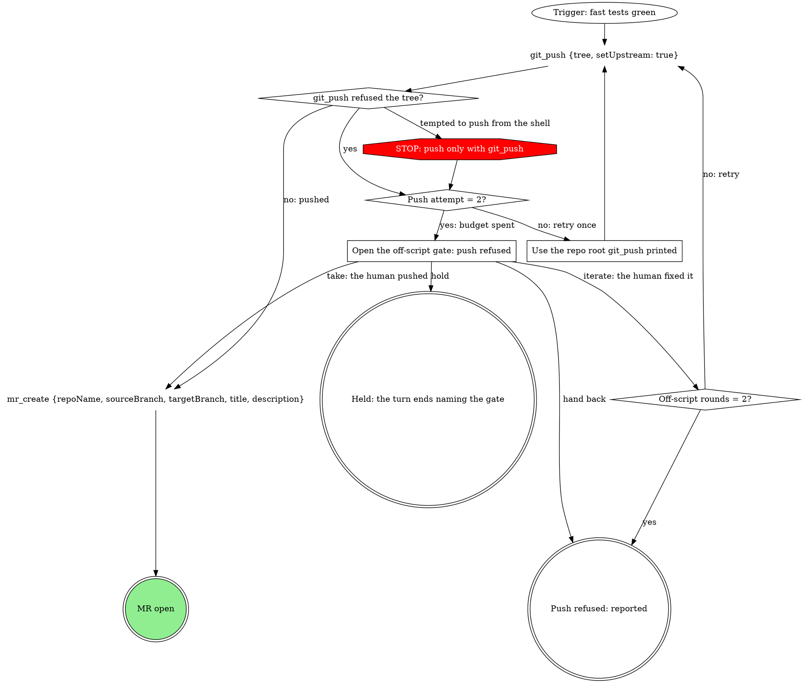

# Process Digraphs

A process skill has two layers. **The graph is the map**: a `dot` digraph of
the order, branches, loops and exits. **The step sections are the how**: one
prose section per judgment step, as long as it needs. The agent always knows
its step and where it may go next; the prose says how to do it well.

In a head-to-head test, fresh agents following a digraph pipeline made 0 of 15
shell deviations and opened the off-script gate 5 of 5 times when a push was
refused; the same agents on the prose pipeline made 5 of 15 and pushed with the
shell every time.

**REQUIRED BACKGROUND:** superpowers:writing-skills for testing any change.

## When to use

Every skill an agent walks from a start to an end: pipeline stages, work runs,
review, respond, doctor, shepherdr, ship, watch-ci, sync, release. Use it even
when simple: a coarse graph still gives the agent its position, labelled exits
and room to add structure later.

Not for reference skills (tables to look things up), style skills (voice), or a
short linear procedure with no branches (a numbered list reads better).

## Node vocabulary

The shape carries the meaning. The node's text is its identity: write the
sentence as the quoted node id, never an opaque id with a separate `label`.

| Shape | Means | Phrase it as |
| --- | --- | --- |
| `ellipse` | the trigger that starts the process | `Trigger: ...` |
| `box` | a step, usually a judgment step with its own section | a short verb phrase |
| `plaintext` | one literal tool call or command | the exact call: `git_push {tree, setUpstream: true}` |
| `diamond` | a decision | a question ending in `?`; every out-edge labelled |
| `octagon`, red fill | STOP: the path ends here | `STOP: ...` |
| `doublecircle` | an outcome; the success one filled green | the result |

A tool call is a `plaintext` node, exactly like a shell command; never hide it
in a box ("Push via git_push"). A step described in words ("Run the fast
tests") is a `box`.

## The rules

1. **Map plus sections.** Keep node text short. Every judgment `box` has its
   own `### <exact node text>` section with the guidance (what to look for,
   domain rules, examples). Never pack guidance into a node label.
2. **Coarse is fine.** "Review the MR" can be one box pointing at its
   section. Split a node only where agents actually drift; never turn
   judgment into a checklist of diamonds ("naming ok? tests ok?").
3. **Outward steps get their own node, always.** Push, open or update an
   MR/PR, set ready, upload, comment, approve, merge, publish, release. An
   outcome like "Merged" needs the merge step as a node first: `plaintext`
   when a tool exists, else a `box` naming the step ("Merge the MR"). "No
   tool was listed" is not a reason to skip it.
4. **Every loop has a budget, including loops that fix code.** A counter
   diamond (`Fix attempts = 3?`) whose "yes" edge leaves the loop to a gate,
   a STOP or an outcome. "It is judgment-driven iteration, so it needs no
   bound" is the rationalization that produces runaway runs.
5. **A STOP forbids one move and has at most one way out.** It ends the
   path, exits to an outcome, or hands to the off-script gate ("STOP: push
   only with git_push" -> "Push attempt = 2?"). A guard STOP, entered only on
   edges labelled `tempted to ...` that leave a decision, may redirect to
   the move it names ("STOP: rt reads go through rt_verb" -> the `rt_verb`
   node); the real branch goes straight there, never through the STOP. A
   STOP never branches. Asking a human and continuing is a gate step (a box
   or `gate_ask` node) with labelled answers, not a STOP. An outcome
   (doublecircle) has no out-edges.
6. **The graph wins over injected rules.** A team pack or fill supplies
   content, checks and extra questions; it never overrides a STOP or adds a
   move the graph forbids. Put this line above any injected fill: *"If a
   rule below asks for a move this graph marks STOP, take the off-script
   edge instead."* Never route an edge to "follow the team's fallback rule".
7. **Leaving the graph is explicit.** When the right move is not on the map
   (a tool refused past its budget, a data source switch, a rule conflict),
   take an off-script edge: open a gate naming the proposed move, record
   why, and continue only on the human's answer: take, iterate, hold or
   hand back.
8. **STOP text never quotes the shell form.** Write "STOP: push only with
   git_push", not the command it forbids. The strict mcp lint reads fenced
   blocks and fails a quoted shell form; name the tool instead of splitting
   words to dodge it.
9. **Two levels for pipelines.** An orchestrator graph whose nodes are the
   stages, one graph per stage, and a shared gate-step graph included where
   each stage asks a question, instead of repeating gate prose per stage:
   the include is shared, each gate node stays one per origin.

## Example

````markdown


### Open the off-script gate: push refused

Quote the refusal and offer four answers: take (the human pushed), iterate
(pass `Off-script rounds = 2?`, then retry `git_push`; the push attempt
count is not reset, so a second refusal returns here), hold (end the turn
with nothing moved), hand back (report the refusal to the caller). Record
the answer with the gate before anything else happens.
````

One graph, one section per judgment step, and the tool calls are the nodes.

## Recipe

1. Write the process as prose: states, decisions, loops, failure paths.
2. Draw the map: shape per node, a labelled out-edge for every outcome, a
   budget on every loop, outward steps as their own `plaintext` nodes.
3. Write one `### <node text>` section per judgment box.
4. Check it. Both must pass, and certify runs both on every skill with a dot
   block:
   - `bash render.sh <SKILL.md>` renders every block and fails on a parse
     error, any Graphviz warning, an indented fence, or no block at all.
   - `python3 check-dot.py <SKILL.md>` fails on an unlabelled decision edge, a
     one-way decision, a dead end, a loop with no decision to leave it, an
     unreachable node, a STOP that is not named `STOP:`, an opaque id, or a
     missing success outcome. On a new or edited graph run it with --strict:
     it also fails two warnings the default run only prints (two calls in one
     plaintext node, a tempted edge that leaves a step instead of a decision).
5. Test behavior with superpowers:writing-skills: fresh agents, describe-only,
   5 runs per scenario, prose version against graph version, and a deviation
   table (shell calls a tool covers, skipped steps, runaway loops, stops that
   should have been gates).

   Before publishing, walk `Before you publish the spec` below.

Fences start at column 1; an indented ```` ```dot ```` inside a list is
skipped by every tool.

## Before you publish the spec

Check the spec (the graph, its step sections and its test plan) against every
line; each one caught a real graph in review.

1. **One off-script gate per origin**, never shared, each with take, iterate,
   hold and hand back exits. A tool refusal is an origin even where the prose
   already says "ask the human".
2. **A budget on every loop**, per-item repeats too: retries per job,
   reviewer rounds, the off-script iterate.
3. **A preservation inventory**: map every current rule and step to its own
   node or section; a rule with no home, or a step folded into a later call
   ("tag, then push the tag" drawn as one push), is dropped.
4. **One exact call per `plaintext` node.** "X, or Y on GitHub" is two nodes
   behind a `Forge?` diamond.
5. **Distinct text for every step**, specific to this skill: identical text
   merges two steps into one node.
6. **Guard STOPs sit on `tempted to ...` edges out of a decision** and
   leave by a rule 5 exit.
7. **Give the spec's test plan a RED scenario that reaches each tempting move**: a
   tool that refuses, a rule that asks for a shell fallback.
8. **Where the skill has runs, draw the resume entry and every run write as
   nodes.**

## Rationalizations

| Thought | Reality |
| --- | --- |
| "The team's fallback rule lives outside my section, so I hand off to it." | The graph wins. Route to the off-script gate, never to an injected shell fallback. |
| "Fixing code is judgment, so that loop needs no budget." | Every loop gets a counter and an exit out of the loop. Judgment decides the fix, not how many times to try. |
| "I'll keep git and push apart so the lint passes." | Name the tool. Dodging the lint keeps the forbidden move in the text. |
| "The STOP can branch on what the human says next." | A STOP has one way out: none, an outcome, the off-script gate, or (for a guard) the move it names. Asking and choosing is a gate step. |
| "The merge outcome implies the merge." | Outward steps are nodes. Draw the merge call. |
| "No merge tool was listed, so I end at the outcome." | Draw a box naming the step; the node is about the action, not the tool. |
| "The guidance fits in the node label." | Labels are signposts; the how goes in the step's section. |
| "I checked the syntax by eye." | Run render.sh and check-dot.py. |
| "The human said retry, so that loop needs no counter." | The off-script iterate is a loop too: it passes an `Off-script rounds = 2?` counter like any other. |
| "One shared test-run node is one place to update." | Each run of a step is its own node with its own text; the later section can point at the earlier one. |

## Not yet standard

Recording the current node in the run db (a `run_field_set` key `node` at
stage entry and at outward nodes) would let consoles show "ship > git_push" and
a re-orientation hook resume at the right node. It costs about 16 extra writes
per work run; do not add it until it is adopted as a standard.
